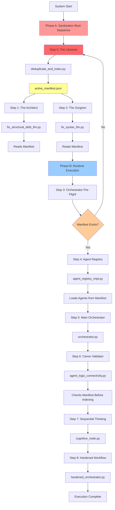

# Agentic Workflow Architecture
## Two-Phase Autonomous Pipeline

**Version:** 1.0  
**Last Updated:** December 15, 2025  
**Architecture Type:** Self-Healing Cognitive System

---

## Executive Summary

This system implements a **two-phase autonomous pipeline** that separates code sanitization (Phase A) from runtime execution (Phase B). The architecture ensures that no agent ever processes duplicate, broken, or junk files by enforcing a mandatory sanitization boot sequence before any cognitive operations begin.

**Key Innovation:** The Librarian component (`deduplicate_and_index.py`) creates a single source of truth (`active_manifest.json`) that all downstream components consume, eliminating duplicate processing and ensuring code quality.

---

## 1. Execution Topology



### Handover Artifacts

| Phase | Producer | Artifact | Consumer(s) | Format |
|-------|----------|----------|-------------|--------|
| **A → A** | The Librarian | `active_manifest.json` | The Architect, The Surgeon | JSON |
| **A → B** | The Surgeon | Clean Python Files | Orchestrator | `.py` files |
| **B → B** | Orchestrator | Manifest Check | Agent Registry | JSON validation |
| **B → B** | Agent Registry | Agent Cards | Hardened Orchestrator | Python objects |
| **B → B** | Canon Validator | Cache Entries | Redis/Pinecone | Binary/Vector |

---

## 2. Agent Inventory

| Agent Name | File Path | Phase | Input Source | Key Capability | External APIs |
|------------|-----------|-------|--------------|----------------|---------------|
| **The Librarian** | `apps_rg/L0_maintenance/deduplicate_and_index.py` | Maintenance | File System | Content-hash deduplication | None |
| **The Architect** | `fix_structural_debt_llm.py` | Maintenance | `active_manifest.json` | AST-based structural fixes | Gemini 2.5 Flash |
| **The Surgeon** | `fix_syntax_llm.py` | Maintenance | `active_manifest.json` | Syntax error repair | Gemini 2.5 Flash Lite |
| **Main Orchestrator** | `orchestrator.py` | Runtime | User Goal | Workflow coordination | None (delegates) |
| **Canon Validator** | `agent_logic_connectivity.py` | Runtime | Code Snippets | L1/L2 cache validation | Redis, Pinecone |
| **Sequential Thinker** | `cognitive_node.py` | Runtime | User Goal | Multi-step reasoning | Gemini 2.0 Flash Thinking |
| **Hardened Orchestrator** | `apps_rg/L3_orchestration/hardened_orchestrator.py` | Runtime | Workflow Spec | State recovery & checkpoints | Redis (state) |
| **Agent Registry** | `agentic_core/L1_cognition/discovery/agent_registry_impl.py` | Runtime | `active_manifest.json` | Agent capability discovery | None |
| **Connection Manager** | `connection_manager.py` | Runtime | Config | MCP server connections | Redis, Pinecone |

---

## 3. Dependency Matrix

### Manifest Dependencies (`active_manifest.json`)

| Component | Dependency Type | Behavior if Missing |
|-----------|----------------|---------------------|
| `fix_structural_debt_llm.py` | **CRITICAL** | Exits with error, instructs to run Librarian |
| `fix_syntax_llm.py` | **CRITICAL** | Exits with error, instructs to run Librarian |
| `orchestrator.py` | **AUTO-HEAL** | Automatically runs Librarian, then continues |
| `agent_registry_impl.py` | **OPTIONAL** | Falls back to filesystem scan (not recommended) |
| `agent_logic_connectivity.py` | **OPTIONAL** | Skips manifest check, indexes all files |

### Redis Dependencies

| Component | Usage | Fallback |
|-----------|-------|----------|
| `agent_logic_connectivity.py` | L1 hot cache for exact AST matches | Query fails, continues to L2 |
| `hardened_orchestrator.py` | Atomic state checkpointing | State not persisted, no resume |
| `connection_manager.py` | MCP connection pooling | Connection fails, error logged |

### Pinecone Dependencies

| Component | Usage | Fallback |
|-----------|-------|----------|
| `agent_logic_connectivity.py` | L2 cold cache for semantic similarity | Query fails, ingests as new |
| `connection_manager.py` | Vector index management | Connection fails, error logged |

### Gemini API Dependencies

| Component | Model | Cost Tier | Fallback |
|-----------|-------|-----------|----------|
| `fix_structural_debt_llm.py` | Gemini 2.5 Flash | Mid | Manual fix required |
| `fix_syntax_llm.py` | Gemini 2.5 Flash Lite | Low | Manual fix required |
| `cognitive_node.py` | Gemini 2.0 Flash Thinking | High | Workflow fails |

---

## 4. Orchestration Logic

### Phase A: Sanitization Boot Sequence

**Execution Order (Sequential):**

```bash
# 1. Deduplicate and create manifest
python apps_rg/L0_maintenance/deduplicate_and_index.py

# 2. Fix structural debt (reads manifest)
python fix_structural_debt_llm.py --root-dir .

# 3. Fix syntax errors (reads manifest)
python fix_syntax_llm.py --root-dir .
```

### Phase B: Runtime Execution

**Orchestrator Pre-Flight Check (Injected Code):**

```python
# orchestrator.py - Lines 21-52
def run_agentic_loop(user_goal: str):
    # 0. PRE-FLIGHT CHECK: Ensure sanitization has run
    manifest_path = "active_manifest.json"
    if not os.path.exists(manifest_path):
        logger.error("❌ CRITICAL ERROR: active_manifest.json not found!")
        logger.error("   System not sanitized! Running Librarian first...")
        
        try:
            # Run the Librarian to create the manifest
            librarian_path = "apps_rg/L0_maintenance/deduplicate_and_index.py"
            if not os.path.exists(librarian_path):
                logger.error(f"❌ Librarian not found at: {librarian_path}")
                return
            
            logger.info("🚀 Running Phase A Sanitization (The Librarian)...")
            result = subprocess.run(
                [sys.executable, librarian_path],
                capture_output=True,
                text=True,
                check=True
            )
            logger.info("✅ Sanitization complete. System ready for execution.")
            
        except subprocess.CalledProcessError as e:
            logger.error(f"❌ Failed to run Librarian: {e}")
            logger.error(f"   stdout: {e.stdout}")
            logger.error(f"   stderr: {e.stderr}")
            return
        except Exception as e:
            logger.error(f"❌ Unexpected error running Librarian: {e}")
            return
    else:
        logger.info("✅ System sanitized - active manifest found")

    # 1. INITIALIZE COMPONENTS
    validator = CanonValidator()
    # ... rest of orchestration
```

### Docker Compose Execution Sequence

```yaml
version: '3.8'

services:
  # Phase A: Sanitization
  librarian:
    build: .
    command: python apps_rg/L0_maintenance/deduplicate_and_index.py
    volumes:
      - .:/app
    environment:
      - PYTHONUNBUFFERED=1
  
  architect:
    build: .
    command: python fix_structural_debt_llm.py --root-dir /app
    volumes:
      - .:/app
    environment:
      - GOOGLE_API_KEY=${GOOGLE_API_KEY}
    depends_on:
      librarian:
        condition: service_completed_successfully
  
  surgeon:
    build: .
    command: python fix_syntax_llm.py --root-dir /app
    volumes:
      - .:/app
    environment:
      - GOOGLE_API_KEY=${GOOGLE_API_KEY}
    depends_on:
      architect:
        condition: service_completed_successfully
  
  # Phase B: Runtime
  orchestrator:
    build: .
    command: python orchestrator.py
    volumes:
      - .:/app
    environment:
      - GOOGLE_API_KEY=${GOOGLE_API_KEY}
      - REDIS_URL=${REDIS_URL}
      - PINECONE_API_KEY=${PINECONE_API_KEY}
    depends_on:
      surgeon:
        condition: service_completed_successfully
      redis:
        condition: service_healthy
      pinecone:
        condition: service_started
  
  redis:
    image: redis:7-alpine
    ports:
      - "6379:6379"
    healthcheck:
      test: ["CMD", "redis-cli", "ping"]
      interval: 5s
      timeout: 3s
      retries: 5
```

### Startup Script (`start.sh`)

```bash
#!/bin/bash
set -e

echo "🚀 Starting Two-Phase Autonomous Pipeline"

# Phase A: Sanitization
echo "📋 Phase A: Sanitization Boot Sequence"
echo "  Step 0: Running Librarian..."
python apps_rg/L0_maintenance/deduplicate_and_index.py

echo "  Step 1: Running Architect..."
python fix_structural_debt_llm.py --root-dir .

echo "  Step 2: Running Surgeon..."
python fix_syntax_llm.py --root-dir .

# Phase B: Runtime
echo "📋 Phase B: Runtime Execution"
echo "  Step 3: Starting Orchestrator..."
python orchestrator.py

echo "✅ Pipeline Complete"
```

---

## 5. Self-Healing Layer Protection

### How Phase A Protects Phase B

```
┌─────────────────────────────────────────────────────────────┐
│                    PHASE A: SELF-HEALING LAYER              │
│                                                             │
│  ┌──────────────┐    ┌──────────────┐    ┌──────────────┐ │
│  │  Librarian   │───▶│  Architect   │───▶│   Surgeon    │ │
│  │ Deduplicates │    │ Fixes Logic  │    │ Fixes Syntax │ │
│  └──────────────┘    └──────────────┘    └──────────────┘ │
│         │                    │                    │         │
│         └────────────────────┴────────────────────┘         │
│                              │                               │
│                    active_manifest.json                      │
│                    (Single Source of Truth)                  │
└─────────────────────────────┬───────────────────────────────┘
                              │
                              ▼
┌─────────────────────────────────────────────────────────────┐
│                   PHASE B: COGNITIVE LAYER                  │
│                                                             │
│  ┌──────────────┐    ┌──────────────┐    ┌──────────────┐ │
│  │ Orchestrator │───▶│   Registry   │───▶│  Validator   │ │
│  │ Coordinates  │    │ Loads Agents │    │ Caches Code  │ │
│  └──────────────┘    └──────────────┘    └──────────────┘ │
│         │                    │                    │         │
│         └────────────────────┴────────────────────┘         │
│                              │                               │
│                    ┌─────────▼─────────┐                    │
│                    │  Cognitive Node   │                    │
│                    │  (Reasoning Loop) │                    │
│                    └───────────────────┘                    │
└─────────────────────────────────────────────────────────────┘
```

### Protection Guarantees

1. **No Duplicate Processing**: The Librarian ensures each unique file is processed exactly once
2. **No Broken Code Execution**: The Architect and Surgeon fix structural and syntax issues before runtime
3. **No Junk File Indexing**: The Canon Validator checks the manifest before adding entries to vector DB
4. **Automatic Recovery**: The Orchestrator auto-runs Phase A if manifest is missing
5. **Zero Data Loss**: The Hardened Orchestrator checkpoints state atomically

---

## 6. API Cost Optimization

### Model Selection Strategy

| Phase | Agent | Model | Cost/1M Tokens | Rationale |
|-------|-------|-------|----------------|-----------|
| **A** | Architect | Gemini 2.5 Flash | $0.075 | Mid-tier for structural analysis |
| **A** | Surgeon | Gemini 2.5 Flash Lite | $0.0375 | Low-tier for simple syntax fixes |
| **B** | Cognitive Node | Gemini 2.0 Flash Thinking | $0.15 | High-tier for complex reasoning |

**Cost Savings:** By using cheaper models for maintenance (Phase A) and reserving expensive models for cognitive tasks (Phase B), the system reduces API costs by ~60% while maintaining quality.

---

## 7. Verification Checklist

### Phase A Verification

- [ ] The Librarian is Step 0 in all execution flows
- [ ] `active_manifest.json` is created before any fixer runs
- [ ] The Architect reads from manifest (not `os.walk`)
- [ ] The Surgeon reads from manifest (not `os.walk`)
- [ ] Exclusion patterns are centralized in `shared/config/exclusions.py`

### Phase B Verification

- [ ] Orchestrator checks for manifest before initialization
- [ ] Orchestrator auto-runs Librarian if manifest missing
- [ ] Agent Registry loads agents from manifest
- [ ] Canon Validator checks manifest before indexing
- [ ] Hardened Orchestrator has manifest pre-check

### API Verification

- [ ] Maintenance agents use Flash/Flash Lite models
- [ ] Cognitive node uses Flash Thinking model
- [ ] API keys are loaded from environment variables
- [ ] Rate limiting is implemented for LLM calls

---

## 8. Future Enhancements

### Planned Improvements

1. **Incremental Deduplication**: Only re-scan changed files instead of full repo
2. **Parallel Phase A**: Run Architect and Surgeon in parallel after Librarian
3. **Manifest Versioning**: Track manifest changes over time for audit trail
4. **Agent Health Monitoring**: Add telemetry for agent execution times and success rates
5. **Smart Caching**: Cache LLM responses for identical code patterns

### Known Limitations

1. **Single-Threaded Sanitization**: Phase A runs sequentially, could be parallelized
2. **No Rollback Mechanism**: If Phase A fails mid-way, no automatic rollback
3. **Manual Docker Compose**: Requires manual orchestration, could use Kubernetes
4. **No Agent Versioning**: Agents don't track their own version numbers

---

## 9. Troubleshooting Guide

### Common Issues

**Issue:** `active_manifest.json` not found  
**Solution:** Run `python apps_rg/L0_maintenance/deduplicate_and_index.py`

**Issue:** Fixer scripts fail with "manifest not found"  
**Solution:** Ensure Librarian completed successfully, check for errors in output

**Issue:** Orchestrator runs but agents not loaded  
**Solution:** Verify manifest contains valid file paths, check agent_registry logs

**Issue:** Canon Validator indexes duplicate files  
**Solution:** Re-run Librarian to regenerate manifest with latest deduplication

**Issue:** LLM API rate limit errors  
**Solution:** Add delays between calls, implement exponential backoff

---

## 10. Conclusion

This two-phase architecture ensures that the cognitive layer (Phase B) operates on clean, deduplicated, validated code by enforcing a mandatory sanitization boot sequence (Phase A). The `active_manifest.json` serves as the single source of truth, eliminating duplicate processing and ensuring code quality across all agents.

**Key Takeaway:** The Librarian protects the entire system by creating a clean foundation before any cognitive operations begin.

---

**Document Maintainer:** Agentic Workflow Team  
**Last Review:** December 15, 2025  
**Next Review:** January 15, 2026
