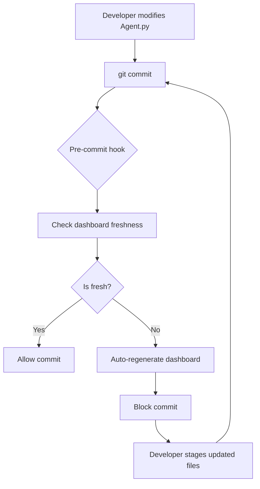
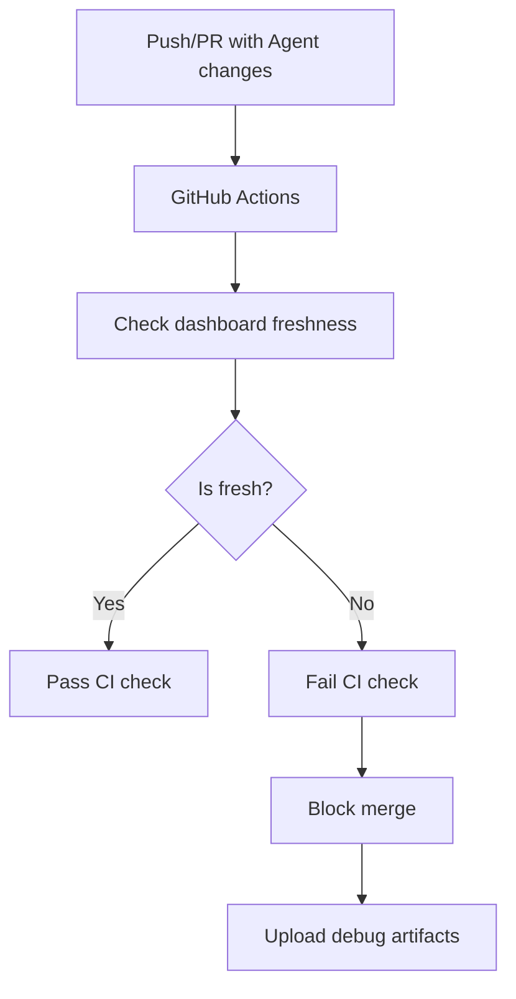

# Dashboard Pipeline Enforcement

**Status:** ✅ IMPLEMENTED
**Date:** January 7, 2026
**Purpose:** Ensure the autonomy dashboard is always up-to-date and sources from SSOT

---

## 🎯 Overview

The dashboard pipeline enforcement system automatically validates and regenerates the autonomy dashboard whenever agent code changes are committed. This ensures the dashboard always reflects the current state of the codebase.

---

## 🏗️ Architecture

### Components

1. **Smart Discovery** (`scripts/smart_discovery.py`)
   - Detects if discovery JSON is stale
   - Compares JSON mtime vs source file mtimes
   - 1-hour staleness threshold
   - Auto-triggers discovery when needed

2. **Freshness Enforcer** (`scripts/enforce_dashboard_freshness.py`)
   - Validates dashboard freshness before commits
   - Auto-regenerates discovery + dashboard if stale
   - Blocks commits until dashboard is updated
   - Provides clear instructions for staging updated files

3. **Pre-Commit Hook** (`.git/hooks/pre-commit`)
   - Triggers on any `*Agent.py` file changes
   - Triggers on dashboard-related file changes
   - Runs freshness enforcement automatically
   - Can be bypassed with `--no-verify` (not recommended)

4. **CI/CD Workflow** (`.github/workflows/dashboard-freshness.yml`)
   - Runs on pull requests and pushes
   - Validates dashboard freshness in CI
   - Blocks merges if dashboard is stale
   - Uploads artifacts on failure for debugging

---

## 🔄 Workflow

### Local Development



### CI/CD Pipeline



---

## 📋 Usage

### Automatic Enforcement (Recommended)

The pre-commit hook runs automatically on every commit:

```bash
# Make changes to agents
vim agentic_core/L2_execution/ToolRegistry/SomeAgent.py

# Commit changes - hook runs automatically
git add agentic_core/L2_execution/ToolRegistry/SomeAgent.py
git commit -m "feat: update SomeAgent"

# If dashboard is stale, hook will:
# 1. Regenerate discovery JSON
# 2. Regenerate dashboard
# 3. Block commit with instructions
```

### Manual Enforcement

Check dashboard freshness manually:

```bash
# Check only (no regeneration)
python scripts/enforce_dashboard_freshness.py --check-only

# Check and auto-regenerate if needed
python scripts/enforce_dashboard_freshness.py
```

### Bypass Hook (Emergency Only)

```bash
# NOT RECOMMENDED - bypasses all checks
git commit --no-verify -m "emergency fix"
```

---

## 🔍 Validation Rules

### Staleness Detection

Dashboard is considered **stale** if:

1. Discovery JSON doesn't exist
2. Dashboard HTML doesn't exist
3. Discovery JSON is older than 1 hour
4. Source files modified after JSON generation
5. Dashboard HTML older than discovery JSON

### SSOT Compliance

Dashboard **must**:

1. Source data from `agent_discovery_full.json`
2. Use `DashboardDataGenerator.load_registry()`
3. Never use cached or hardcoded data
4. Always call `smart_discovery.ensure_fresh_discovery()` before generation

---

## 📊 Monitoring

### Pre-Commit Hook Output

**Success:**
```
🔍 Agent/Dashboard files detected in commit. Enforcing dashboard freshness...

✅ Dashboard is fresh and up-to-date
   Reason: Dashboard is fresh

✅ Dashboard freshness verified
```

**Regeneration Required:**
```
🔍 Agent/Dashboard files detected in commit. Enforcing dashboard freshness...

⚠️  Dashboard is stale: Source files modified after JSON

🔧 Auto-regenerating dashboard to ensure freshness...

✅ DASHBOARD UPDATED SUCCESSFULLY

📝 IMPORTANT: The following files have been updated:
   - agent_discovery_full.json
   - agent_discovery_full.manifest.json
   - reports/autonomy_dashboard.html
   - reports/autonomy_compliance_report.md
   - reports/autonomy_compliance_data.csv

🔄 Please stage these files and commit again:
   git add agent_discovery_full.json agent_discovery_full.manifest.json reports/
   git commit
```

### CI/CD Output

Check GitHub Actions tab for:
- Dashboard freshness validation results
- SSOT compliance verification
- Artifact uploads (on failure)

---

## 🛠️ Configuration

### Staleness Threshold

Modify in `scripts/smart_discovery.py`:

```python
# Default: 1 hour
STALENESS_THRESHOLD = timedelta(hours=1)

# For faster iteration (development):
STALENESS_THRESHOLD = timedelta(minutes=15)

# For production (stricter):
STALENESS_THRESHOLD = timedelta(minutes=30)
```

### Trigger Patterns

Modify in `.git/hooks/pre-commit`:

```bash
# Current: All Agent.py files
AGENT_FILES=$(git diff --cached --name-only | grep -E "Agent\.py$")

# Alternative: Only core agents
AGENT_FILES=$(git diff --cached --name-only | grep -E "agentic_core/.*Agent\.py$")
```

---

## 🚨 Troubleshooting

### Hook Not Running

```bash
# Ensure hook is executable
chmod +x .git/hooks/pre-commit

# Verify hook exists
ls -la .git/hooks/pre-commit
```

### Python Import Errors

```bash
# Ensure project root in PYTHONPATH
export PYTHONPATH="${PYTHONPATH}:/path/to/Agentic-Workflow"

# Or use absolute imports in scripts
```

### Discovery Fails

```bash
# Run discovery manually with verbose output
python scripts/full_agent_discovery.py --force

# Check for syntax errors in agents
python scripts/full_agent_discovery.py 2>&1 | grep "SYNTAX"
```

### Dashboard Generation Fails

```bash
# Run dashboard generation manually
python -c "
from pathlib import Path
from agentic_core.L5_safety.validators.AutonomyGuardianAgent import AutonomyGuardianAgent
agent = AutonomyGuardianAgent(Path.cwd())
agent.generate_compliance_report(markdown=True)
"
```

---

## 📈 Benefits

### Data Integrity

- ✅ Dashboard always reflects current codebase
- ✅ No stale or cached data
- ✅ SSOT compliance enforced
- ✅ Automatic validation on every commit

### Developer Experience

- ✅ Automatic regeneration (no manual steps)
- ✅ Clear error messages and instructions
- ✅ Fast feedback loop (pre-commit)
- ✅ CI/CD integration for team collaboration

### Quality Assurance

- ✅ Prevents commits with stale dashboards
- ✅ Validates SSOT compliance
- ✅ Blocks merges if dashboard is out of sync
- ✅ Audit trail via git history

---

## 🔄 Maintenance

### Regular Tasks

1. **Weekly:** Review staleness threshold effectiveness
2. **Monthly:** Audit bypass usage (`git log --grep="no-verify"`)
3. **Quarterly:** Update trigger patterns based on repo structure changes

### Updates

When modifying dashboard generation logic:

1. Update `AutonomyGuardianAgent.py`
2. Update `dashboard_data_generator.py` or `dashboard_renderer.py`
3. Test with `python scripts/enforce_dashboard_freshness.py`
4. Commit changes (hook will validate)

---

## 📚 Related Documentation

- `scripts/smart_discovery.py` - Staleness detection logic
- `scripts/full_agent_discovery.py` - Agent discovery with incremental mode
- `agentic_core/L5_safety/validators/AutonomyGuardianAgent.py` - Dashboard generation
- `.github/workflows/dashboard-freshness.yml` - CI/CD configuration

---

## ✅ Implementation Checklist

- [x] Create `enforce_dashboard_freshness.py` script
- [x] Update pre-commit hook to trigger on Agent.py changes
- [x] Add CI/CD workflow for pull request validation
- [x] Document enforcement pipeline
- [x] Test with sample agent modification
- [ ] Roll out to team with training session
- [ ] Monitor for first week and adjust thresholds

---

**Last Updated:** January 7, 2026
**Maintained By:** Agentic Core Team
**Status:** Production Ready
