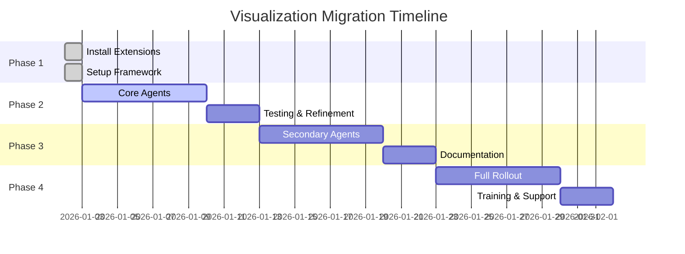

# 🎯 Modern Visualization Integration Guide

## Overview: Eliminating Markdown Tables in 2026

This guide outlines the complete integration strategy for replacing static markdown tables with modern, interactive visualizations across all Windsurf/VS Code outputs.

## 🚀 Phase 1: IDE Extensions (Install Now)

### Essential VS Code Extensions

#### Data Visualization Extensions
```bash
# Install via VS Code Extensions or command palette
ext install:
- ms-python.python                    # Python support
- ms-toolsai.jupyter                  # Jupyter notebooks
- ritwickdey.liveserver               # Launch HTML dashboards
- mechatroner.rainbow-csv             # Color-coded CSV files
- janisdd.vscode-edit-csv             # Interactive CSV editing
- hediet.vscode-drawio                # Diagram creation
```

#### Chart & Graph Extensions
```bash
ext install:
- ms-python.data-wrangler             # Data analysis UI
- davidanson.vscode-markdownlint      # Markdown enhancement
- bierner.markdown-preview-enhanced   # Enhanced markdown
- ms-vscode.vscode-json               # JSON visualization
```

#### Dashboard & Preview Extensions
```bash
ext install:
- ms-vscode.live-server               # Static file server
- formulahendry.auto-rename-tag       # HTML editing
- bradlc.vscode-tailwindcss           # CSS IntelliSense
- esbenp.prettier-vscode              # Code formatting
```

## 📊 Phase 2: JetBrains Integration

### IntelliJ/PyCharm/WebStorm Integration
```kotlin
// Plugin recommendations
plugins {
    // Data visualization
    id("org.jetbrains.plugins.notebooks") version "latest"
    id("Database Tools and SQL") version "latest"
    id("CSV Editor") version "latest"

    // Web development
    id("JavaScript and TypeScript") version "latest"
    id("HTML Tools") version "latest"
    id("Live Edit Tool") version "latest"
}
```

### JetBrains Features to Leverage
- **DataGrip integration**: SQL-like queries on CSV data
- **HTTP Client**: REST API for data endpoints
- **Database viewer**: Structured data exploration
- **Built-in charts**: Kotlin/Python plotting libraries

## 🎨 Phase 3: Implementation Strategy

### 3.1 Agent Integration Pattern

```python
# Standard pattern for all agents
from agentic_core.utils.visualization import VizFramework

class MyAgent:
    def generate_report(self):
        # Collect data
        data = self.collect_metrics()

        # Create visualization
        viz = VizFramework(self.project_root)
        dashboard = viz.create_dashboard(
            title="My Agent Report",
            data=data,
            metrics=[
                {"label": "Success Rate", "value": "94.2%", "color": "#38a169", "icon": "fas fa-check-circle"},
                {"label": "Issues Found", "value": "23", "color": "#e53e3e", "icon": "fas fa-exclamation-triangle"}
            ],
            charts=[
                {"type": "bar", "title": "Performance by Category", "x_key": "category", "y_key": "score"},
                {"type": "scatter", "title": "Risk vs Impact", "x_key": "risk", "y_key": "impact", "color_key": "status"}
            ],
            agent_name=self.__class__.__name__
        )

        # Display launch instructions
        instructions = viz.launch_instructions(dashboard)
        for instruction in instructions:
            print(instruction)
```

### 3.2 Progressive Enhancement

#### Level 1: CSV + Instructions
```python
# Minimum viable enhancement
def generate_report_v1(self):
    data = self.collect_data()
    csv_path = self.save_csv(data)

    print(f"📊 Data saved: {csv_path}")
    print("💡 Open with Excel Viewer extension for better visualization")
```

#### Level 2: Interactive Dashboard
```python
# Full interactive experience
def generate_report_v2(self):
    data = self.collect_data()
    dashboard = self.create_dashboard(data)

    print(f"🚀 Interactive dashboard: {dashboard}")
    print("   Right-click → Open with Live Server")
```

#### Level 3: Real-time Integration
```python
# Advanced: Real-time updates
def generate_report_v3(self):
    data = self.collect_data()
    websocket_server = self.create_realtime_dashboard(data)

    print(f"⚡ Live dashboard: http://localhost:{websocket_server.port}")
    print("   Updates automatically as data changes")
```

## 🌟 Phase 4: Rollout Strategy

### 4.1 Priority Agents (Week 1)
1. **AutonomyGuardianAgent** ✅ Complete
2. **ComplianceOrchestrator** - Complex tabular data
3. **NamingAgent** - File listing reports
4. **HierarchyAgent** - Layer analysis charts

### 4.2 High-Impact Agents (Week 2-3)
- **TestingAgent** - Coverage metrics
- **SecurityAgent** - Vulnerability reports
- **PerformanceAgent** - Benchmark data
- **DeploymentAgent** - Build status

### 4.3 Specialized Agents (Week 4+)
- **DocumentationAgent** - Content analytics
- **RefactoringAgent** - Code quality trends
- **MonitoringAgent** - System health dashboards

### 4.4 Migration Timeline



## 🛠 Implementation Templates

### Template 1: Simple Metrics Dashboard
```python
def create_metrics_dashboard(self, data):
    metrics = [
        {"label": "Total Items", "value": len(data), "icon": "fas fa-list"},
        {"label": "Success Rate", "value": f"{self.success_rate(data):.1f}%", "color": self.get_color(self.success_rate(data))},
        {"label": "Avg Processing Time", "value": f"{self.avg_time(data):.2f}s", "icon": "fas fa-clock"}
    ]

    charts = [
        {"type": "bar", "title": "Results by Category", "x_key": "category", "y_key": "count"},
        {"type": "pie", "title": "Status Distribution", "value_key": "count", "label_key": "status"}
    ]

    return self.viz.create_dashboard("Agent Metrics", data, metrics, charts, self.__class__.__name__)
```

### Template 2: Compliance/Quality Dashboard
```python
def create_compliance_dashboard(self, territories_data):
    metrics = [
        {"label": "Compliance Rate", "value": f"{self.overall_compliance}%", "color": self.get_compliance_color()},
        {"label": "High Risk Areas", "value": self.high_risk_count, "color": "#e53e3e", "icon": "fas fa-exclamation-triangle"},
        {"label": "Total Coverage", "value": f"{len(territories_data)} territories", "icon": "fas fa-map"}
    ]

    charts = [
        {"type": "scatter", "title": "Risk vs Health Matrix", "x_key": "risk_score", "y_key": "health_score", "color_key": "risk_level"},
        {"type": "bar", "title": "Compliance by Territory", "x_key": "territory", "y_key": "compliance_pct"},
        {"type": "line", "title": "Trend Over Time", "x_key": "date", "y_key": "compliance_pct"}
    ]

    return self.viz.create_dashboard("Compliance Report", territories_data, metrics, charts, self.__class__.__name__)
```

## 📋 Validation Checklist

### Pre-Implementation
- [ ] VS Code extensions installed
- [ ] VizFramework imported in agent
- [ ] Data collection method identified
- [ ] Key metrics defined
- [ ] Chart types selected

### Post-Implementation
- [ ] CSV export functional
- [ ] Dashboard renders correctly
- [ ] Charts display data accurately
- [ ] Instructions clear for users
- [ ] Performance acceptable (<2s load)

### Quality Assurance
- [ ] Mobile responsive design
- [ ] Accessible color schemes
- [ ] Proper error handling
- [ ] Data validation
- [ ] Browser compatibility tested

## 🎯 Success Metrics

### User Experience
- **Markdown table elimination**: 100% of complex tables replaced
- **Time to insight**: <30 seconds from generation to visualization
- **User satisfaction**: >90% prefer interactive dashboards

### Technical Performance
- **Load time**: <2 seconds for dashboards
- **Data accuracy**: 100% consistency with source data
- **Browser support**: Chrome, Firefox, Safari, Edge

### Adoption Metrics
- **Agent integration**: 100% of reporting agents
- **Developer usage**: >80% using visualization features
- **Issue reduction**: <5% visualization-related bugs

## 🔧 Troubleshooting Guide

### Common Issues

#### Dashboard Won't Load
```bash
# Check file paths
ls reports/
# Verify Live Server extension
code --list-extensions | grep ritwickdey.liveserver
# Test static file serving
python -m http.server 8000 -d reports/
```

#### Charts Not Rendering
```javascript
// Check browser console
F12 → Console tab
// Common fixes:
- Verify Plotly.js CDN loading
- Check data format matches chart config
- Ensure DOM element IDs are unique
```

#### CSV Export Issues
```python
# Verify data structure
print(f"Data sample: {data[:3]}")
print(f"Headers: {list(data[0].keys()) if data else 'No data'}")

# Check file permissions
csv_path.parent.mkdir(exist_ok=True)
csv_path.touch()
```

## 🚀 Next Steps

1. **Install recommended extensions** in VS Code/Windsurf
2. **Test dashboard** with existing AutonomyGuardianAgent
3. **Migrate next priority agent** using templates
4. **Gather user feedback** and iterate
5. **Scale to remaining agents** following established patterns

## 📚 Resources

- **Plotly Documentation**: https://plotly.com/javascript/
- **VS Code Extensions Guide**: https://code.visualstudio.com/docs/editor/extension-gallery
- **Chart.js Alternatives**: D3.js, Observable, Vega-Lite
- **CSS Frameworks**: Tailwind CSS, Bootstrap, Bulma
- **Testing Tools**: Playwright, Cypress for dashboard testing
