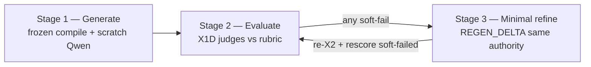

# Executive Summary — Operator Guide

> **Plan SSOT:** [.codex/plans/exec-summary-operator-ship-a3f7c2.md](../.codex/plans/exec-summary-operator-ship-a3f7c2.md)
> **Surgical judge regen:** [.codex/plans/exec-summary-anthropic-surgical-regen-f3c8d2.md](../.codex/plans/exec-summary-anthropic-surgical-regen-f3c8d2.md)
> **Token / regen budget:** [.codex/plans/exec-summary-qwen-regen-token-budget-c4e8a1.md](../.codex/plans/exec-summary-qwen-regen-token-budget-c4e8a1.md) · research: [executive_summary_qwen_regen_token_budget_research_20260525.md](../reports/apps_rg/executive_summary_qwen_regen_token_budget_research_20260525.md)

## One command

```powershell
python -m apps_rg --section executive_summary `
  --target-company "<company>" `
  --target-role "<role>" `
  --jd <path-to-jd.txt> `
  --manual-brief <path-to-briefing.md>
```

## Two outcomes (operator-ship W1)

| Tier | Meaning | CLI |
|------|---------|-----|
| **DRAFT_READY** | `REAL_LLM` + X2 PASS (`PRODUCT_QUALITY_STATUS=PASS`) | **exit 0**, `proof_eligible=false` |
| **CERTIFIED** | `X3_ALLOW` + all judges ≥ 4.0/5 | **exit 0**, `proof_eligible=true` when manifest allows |
| **BEST_EFFORT_PUBLISH** | Pool selected a regen snapshot with X2 PASS but ≥1 judge below floor | **REVIEW** only; `proof_eligible=false`; requires `--best-effort-publish-allowed` or `APPS_RG_EXEC_SUMMARY_BEST_EFFORT_PUBLISH_ALLOWED=1` |

`publish_disposition.json` records `certified` vs `best_effort` vs `judge_certification_required`. **Approved** (certified) means all model-backed judges passed on the published snapshot. **Saved for review** (best_effort) means the lane published a candidate for operator inspection without X1D certification.

Stdout includes `OPERATOR_STATUS`, `DRAFT_READY`, `CERTIFIED`, `DISPOSITION_TIER` (see `cli_section_execution_report.json`).

- `PRODUCT_QUALITY_STATUS` = X2 only (deterministic rules).
- `PRODUCT_STATUS` = full X3 disposition (judges).
- Do not treat **exit 1** alone as “generation failed” when `OPERATOR_STATUS=DRAFT_READY`.

## Repair loops (simplified)

1. **Synthesis regen** — before judges; default **on** (`APPS_RG_EXEC_SUMMARY_SYNTHESIS_REGEN`).
2. **Judge regen** — after judges when any model-backed judge is below floor; default **on** on product CLI. Default **3 cycles** (Qwen rewrite → re-X2 → **rescore soft-failed judges only**). Stops early when all judges pass. Opt-out: `APPS_RG_EXEC_SUMMARY_JUDGE_REGEN=0`. Cap: `APPS_RG_EXEC_SUMMARY_JUDGE_REGEN_MAX_ATTEMPTS` (default `3`, max `3`). Trigger: `any_judge_below_floor` (no 2/3-pass skip). Legacy full panel after each regen: `APPS_RG_EXEC_SUMMARY_POST_REGEN_JUDGE_MODE=full_panel`.

**Regen philosophy (24k):** Retries are limited by **cycle count**, not by truncating judge feedback in the delta prompt. Each retry uses a **strict surgical delta** (frozen compile, `REGEN_DELTA` / prescriptive delta, G5 sentence-edit budget) — remediate failed dimensions only; do not re-run or rewrite the full scratch prompt. All soft-failed judge findings and remediation hints are included verbatim in `REGEN_DELTA`.

## Three-stage judge regen (Anthropic-aligned)

Maps Anthropic **prompt chaining** and **evaluator–optimizer** to this lane. Normative core contract: [same_authority_regen_envelope_spec_v1.md](../reference/L2_execution/same_authority_regen_envelope_spec_v1.md) · [ADR-085](../adr/ADR-085-same-authority-incremental-regen.md). External references: [Building Effective Agents](https://www.anthropic.com/research/building-effective-agents) · [Effective context engineering](https://www.anthropic.com/engineering/effective-context-engineering-for-ai-agents).



| Stage | What runs | What must stay frozen |
|-------|-----------|------------------------|
| **1 — Generate** | First Qwen call on compiled prompt (JD/briefing targeting-only; C0 facts) | `compilation_hash`, system prefix, slot map |
| **2 — Evaluate** | Model-backed X1D panel (separate provider calls) | No Qwen rewrite; judges only score the scratch |
| **3 — Minimal refine** | `core.SameAuthorityRegenRunner` appends anchor assistant + `REGEN_DELTA_v1` user turn | Same model/provider lane; **no** PA recompile; anchor JSON on assistant turn only |

### `messages[]` shape (Stage 3)

Per spec § provider request proof:

1. `system` (+ `developer` if any) — frozen prefix from Stage 1 compile
2. `user` — original generation turn (unchanged)
3. `assistant` — **anchor** = prior `resume_display_text` + `claim_ledger` JSON
4. `user` — **`REGEN_DELTA_v1`** = `PROMPT_LOCK` + delta lines only (no embedded anchor draft)

Delta lines are packed in fixed order: **dimension → judge_feedback (verbatim) → floors → guards**. Code constant: `REGEN_DELTA_SECTION_ORDER` in `executive_summary_judge_remediation.py`. Prescriptive dimension lines include an **EDIT_BUDGET** tied to the G5v2 allowlist (e.g. `you may change S2–S5 (indexes 2, 3, 4, 5) … freeze all other sentences verbatim`).

### What judge regen must **not** do

- Re-run or re-compile the **full scratch** prompt because a judge failed.
- Truncate or drop soft-failed judge findings to save tokens (there is **no** operator env knob for that).
- Substitute provider/model on the regen turn.
- Publish a regen candidate when **X2 regresses** (scratch remains publish baseline).
- Treat transport timeout or `budget_blocked` as a successful semantic rewrite.

### Per-cycle loop (default product path)

1. Build full verbatim judge feedback + prescriptive dimension lines → `REGEN_DELTA`.
2. Qwen regen (same authority) → parse candidate JSON.
3. Re-run **X2** on candidate.
4. Rescore **soft-failed judges only** (`APPS_RG_EXEC_SUMMARY_POST_REGEN_JUDGE_MODE=soft_failed_only`).
5. **G5v2** allowlist gate — edits must fall in `cited_sentence_indexes` from soft-failed judges (plus `delta_class` fallback). Legacy numeric budget is **advisory only** (`g5_legacy_budget_advisory` in receipt).
6. Accept cycle only if publish-eligible; else next cycle up to `APPS_RG_EXEC_SUMMARY_JUDGE_REGEN_MAX_ATTEMPTS`.

**Artifacts:** `judge_remediation_receipt.json`, `judge_remediation_cycles.json`, `g5_delta_scope_cycle_*.json`, `regen_token_budget_receipt.json` under `artifacts/apps_rg/runtime_proofs/executive_summary/real/exec_summary_<ts>/`.

## Env flags that matter

| Variable | Default | Purpose |
|----------|---------|---------|
| `APPS_RG_EXEC_SUMMARY_SYNTHESIS_REGEN` | on | Pre-X2 shape repair |
| `APPS_RG_EXEC_SUMMARY_JUDGE_REGEN` | **on** (product path); `=0` opt-out | Post-judge Qwen rewrite loop |
| `APPS_RG_EXEC_SUMMARY_JUDGE_REGEN_MAX_ATTEMPTS` | `3` (max `3`) | Qwen judge-regen cycles (not judge API count) |
| `APPS_RG_EXEC_SUMMARY_POST_REGEN_JUDGE_MODE` | `soft_failed_only` | After regen: rescore 1–2 judges vs full panel of 3 |
| `APPS_RG_ALLOW_NON_ALLOW_EXIT_ZERO` | ignored on product path | Dev/harness only |
| `APPS_RG_EXEC_SUMMARY_BEST_EFFORT_PUBLISH_ALLOWED` | off | Pool publish when judges fail but X2 passed (non-certified) |
| `--best-effort-publish-allowed` | off | CLI alias for best-effort pool publish |
| `APPS_RG_EXEC_SUMMARY_TARGETING_PARITY_STRICT` | on (`=0` warn-only) | Block X1D judge panel when `targeting_parity_status=mismatch` |

### Token budget & Qwen transport (W1/W2)

All **post-scratch** regen/repair Qwen calls go through `budgeted_qwen_regen_call` (fail-closed pre-dispatch). Scratch first-call still uses the lane’s single direct `call_qwen_vllm` after optional trim.

| Variable | Suggested | Purpose |
|----------|-----------|---------|
| `VLLM_MAX_MODEL_LEN` | `24576` (must match Docker `--max-model-len`) | Operator-declared context window |
| `APPS_RG_EXEC_SUMMARY_VERIFY_VLLM_CONTEXT_WINDOW` | `0` (off) | `=1` probes `/v1/models` for `max_model_len` metadata (W2.1) |
| `APPS_RG_EXEC_SUMMARY_MAX_OUTPUT_TOKENS` | `2048` | Scratch generation cap only; legacy `APPS_RG_EXEC_SUMMARY_QWEN_MAX_OUTPUT_TOKENS` is still accepted |
| `APPS_RG_EXEC_SUMMARY_REGEN_MAX_OUTPUT_TOKENS` | `2048` | All synthesis/judge/X2-repair regen (≤ scratch cap); legacy `APPS_RG_EXEC_SUMMARY_QWEN_REGEN_MAX_OUTPUT_TOKENS` is still accepted |
| `APPS_RG_QWEN_TIMEOUT_SECONDS` | `90`–`120` | **Transport** timeout per chat completion (not token budget) |
| `APPS_RG_QWEN_TRANSPORT_MAX_ATTEMPTS` | `3` | HTTP retries on transient failures only (not semantic regen attempts) |
| `APPS_RG_QWEN_MODELS_PROBE_TIMEOUT_SECONDS` | `5` | `/v1/models` probe when verify flag is on |
**First-pass policy (W2.2):** After optional-only trim, scratch dispatch is blocked if estimated input exceeds **92%** of `available_input_tokens` (code constant — not env-overridable; `TOKEN_BUDGET_EXCEEDED_FIRST_PASS_85PCT`). Hard cap at 100% still applies (`TOKEN_BUDGET_EXCEEDED_AFTER_TRIM`).

**24k budget rationalization (Brown SVP):** With `VLLM_MAX_MODEL_LEN=24576`, available input is **22,016** tokens (92% gate **20,254**). Full JD + briefing under default targeting caps (~**16.9k** dispatch measured) leaves **~3.4k** tokens before the 92% block. Detail: [executive_summary_24k_context_budget_rationalization_20260526.md](../reports/apps_rg/executive_summary_24k_context_budget_rationalization_20260526.md).

**Operator guidance on block:** `token_budget_receipt.json` includes `operator_message` / `operator_guidance` with briefing/JD shortening steps that preserve HIGH facts, `selected_fact_plan`, evidence law, and SRFS shape. Same text prints to **stderr** and appears in `command_output.txt` under `TOKEN_BUDGET_OPERATOR_GUIDANCE`.

**Context provenance (W2.1):** `token_budget_receipt.json` and regen receipts include `provider_context_window_source` (`ENV_VLLM_MAX_MODEL_LEN` \| `SERVER_MODELS_METADATA` \| `UNKNOWN`), `server_context_window_verified`, and `server_context_window_warning` when the window is operator-declared only.

### Transport timeout vs budget (invariant I6)

| Signal | Meaning | Operator action |
|--------|---------|-----------------|
| `budget_blocked` / `dispatch_allowed=false` | Thread too large **before** Qwen was called | Shrink thread, enable compaction, or raise `VLLM_MAX_MODEL_LEN` |
| `transport_timeout=true` | HTTP/chat completion timed out **after** dispatch was allowed | Raise `APPS_RG_QWEN_TIMEOUT_SECONDS`; check vLLM load |
| `accepted=true` on a regen cycle | Output hash changed **and** matching `provider_response_*` exists for that `call_id` | Do not treat timeout or budget block as success |

`budget_allowed=true` with `transport_timeout=true` is **not** a successful regen. Semantic regen attempt index ≠ transport retry count.

## C0.3 skills graph (claim authority vs targeting)

Executive summary proof comes from the **augmented skills graph**, not the JD text. Use this section when triaging graph receipts or explaining a run to stakeholders.

### What is proof vs what is not

| Source | Role | Can appear as a resume claim? |
|--------|------|--------------------------------|
| `allowed_fact_ids` / C0 fact packet | SRFS + pool-wins (typically ~7 facts) | **Yes** — only these |
| `graph_targeting_capsule.json` | JD/GTM skill labels for tone | **No** — `claim_support_allowed: false` |
| `c03_context_fact_ids` | Graph neighbors (e.g. partnerships, revenue ops) | **No** — filtered out of pool |
| JD / briefing | Ranking, role family, brushstroke order | **No** — `jd_used_as_proof: false` |

### Binding vocabulary (read receipts correctly)

| You see | It means | It does **not** mean |
|---------|----------|----------------------|
| `c03_graphrag_bound_status: BOUND` | Graph metadata attached to selected facts | Spine GraphRAG traverse completed |
| `graph_expansion_mode: incident_edge_v1` | Edges touching selected fact nodes | 2-hop BFS retrieval |
| `graph_hop_paths_count: 47` | Count of incident edge refs (capped) | 47 two-hop paths |
| `native_c03` + `FULL_C0_3_GRAPHRAG_BINDING` | Apps_rg route/ACL contract emitted | `agentic_core` C0.3 ran (`core_c03_graph_rag_used` stays false) |
| `canonical_c0_3_claimed: false` | Honest section-lane mode | Missing or broken graph |

**SSOT report:** [c03_exec_summary_binding.md](../reports/apps_rg/c03_exec_summary_binding.md) · **Code glossary:** `apps_rg.runtime.section_spine_terminology.C03_RECEIPT_FIELD_GLOSSARY`

### Artifact quick list (under `exec_summary_<timestamp>/`)

`c03_graphrag_bound.json` · `native_c03_final_evidence.json` · `graph_targeting_capsule.json` · `graph_selection_rationale.json` · `section_metric_receipt.json` · `text_claim_coverage.json`

### Example (Brown `exec_summary_20260526_211453`)

Seven facts were allowed as proof; eleven graph neighbors (GTM/revenue/partnerships) were found but **kept out** of claims. The paragraph’s dollar amounts and Basel/CCAR line trace to those seven IDs in `text_claim_coverage.json`. Release was still **not certified** because judges blocked (Gemini decisive), not because the graph chain failed X2.

---

## X2 credential policy (FSA vs vendor certs)

`x2_exec_summary_no_credential_dump` blocks **vendor cert inventories** (AWS, Databricks, Associate-level label stacks). **FSA** (Fellow of the Society of Actuaries) is treated as **C0.3 skills-graph phase-1 rigor** — not the same as an AWS cert line:

| Allowed | Blocked |
|---------|---------|
| **One** sentence with FSA-only wording woven into quantitative/actuarial narrative | AWS + Databricks + FSA laundry lists |
| | Two+ FSA mentions in the same summary |
| | FSA in the same sentence as AWS/Databricks labels |
| | Vendor cert labels in closing band (S4–S6) |

## What we are not doing

- No new X2 gates for “narrative quality.”
- No lowering judge thresholds to force ALLOW.

## Default run summary (legacy editor / operators)

**Always lead with exactly 3 short sentences** (~12-year-old reading level), then technical detail.

### Layman template (fill in per run)

1. **What happened:** The run finished and saved a draft under `artifacts/.../exec_summary_<timestamp>/` (or: it stopped early because …).
2. **Targeting fix:** The grader used the **same shortened briefing** the writer saw—not the full pasted research doc—so JD-fit scores are fair on that slice.
3. **Approved or not:** Say “approved for release” only on `X3_ALLOW` + certified judges; otherwise say **not approved** and one plain reason (e.g. “two judges scored the paragraph low,” “checklist ran before the log file existed”).

### Technical block (below the 3 sentences)

| Field | Where |
|-------|--------|
| Artifact dir | `artifacts/apps_rg/runtime_proofs/executive_summary/real/exec_summary_*` |
| Targeting parity | `targeting_context_parity_receipt.json` → `parity_match` |
| Product disposition | stdout `PRODUCT_X3_STATUS`, `x3_disposition.json` |
| Operator tier | `OPERATOR_STATUS`, `DRAFT_READY`, `CERTIFIED` in `cli_section_execution_report.json` |

Rule: [.codex/rules/apps-rg-executive-summary-response.mdc](../.codex/rules/apps-rg-executive-summary-response.mdc)

### Example layman (Brown run `exec_summary_20260524_233842`)

1. The run finished and wrote a real executive-summary draft plus all the proof files in the artifact folder.
2. The grader read the same shortened briefing as the writer (about 2,600 characters each)—not the full 15,000-character research paste—so the “unfair textbook” bug is fixed.
3. It’s still **not approved for release** because some automatic checklists failed (including ones that expect a usage log before it’s written) and Gemini and Claude scored the paragraph below the pass line.

## Input parity (L2 vs X1D)

U0 is only the task slice. Three prompt surfaces exist:

| Surface | Artifact | Contents |
|---------|----------|----------|
| L2 (Qwen) | `compiled_prompt.txt` | Full PA: I0, E0, composition plan, C0, JD/briefing, SRFS guards |
| X1D (judges) | `executive_summary_judge_packet_post_x2.json` | GRADE_ONLY rubric, generation law digest, X2 gate snapshot, candidate |
| Regen | `judge_remediation_cycles.json` | Judge feedback appended to prior messages |

Per-run contract manifest: `generation_grade_contract_manifest.json` (digests, E0 compile order, gate keys, `judge_excluded_by_design`).

Targeting parity (`targeting_context_parity_receipt.json`) proves JD/briefing bytes match — not full instructional parity. Judges run **after** structural X2 on `REAL_LLM` paths.

Plan: [.codex/plans/exec-summary-l2-x1d-input-parity-c4f8e1.md](../.codex/plans/exec-summary-l2-x1d-input-parity-c4f8e1.md)

## Debug: which rubric dimension failed? (triangulate → Qwen, not more judges)

After judges (or after X2 block with no judges), read **`dimension_upstream_triangulation.json`** first — it maps failed dimensions to **Qwen/L2 prompt files** and upstream actions without spending on another full judge panel.

| File | Use |
|------|-----|
| **`dimension_upstream_triangulation.json`** | Consensus failed dimensions → `qwen_prompt_surfaces`, `upstream_actions`, `recommended_next_step` |
| `x1d_dimension_matrix.json` | Per-dimension pass/fail per judge + `consensus_fail` when ≥2 judges fail that dimension |
| `x1d_llm_judge_outputs.json` | Holistic score/pass; each judge has `dimension_verdicts` (8 keys) |
| `compiled_prompt.txt` | **What Qwen actually saw** (I0, E0, composition, JD/briefing blocks) |
| `executive_summary_composition_plan.json` | Six-sentence arc / brushstroke plan |
| `x2_gate_outputs.json` | Hard gates (fix these before paying for judges) |

**Read order:** X2 gates → `dimension_upstream_triangulation.json` → `compiled_prompt.txt` → dimension matrix → holistic pass count.

**Judge spend (typical):** 1× post-X2 panel (3 judges) + up to 3 Qwen regen cycles when any judge is below floor + rescore **soft-failed only**. Avoid `POST_REGEN_JUDGE_MODE=full_panel` unless debugging transport.

`dimension_verdicts_inferred: true` means the model omitted structured dimensions; runtime inferred from findings (use with care).

**Regen hints:** Qwen receives judge feedback via `collect_judge_remediation_delta_lines` (`executive_summary_judge_remediation.py`). Trigger mode: `any_judge_below_floor`.

**Plans:** [exec-summary-x1d-dimension-verdicts-e8f4a2.md](../.codex/plans/exec-summary-x1d-dimension-verdicts-e8f4a2.md) · [exec-summary-l2-x1d-input-parity-c4f8e1.md](../.codex/plans/exec-summary-l2-x1d-input-parity-c4f8e1.md)

## Receipt & call-plan glossary (token / regen budget)

Use **`call_id`** to join rows across receipts and provider files (not filename glob alone).

### Scratch (first Qwen call)

| File | Key fields |
|------|------------|
| `token_budget_receipt.json` | `provider_context_window`, `provider_context_window_source`, `server_context_window_verified`, `server_context_window_warning`, `available_input_tokens`, `compiled_prompt_tokens_after_trim`, `first_pass_85pct_limit_tokens`, `first_pass_utilization_pct`, `first_pass_85pct_exceeded`, `dispatch_allowed`, `fail_closed_reason` |
| `provider_request.json` / `provider_response.json` | Scratch dispatch only |

### Regen / repair (via `budgeted_qwen_regen_call`)

| File | Key fields |
|------|------------|
| `executive_summary_qwen_call_plan.json` | Top-level context provenance + `calls[]` with `call_id`, `phase`, `cycle_index`, `attempt_index`, artifact refs |
| `regen_token_budget_receipt.json` | Same `calls[]` rows (budget SSOT per regen attempt) |
| `provider_request_{phase}_cycleNN_attemptNN_{call_id}.json` | Request payload for one regen attempt |
| `provider_response_{phase}_cycleNN_attemptNN_{call_id}.json` | Provider response for that `call_id` |

**Per-call row (`calls[]`) — important fields:**

| Field | When true / set |
|-------|-----------------|
| `dispatch_allowed` | Pre-dispatch budget check passed |
| `transport_dispatched` | `call_qwen_vllm` was invoked |
| `transport_timeout` | Transport failed with timeout (≠ budget pass) |
| `provider_response_present` | `REAL_LLM` response artifact written |
| `parse_ok` | Regen output JSON parsed |
| `accepted` | Budget + transport + response + parse all OK (per-call evidence gate) |

**Phase values:** `synthesis_regen` \| `judge_regen` \| `judge_x2_repair`

**`x3_disposition.json` → `x1d_evaluator_mode`:** `NO_JUDGE_ROWS_EMITTED` means the lane wrote zero judge rows (panel skipped or not invoked — commonly because first-pass X2 failed). It does **not** mean a provider API was down; use per-row `BLOCKED_PROVIDER_UNAVAILABLE` only when judge rows exist and a provider was blocked.

Legacy aliases (`provider_response_judge_regen.json`, etc.) may exist; verifiers should prefer **`call_id`** joins.

### Judge loop (quality — separate from budget proof)

| File | Use |
|------|-----|
| `judge_remediation_receipt.json` | Cycle-level `accepted`, `output_changed`, `budget_blocked` |
| `judge_remediation_cycles.json` | Per-cycle score deltas when regen ran |
| `same_authority_regen_receipt.json` | Core `SameAuthorityRegenRunner` outcome when enabled |
| `regen_escalation_receipt.json` | When `stopped_reason=x2_stuck_same_failure` after cycle 2 — operator options (`widen_delta`, `document_proof_gap`, `stop`) |
| `judge_score_variance_receipt.json` | Dual-panel judge scores on same `judge_packet_hash`; flags when any provider \|Δ\| ≥ 0.3 |

**`cli_section_execution_report.json` operator fields (W3):**

| Field | Meaning |
|-------|---------|
| `regen_reasoning_execution_blocks` | BLOCK rows from `reasoning_execution_receipt.ledger` (scratch + regen provider responses) |
| `regen_stopped_reason` | Copy of `judge_remediation_cycles.stopped_reason` (e.g. `x2_stuck_same_failure`) |
| `regen_escalation_receipt_ref` | Present when escalation receipt was written |
| `regen_escalation_recommended` | `widen_delta` \| `document_proof_gap` \| `stop` |
| `judge_score_variance_flagged` | `true` when variance receipt flagged providers |

**X2 S5 inventory gate:** `x2_exec_summary_s5_no_derivatives_inventory` fails when display S5 contains `derivatives pricing` or `multi-Greek` without a paired percent/outcome from `fact_quant_hpc_001` in the same sentence. Model `self_check.s5_no_derivatives_inventory` must not be `false` when the gate passes.

**X2 stock-bridge gate:** `x2_exec_summary_stock_bridge_max_two` fails when more than two S2–S5 sentences start with stock connectives (`From that`, `Against that`, `Complementing that`, etc.). Pre-judge **synthesis_regen** also targets these failures when enabled.

## Brown budget soak (not judge-cert soak)

Use this to prove **budget safety and artifact linkage** — not that all judges pass or Claude certifies.

**Prerequisites:** Live Qwen (`REAL_LLM`, not `DEV_DEFAULT_MOCK`), vLLM reachable, `targeting_context_parity_receipt.json` → `parity_match=true` (otherwise judge regen may skip).

```powershell
$env:APPS_RG_EXEC_SUMMARY_JUDGE_REGEN_MAX_ATTEMPTS = "3"
$env:APPS_RG_QWEN_TIMEOUT_SECONDS = "120"
$env:VLLM_MAX_MODEL_LEN = "24576"
$env:APPS_RG_EXEC_SUMMARY_VERIFY_VLLM_CONTEXT_WINDOW = "1"

python -m apps_rg --section executive_summary `
  --target-company "Brown & Brown" `
  --target-role "SVP IT Strategy & Innovation" `
  --jd apps_rg/config/targeting/brown_brown_svp_it_strategy_innovation_jd_exec.txt `
  --provider qwen_vllm `
  --allow-non-allow-exit-zero `
  --manual-brief apps_rg/config/targeting/brown_brown_svp_it_strategy_innovation_briefing.md
```

**Required artifacts (budget proof checklist):**

| Artifact | Proof |
|----------|-------|
| `token_budget_receipt.json` | W2.1 provenance + W2.2 85% fields |
| `executive_summary_qwen_call_plan.json` | W1 call plan with `calls[]` |
| `regen_token_budget_receipt.json` | Matching `call_id` rows |
| `provider_request.json` + `provider_response.json` | Scratch REAL_LLM |
| Per **accepted** regen: `provider_request_*` + `provider_response_*` sharing `call_id` | No fake `accepted` without response |
| `x3_disposition.json` | Record disposition; **do not** require ALLOW for budget PASS |

**Explicit non-claims:** Claude may still soft-fail; budget soak PASS means fail-closed dispatch, linked provider artifacts, and honest `accepted` flags — not judge certification. For cert soak, use operator-ship / judge-cert procedures separately.
