# Agentic System Process Map v40 — Mermaid (v2)

> **Companion to SSOT:** [`agentic_process_mapping_v40.md`](agentic_process_mapping_v40.md) — zero-loss ASCII/substep map remains authoritative.
>
> **View in Cursor:** Open this file → **Markdown: Open Preview** (`Ctrl+Shift+V`). **Compact SVG** diagrams (short labels, 10px font). Substep detail in tables + [`agentic_process_mapping_v40.md`](agentic_process_mapping_v40.md). Edit [`mermaid/v40_v2/*.mmd`](mermaid/v40_v2/) then re-render per [`README`](mermaid/v40_v2/README.md).

## Invariants

- **Simplest viable pattern:** deterministic workflow first → single agent → multi-agent only
- **Agent core:** model + tools + instructions + guardrails + evals
- **Cheat rule:** L2 proposes → Exit clears → UWG commits → L4 stores
- **Control split:** Runtime Gates decide live proceed/stop | Exit emits one X3 | L5 certifies evidence
- **Write law:** only UWG writes durable state to L4
- **Learning law:** L6 learns only after the current-run boundary

## Signal legend

| Kind | Signals / artifacts |
|------|---------------------|
| **[ENCODER]** | intent_vec · fact_vec · graph_sig |
| **[DECODER]** | gen_text |
| **Control** | GateVerdict (00C) · receipt · [RET] · [CONTRACT] |

---

## 1. Cross-cutting planes (L5 + 00C)

Edit source — <code>mermaid/v40_v2/01-cross-cutting-planes.mmd</code>

Compact L5 + 00C. Re-render SVG after edits.

---

## 2. Runtime spine overview

Edit source — <code>mermaid/v40_v2/02-runtime-spine-overview.mmd</code>

Compact full spine. Re-render SVG after edits.

---

## 3. U0 and L1 substeps

Diagram **U0 .1–.5** and **L1 .1–.6** map to substeps in the table below.

| Stage | Substeps |
|-------|----------|
| **U0** | U0.1 transport/envelope · U0.2 identity/quota · U0.3 schema/idempotency · U0.4 origin trust · U0.5 ValidatedRequest/RejectedRequest |
| **L1** | L1.1 intent/ambiguity · L1.2 planning priors (L4 read) · L1.3 refinement · L1.4 plan + route hints · L1.5 validation · L1.6 L1PlanContract |

**U0 gates:** G01 ingress · G02 identity · G03 intent triage · G04 safety precheck · G05 risk baseline

**L1 gates:** intent clarity · authority separation · planning budget · L4 planning-prior read eligibility

Mermaid source — <code>mermaid/v40_v2/09-u0-l1-substeps.mmd</code>

See full graph in [`mermaid/v40_v2/09-u0-l1-substeps.mmd`](mermaid/v40_v2/09-u0-l1-substeps.mmd).

---

## 4. L0 route branches

| Route | Path |
|-------|------|
| **R1A** | exact cache → [RET] → Exit |
| **R1B** | semantic cache (intent vs cache embedding) → [RET] → Exit |
| **R5** | fallback/abstain → [RET] → Exit |
| **R3** | C0 → PA → L2 → Exit |
| **R4** | L2 (C0/PA only if route requires) → Exit |
| **R3R4** | L3 managed workflow → L2 step loop → Exit |

**L0 substeps:** L0.1 preflight · L0.2 deterministic selection · L0.3 cache/fallback/HITL posture · L0.4 grounded/action shaping · L0.5 managed workflow eligibility · L0.6 RouteContract emission

**L0 gates:** G07 route authority · determinism · cache compatibility · risk/HITL posture

Mermaid source — <code>mermaid/v40_v2/03-l0-route-branches.mmd</code>

See [`mermaid/v40_v2/03-l0-route-branches.mmd`](mermaid/v40_v2/03-l0-route-branches.mmd).

---

## 5. C0 grounding + PA assembly

**C0** (evidence only, never answers): C0.0 preflight → C0.1 retrieval plan → C0.2 fetch → C0.3 graph RAG → C0.4 stratify → C0.5 FinalEvidenceContract → C0.6 weak-support refinement

**PA** (compose only): PA.0 boundary → PA.1 BOM → PA.2 slots (S0→D0→I0→E0→C0→M0→U0→H0, R0 schema) → PA.3 airlock → PA.4 validate → PA.5 token budget → PA.6 provider render → PA.7 sign artifact

**Gates:** G08 retrieval legality · G09 evidence quality · G10 prompt boundary · instruction/data boundary

Mermaid source — <code>mermaid/v40_v2/04-c0-pa-grounding.mmd</code>

See [`mermaid/v40_v2/04-c0-pa-grounding.mmd`](mermaid/v40_v2/04-c0-pa-grounding.mmd).

---

## 6. L3 managed workflow

Runs only when `RouteContract.execution_form = MANAGED_WORKFLOW`.

| Substep | Role |
|---------|------|
| L3.1 | DAG / HTN / bounded runner |
| L3.2 | Step ledger, context bus, checkpoints |
| L3.3 | L3ToL2StepContract per ready node |
| L3.4 | Concurrency, quality loops, completion package |

**Gates:** G18 workflow trajectory · G19 loop/retry/thrash · workflow budget

Mermaid source — <code>mermaid/v40_v2/05-l3-managed-workflow.mmd</code>

See [`mermaid/v40_v2/05-l3-managed-workflow.mmd`](mermaid/v40_v2/05-l3-managed-workflow.mmd).

---

## 7. L2 execute (E1–E5)

| Phase | Summary |
|-------|---------|
| **E1 Prep** | Frozen execution room, capability/sandbox/replay bind, no L4 write path |
| **E2 Valid** | Signature, capability, sandbox, schema, fail-closed rejection |
| **E3 Exec** | One bounded attempt; lanes: READ_ANALYSIS, MODEL, TOOL, ACTION, ARTIFACT, optional **PTC inside E3 only** |
| **E4 Heal** | Same-authority repair; cannot heal authority/ACL/policy/route/HITL gaps |
| **E5 Seal** | SealedL2Artifact, proposed_state_diff inert only → Exit or L3 merge |

**Entry shapes:** SINGLE_STEP from L0 · L3 step · PromptEnvelope · action/tool packet

**Gates:** G11 registry · G12 args · G13 output trust · G15 sandbox · G19 retry · G20 budget

Mermaid source — <code>mermaid/v40_v2/06-l2-execute-pipeline.mmd</code>

See [`mermaid/v40_v2/06-l2-execute-pipeline.mmd`](mermaid/v40_v2/06-l2-execute-pipeline.mmd).

---

## 8. Exit, X3, UWG, L4

**Exit substeps:** 5.1 ExitReviewPacket · 5.2 X1A–F · 5.3 X1G–I · 5.4 X1J/UWG handoff · 5.5 X2+X3 · 5.6 HITL · 5.7 response + RuntimeExhaustBundle

| X1 dim | Check |
|--------|--------|
| X1A | Today's rules / policy |
| X1B | Answered it |
| X1C | Safe to leave |
| X1D | Answer good (intent vs evidence) |
| X1E | Trajectory OK |
| X1F | Story adds up |
| X1G–I | Replay, observability, cross-run consistency |
| X1J | Write eligibility / CommitRequest |

| X3 | Path |
|----|------|
| X3A | DENY / REROUTE |
| X3B | ESCALATE_HITL → L5 re-clearance → Exit re-entry |
| X3C | COMMIT_REQUEST → UWG → L4 |
| X3D | ALLOW / FINISH → user response |
| X3E | SAFE_ABSTAIN |

**UWG substeps:** validate CommitRequest · StateDiff · policy/replay/audit · lock · atomic commit · refresh reads · audit ledger (**G27**)

**Exit gates:** G21–G24 · G26 Exit eligibility · G27 write sovereignty

Mermaid source — <code>mermaid/v40_v2/07-exit-x3-uwg.mmd</code>

See [`mermaid/v40_v2/07-exit-x3-uwg.mmd`](mermaid/v40_v2/07-exit-x3-uwg.mmd).

---

## 9. L6 post-run learning

| Substep | Role |
|---------|------|
| L6.1 | Runtime exhaust ingest |
| L6.2 | Observer law isolation (no current-run mutation) |
| L6.3 | Outcome / trajectory / governance eval |
| L6.4 | Human calibration, eval record seal |
| L6.5 | RCA / pattern synthesis (graph_sig) |
| L6.6 | Future-run proposal (inert until admitted) |
| L6.7 | Gauntlet → UWG promotion (never direct L4) |

**Gates:** G28 audit completeness · G29 learning firewall

Mermaid source — <code>mermaid/v40_v2/08-l6-post-run-learning.mmd</code>

See [`mermaid/v40_v2/08-l6-post-run-learning.mmd`](mermaid/v40_v2/08-l6-post-run-learning.mmd).

---

## Gate index (00C — selected)

| Stage | Gates (from v40 SSOT) |
|-------|------------------------|
| U0 | G01–G05 |
| L0 | G07 |
| C0 | G08, G09 |
| PA | G10 |
| L2 | G11–G13, G15, G19, G20 |
| L3 | G18, G19 |
| Exit | G21–G24, G26, G27 |
| UWG | G27 |
| L6 | G28, G29 |

Full substep prose, signals, MAY/MUST NOT, and receipts: see [`agentic_process_mapping_v40.md`](agentic_process_mapping_v40.md).
