# Agentic System Process Map — Executive Summary (v2, Mermaid)

> **Companion to SSOT:** [`agentic_system_process_map_exec.md`](agentic_system_process_map_exec.md) — ASCII executive map remains authoritative.
>
> **View in Cursor:** Open this file → **Markdown: Open Preview** (`Ctrl+Shift+V`). Diagrams render as **compact SVG** (short node labels, 10px font). Full prose: SSOT + tables below. Edit [`mermaid/exec_v2/*.mmd`](mermaid/exec_v2/) then re-render per [`README`](mermaid/exec_v2/README.md).

## Invariants

- **Simplest viable pattern:** deterministic workflow first → single agent → multi-agent only
- **Agent core:** model + tools + instructions + guardrails + evals
- **Cheat rule:** L2 proposes → Exit clears → UWG commits → L4 stores
- **Control split:** Runtime Gates decide live proceed/stop | Exit emits one X3 | L5 certifies authority
- **L7:** taps every stage (cross-cutting, parallel) and seals bundle post-run (non-blocking)

## Model architecture & signal legend

| Primitive | Role | Signals / outputs |
|-----------|------|-------------------|
| **[ENCODER]** | Embedding, semantic search, classification | intent vector (live ask) · fact vector (stored chunk) · graph_sig (lineage / ACL / citation) |
| **[DECODER]** | Planning, reasoning, tool-calling, evaluation | gen_text (plans, judgments, tool proposals) |
| **[00D] Eval** | LLM-as-judge, validators, schema checkers | Scorecard / critique; primary at Exit (X1D) + X2; bridge packages metrics; light at 00C/L2; post-run L6. Does **not** route, execute, approve, or write L4 |
| **[00E] Audit** | OTEL spans, assertions, hash-chain, signer | audit_trace; tap every stage; seal at L7. Does **not** route, judge, approve, write L4, or gate runtime |

---

## 1. Cross-cutting planes

Edit source — <code>mermaid/exec_v2/01-cross-cutting-planes.mmd</code>

Compact diagram (L5, L7, 00C → spine). Re-render SVG after edits.

---

## 2. Runtime spine (current run)

Edit source — <code>mermaid/exec_v2/02-runtime-spine.mmd</code>

Compact spine: U0→L1→L0→L3→L2→Bridge→Exit→UWG/L6/L7. Re-render SVG after edits.

**Stage notes**

- **U0:** auth, quota, malformed schema only.
- **L3:** R1/R5 short-circuit skip L3/L2 and go straight to Exit (see §3).
- **L2:** bounded autonomy; cannot write L4; optional 00D critique before E5 (same-authority, no approval power).
- **Bridge:** `build_exit_artifact` → X1 dict + `_evidence_metrics`; `evaluate_sealed(...)` when typed path active; does not replace Exit, write L4, or bypass UWG.
- **Exit:** receives `[RET]` short-circuits; X1D = primary 00D judge home; X3 aggregates exactly one outcome.
- **L6:** no current-run rescue; no direct L4 write.
- **L7:** failure → bundle DEGRADED; runtime already done; L7 ≠ L5 (pre/intra-run authority) · L7 ≠ L6 (future-run proposals).

---

## 3. L0 routing branches

Edit source — <code>mermaid/exec_v2/03-l0-routing.mmd</code>

Compact L0 branches (R1/R5 RET, R2/R34→C0→PA→L3). Re-render SVG after edits.

---

## 4. L2 execute sub-pipeline (E1–E5)

Edit source — <code>mermaid/exec_v2/04-l2-execute.mmd</code>

Compact E1→E5 + Bridge. Re-render SVG after edits.

---

## 5. Exit evaluation & X3 outcomes

Edit source — <code>mermaid/exec_v2/05-exit-x3.mmd</code>

Compact X1/X2→X3 dispositions + UWG→L4. Re-render SVG after edits.

---

## Lean hotspots

### L4 read hotspots

| Stage | Reads |
|-------|--------|
| L1 | Planning priors / approved examples |
| L0 | Cache, route policy, blueprint, registry |
| C0 | Retrieval surfaces, indexes, graph projections, citations, ACL, freshness |
| PA | Prompt BOM, schema, allowed examples |
| L2 | Tool/model/connector/sandbox registry snapshots |
| Exit | Policy thresholds, grader profiles, proposed mutation metadata |
| L6 | Completed-run exhaust, eval records, traces |
| L7 | Prior bundles for diff/regression, signer key registry, mutation canary registry |

### L5 cert hotspots

| Stage | Cert focus |
|-------|------------|
| U0 | Origin labels / boundary triage |
| L1 | User intent vs authority separation |
| L0 | Route authority / side-effect posture |
| C0 | Source authority / ACL / retrieved text as data only |
| PA | Slot authority ordering / instruction-data airlock |
| L2 | Capability token / sandbox envelope / same-authority heal |
| Exit | Safe-to-leave / HITL / egress / replay / audit |
| UWG | Policy-replay-audit match before commit |
| L6 | Governance regression after runtime only |
| L7 | Signer identity / bundle-schema authority / trust-level transitions |

### L7 auovt tap points

| Stage | Tap payload |
|-------|-------------|
| U0 | Request envelope hash, origin label |
| L1 | Plan contract hash, intent vector fingerprint |
| L0 | RouteContract id, gate verdicts |
| C0 | Evidence contract hash, ACL decisions, citation set |
| PA | Compiled prompt artifact hash, slot ordering |
| L2 | Tool-call args/results, heal attempts, proposed_state_diff |
| E5→Bridge | Exit-artifact dict hash, BUS T evidence_quality_metrics, shadow packet ids |
| Exit | Judge scorecard (X1D / 00D), X1 dims, X2 verdicts, X3 disposition, HITL escalations |
| UWG | Commit-request → commit-result with policy-replay-audit match |
| L6 | RCA, drift signals, promotion requests |
