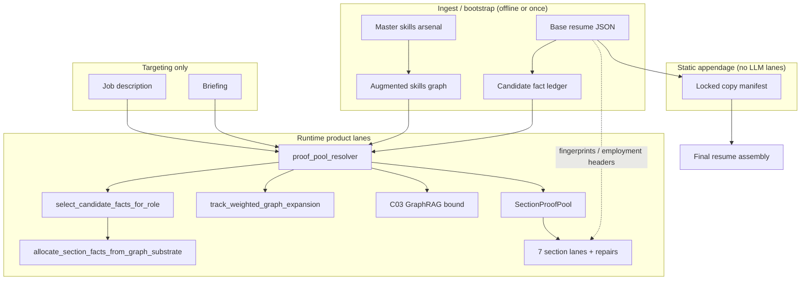
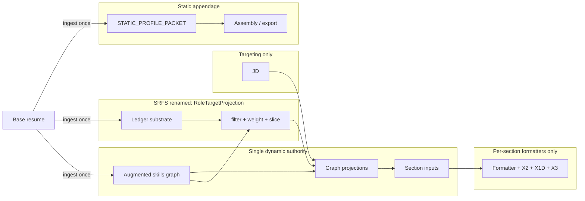

# apps_rg Product Path — Simplification Redesign

**Status:** Architecture / design only (no implementation in this document)  
**Generated:** 2026-05-21  
**Scope:** `apps_rg/` product runtime; **no** `agentic_core` changes  
**Inputs:** Code audit, [apps_rg_section_complexity_reduction_audit.md](apps_rg_section_complexity_reduction_audit.md), [section_authority_convergence_audit.py](../../../ops_scripts/apps_rg/section_authority_convergence_audit.py), runtime proof bundle `artifacts/apps_rg/runtime_proofs/full_resume_0e41a1c13cfe/lanes`

---

## Product decisions (locked for this redesign)

| Decision | Implication |
|----------|-------------|
| Skills graph = **single dynamic authority** for generated resume content | All seven LLM lanes select from graph projections, not parallel ledgers |
| Static facts = **immutable appendage** | Education, certifications, identity, InsurTech, EY, early career — pre-materialized, no runtime orchestration |
| Base resume = **ingest/bootstrap only** | Structural SSOT for locked copy + fingerprints; not competing claim proof at runtime |
| No duplicate truth systems | One claim substrate (ledger), one skills SSOT (arsenal/graph), one selection projection (SRFS), one static packet |
| JD = **targeting signal only** | Never proof authority |
| SRFS = **deterministic projection** from graph/ledger substrate | Not independent runtime authority |

---

## 1. Current complexity map

### 1.1 Authority layers (as-implemented today)



**Observed tension:** Runtime already **labels** pools `augmented_skills_graph` with `srfs_present=False`, but selection still runs through `select_candidate_facts_for_role` (SRFS naming, slice gates, metadata helpers for four deprecated `proof_pool_type` values). Executive summary adds C03 + track expansion + evidence capsule paths that assume legacy SRFS pool typing.

### 1.2 Per-section machinery (LOC / module count)

| Section | Runtime modules (tagged) | Approx LOC | Repair modules | Authority divergence |
|---------|--------------------------|------------|----------------|----------------------|
| headline | 6 | ~3,245 | 0 (+ LLM format loops) | Graph pool + base resume tokens |
| executive_summary | 16 | ~9,336 | 4 (+ graph-only quality) | Richest stack: C03, track expansion, capsule (SRFS-gated), SRFS repair family |
| competencies | 14 | ~5,856 | 1 (+ capability projection) | Track-weighted graph only; heavy post-LLM projection |
| unify_bullets | 5 | ~2,187 | 0 (+ metric Qwen repair) | Graph + forbidden base hydration |
| unify_narrative | 5 | ~2,014 | 0 (+ companion repair) | Graph + companion bullets context |
| ibm_bullets | 5 | ~2,041 | 0 | Same as unify_bullets pattern |
| ibm_narrative | 9 | ~2,703 | 1 | runtime + execution split |

**Cross-cutting duplication:** 7 lanes × (contract + product_shape + lane_registry + lane + x2 + x1d + dispatch PA shim) ≈ mini-spine each; 50–78 proof files per lane vs 4–5 gate release artifacts.

### 1.3 Static vs dynamic fact handling

| Fact class | Current path | Dynamic at runtime? |
|------------|--------------|---------------------|
| Education, certifications | `locked_copy_manifest` → `build_locked_sections` from base JSON | **No** (correct) |
| InsurTech, EY, early career | Same locked-copy pipeline | **No** (correct) |
| Company names, titles, dates, locations | Locked manifest slices | **No** (correct) |
| Identity / contact / export merge | `resume_export_enrich.py` verbatim from base at DOCX | **No** (correct) |
| Prior resume variants → ledger | `c0/prior_resume_variant_extractor.py`, `c02_evidence_fetch.py` | **Yes (pre-runtime ingest)** — not product lane proof |
| Generated story bullets | Graph allocation + LLM | **Yes** (intended) |

**Residual complexity:** C0 prior-variant ingest still **feeds** ledger enrichment for education/cert headers; product lanes do not LLM-generate static sections, but ingest pipeline is a **second path** into claim substrate that operators must understand.

---

## 2. AUTHORITY_MATRIX

| Source | Used by sections | Proof role | Runtime role | Duplicative with | Verdict |
|--------|------------------|------------|--------------|------------------|---------|
| **Augmented skills graph** (`master_skills_arsenal_ledger.json` + graph nodes/edges) | All 7 generated lanes | **Canonical claim/skills proof** (`proof_source=augmented_skills_graph`) | Pool builder, allowed_fact_ids, X2 `x2_gate_graph_only_proof_pool` | — | **KEEP** (sole dynamic authority) |
| **Candidate fact ledger** | All lanes (via resolver) | Claim text substrate, trace/archive refs; **not** skills SSOT | Loaded for `select_candidate_facts_for_role` + claim indexes | Graph (skills rows supersede ledger for skills) | **KEEP** as substrate only; **MERGE** docs to say "substrate not authority" |
| **SRFS / `select_candidate_facts_for_role`** | All lanes (inside allocation); exec arsenal slice | **Selection projection** → `selected_fact_plan`; gates still named `srfs_*` | `section_graph_skills_proof_pool.allocate_*` calls SRFS selector; metadata `selected_role_fact_set_used: False` | Graph (same facts, dual naming) | **MERGE** into `GraphProjection` API; **KILL** standalone SRFS pool type at runtime |
| **Base resume JSON** | All lanes (load); bullet lanes (fingerprints); locked copy | **Not** claim proof for story lanes (`base_resume_claim_authority: false`) | Employment headers, hydration **forbidden**, comparison for verbatim detection | Locked copy (overlapping facts) | **KEEP** bootstrap only; **KILL** `base_resume_fallback` proof path |
| **Broad skills ledger** (env `APPS_RG_BROAD_SKILLS_LEDGER_PATH`) | Deprecated branches in resolver | Was skills authority; now blocked | Metadata helpers only; `legacy_broad_skills_ledger` flag rejected | Graph | **KILL** runtime branches + metadata factories |
| **SRFS proof pool type** (`selected_role_fact_set`) | Exec evidence capsule (enabled only when `proof_pool_type == selected_role_fact_set`) | Legacy prompt packet | **Off** on live graph path (`executive_summary_evidence_capsule._capsule_enabled` L65–66) | INPUT_AUTHORITY block | **KILL** pool type; **MERGE** capsule into graph projection prompt block |
| **Base resume fallback** | X2 gates reference; metadata helpers | Forbidden for product | `base_resume_fallback_used=False` always on graph path | Graph | **KILL** |
| **Master skills arsenal** (raw) | Via graph loader | Graph construction SSOT | Not directly read by lanes | Graph file | **KEEP** as build input; not runtime alternate |
| **JD / briefing** | All lanes | Targeting / weighting only | `target_company`, `target_role`, `jd_text`, `briefing_text` into selector | — | **KEEP** (targeting only) |
| **Locked copy manifest** | Final assembly, X2 locked equality | Deterministic proof for static sections | Built once from base; no LLM | Base resume | **KEEP**; promote to **STATIC_PROFILE_PACKET** |
| **C03 GraphRAG bound** | executive_summary (primary), competencies (native enrich) | Graph extension, not separate authority | `build_executive_summary_c03_graphrag_bound` | Track expansion | **KEEP** as projection modifier |
| **Track-weighted graph expansion** | competencies, executive_summary | Role-family weighting on graph | `build_track_weighted_expansion` | SRFS slice for competencies | **KEEP** as projection modifier |
| **Executive evidence capsule** | executive_summary only | Prompt compaction | Gated on dead SRFS pool type | `input_authority_prompt_block` | **MERGE or DELETE** |
| **Competencies capability projection** | competencies | Post-LLM synonym repair | 848 LOC repair stack | X2 term support gates | **MERGE** into deterministic formatter + X2 only |
| **Canonical hydration** (IBM/Unify) | ibm/unify bullets when thin pool | Was fallback paste | **Forbidden** under graph (`graph_story_authority`) | Graph allocation | **DELETE** modules after graph allocation proven sufficient |
| **Companion lane context** | unify/ibm narrative | Narrative coherence | Loads prior bullets lane output | — | **KEEP** (formatter constraint, not authority) |
| **Section-local LLM repairs** | headline, exec, bullets, competencies | Quality loops pre/post X2 | Multiple Qwen repair paths | X2/X1D | **DELETE** aggressive; keep ≤1 regen flag in section_spec |

---

## 3. Root causes

1. **Authority migration incomplete (P2 graph-only declared, P1 shapes remain)**  
   `proof_pool_resolver.py` header states graph-only (L3–9), yet imports four `proof_pool_type` metadata builders and retains `_allocate_from_ledger`, `_build_competencies_ledger_plan`, and `PROOF_SOURCE_*` constants for deprecated paths.

2. **SRFS named as both file artifact and selection function**  
   `fact_inventory/selected_role_fact_set.py` performs selection; `runtime/sections/selected_role_fact_set.py` duplicates helpers; X2 gates still reference `srfs_source_fact_slice_gate_active` and `proof_source in ("srfs", "broad_skills_ledger")` in bullet validators — vocabulary implies parallel authority.

3. **Per-section mini-spines instead of thin formatters**  
   Each lane reimplements: proof load, FEC bridge, one-spine certification, PA compile, repair policy, X2 mirror quality, companion wiring. Executive summary and competencies accumulated the most compensating layers after gate failures.

4. **Executive summary dual prompt authority**  
   `INPUT_AUTHORITY` (`input_authority_prompt_block.py`) vs `executive_summary_evidence_capsule.py` (SRFS-only enablement) vs token budget policy — three encodings of the same allowed_fact_ids story.

5. **Competencies confounded graph proof with phrase-extraction repair**  
   Graph path is correct (`competencies_graph_skills_proof_pool.py`); `competencies_capability_projection.py` (+ bullet_restatement LLM) reintroduces a second quality system after generation.

6. **Base resume still loaded everywhere**  
   Necessary for locked copy and employment headers, but loaders and hydration modules blurred bootstrap vs proof; graph_story_authority had to add explicit forbid paths.

7. **Rigor registry drift**  
   `lane_registry` critical gates ⊄ production `x2_gate_outputs.json` — operators chase ghost gates; complexity audit shows 5–8 rigor-only gates per section.

8. **C0 ingest as hidden substrate mutator**  
   Prior resume variants can enrich ledger (including education/cert extraction) outside the graph-first mental model — not wrong, but undocumented as pre-runtime-only.

---

## 4. Target simplified architecture

### 4.1 Canonical model



### 4.2 STATIC_PROFILE_PACKET (new SSOT shape)

Bound **once at ingest** (same content as today’s locked copy, unified name):

```json
{
  "packet_version": "static_profile_v1",
  "identity": { },
  "education": [ ],
  "certifications": [ ],
  "immutable_credentials": [ ],
  "locked_employment_blocks": {
    "insurtech": { },
    "ey": { },
    "early_career": { }
  },
  "structural_facts": {
    "company_names": [ ],
    "titles": [ ],
    "locations": [ ],
    "dates": [ ]
  },
  "source": {
    "base_resume_json_ref": "...",
    "base_resume_json_hash": "..."
  }
}
```

**Rules:** No runtime retrieval orchestration; lanes **must not** read base resume for claim proof; assembly reads packet only.

### 4.3 Graph node taxonomy (target)

| Node family | Examples | Section consumption |
|-------------|----------|---------------------|
| skills | skill rows, clusters | competencies, headline tokens |
| experiences | employment blocks | narrative headers (structural only from static) |
| accomplishments / metrics | quantified outcomes | bullets, exec summary |
| responsibilities | role scope claims | bullets, narratives |
| domain / governance / leadership / commercial | evidence tags | exec summary, competencies weighting |
| static_profile_refs | pointers into STATIC_PROFILE_PACKET | forbid LLM rewrite of refs |

### 4.4 Section inputs (uniform contract)

Every generated section receives:

```python
@dataclass
class SectionGraphInput:
    section_id: str
    projection: RoleTargetProjection  # today’s SRFS output, renamed
    allowed_fact_ids: frozenset[str]
    fact_lines: list[FactLine]  # deterministic render from projection
    targeting: TargetingContext  # JD, briefing, title, company — not proof
    static_profile: StaticProfilePacket  # read-only refs for validators only
```

| Section | Graph projection | Formatter-only differences |
|---------|------------------|----------------------------|
| headline | skill + metric slice, high confidence | length, claim ledger shape |
| executive_summary | exec slice + C03 bound + track expansion | sentence count, no credential dump |
| competencies | track-weighted skill **clusters** | category taxonomy, term support class |
| unify_bullets | company-hinted accomplishment slice | 5–7 bullets, mechanism distribution |
| unify_narrative | companion-aware narrative slice | paragraph, metric bundle from companion |
| ibm_bullets | same pattern as unify | IBM canonical bullet IDs |
| ibm_narrative | same pattern as unify | IBM employment header from static |

**Rule:** No section invents its own sourcing model — only `section_spec.formatter` + `section_spec.x2_gates` differ.

### 4.5 SRFS reframe

| Today | Target |
|-------|--------|
| `SelectedRoleFactSet` file artifact | Optional **offline receipt** (`role_target_projection.json`) for audit |
| `select_candidate_facts_for_role` | `project_graph_for_target(...)` — deterministic filter of graph+ledger |
| `proof_pool_type: selected_role_fact_set` | **Removed** |
| `srfs_present` flag on pool | **Removed** — always projection from graph |
| X2 `srfs_*` gate names | Renamed `projection_*` or folded into `allowed_fact_ids` gate |
| Exec SRFS repair modules | **Deleted** (already release-disabled) |

SRFS **must not** appear in prompt as authority label; prompts cite `allowed_fact_ids` from projection only.

### 4.6 Competencies target path

```
graph skill clusters
  → role weighting (track_weighted_graph_expansion)
  → deterministic selector (top-N per cluster, no LLM sourcing)
  → minimal formatter (category labels from taxonomy YAML)
  → LLM wording only (optional, single pass)
  → X2 term_supports_graph (no bullet_restatement LLM)
```

**Delete:** `competencies_capability_projection` as repair authority; `bullet_restatement_repair`; deprecated `_build_competencies_ledger_plan`.

### 4.7 Executive summary target path

```
graph exec projection (same authority as bullets)
  → formatter constraints (4–5 sentences, credential deferral)
  → INPUT_AUTHORITY block only (merge capsule)
  → optional single synthesis regen (section_spec flag)
  → X2 / X1D / X3
```

**Delete:** evidence capsule SRFS gate, SRFS emergency/judge-safe/density repair, `exec_summary_graph_only_quality` parallel rewrite, duplicate declarative contract YAML.

### 4.8 Base resume demotion

| Allowed | Forbidden |
|---------|-----------|
| Ingest → ledger + graph + STATIC_PROFILE_PACKET | `base_resume_fallback` proof pool |
| Fingerprint compare in X2 (verbatim bullet detection) | `hydrate_*_from_canonical_resume` |
| Load employment **headers** for narratives (fact_ids from static) | `base_resume_claim_authority: true` |
| Locked copy builder at ingest | LLM reads base resume bullets as evidence |

---

## 5. Concrete delete list

### 5.1 DELETE (aggressive — no replacement)

| Item | Path / symbol | Rationale |
|------|---------------|-----------|
| Broad skills ledger authority | `proof_pool_resolver._allocate_from_ledger`, `broad_skills_ledger_proof_pool_metadata` | Superseded by graph; env override legacy |
| Base resume fallback proof | `PROOF_SOURCE_BASE_RESUME_FALLBACK`, `base_proof_pool_metadata` | Fail-closed graph policy |
| SRFS pool type at runtime | `srfs_proof_pool_metadata`, `proof_pool_type: selected_role_fact_set` in live path | Projection only |
| IBM/Unify canonical hydration | `ibm_canonical_hydration.py`, `unify_canonical_hydration.py` | Forbidden under graph_story_authority |
| Exec SRFS repair stack | ~~`exec_summary_srfs_emergency_finalizer.py`~~, ~~`exec_summary_srfs_density_repair.py`~~ (removed W2); `exec_summary_srfs_judge_safe.py` opt-in only | W2 burndown: density + emergency deleted; judge_safe behind release flag |
| Duplicate declarative contracts | `prompt_assembly/section_contracts/*_contract.yaml` (3 files) | Fold into `section_prompt_contracts/*.contract.yaml` |
| Dispatch PA shims | `runtime/dispatch/*_pa.py` (5-line re-exports) | Import from `sections/*_pa` directly |
| Competencies ledger plan | `_build_competencies_ledger_plan` | Marked deprecated in resolver |
| Headline LLM format repair loops | `headline_format_repair`, `headline_proof_shape_retry_llm` | X2 fail + ≤1 regen |
| Competencies bullet_restatement LLM | competencies lane repair | X2-only quality |
| `competencies_rigor.py` | constants triplicating X2 + product_shape | Single SSOT |
| Ghost rigor gates | lane_registry entries not in `x2_gate_outputs.json` | Align or remove |

### 5.2 MERGE (collapse into shared seam)

| From | Into |
|------|------|
| `competencies_lane_runtime.py` + `competencies_lane_execution.py` | `section_lane_runner` + `competencies_formatter` |
| `ibm_narrative_lane_runtime.py` + `ibm_narrative_lane_execution.py` | same runner |
| `executive_summary_composition.py`, `evidence_capsule.py`, `proof_bundle.py` | `executive_summary_formatter` hooks in section_spec |
| `executive_summary_evidence_capsule` | `input_authority_prompt_block` graph projection packet |
| `fact_inventory/selected_role_fact_set.py` + `runtime/sections/selected_role_fact_set.py` | `graph_projection.py` (inventory + runtime) |
| `competencies_capability_projection` (repair) | Deterministic pre-X2 normalizer ≤100 LOC or inline in X2 |

### 5.3 KEEP (with rename / narrow scope)

| Item | Narrowing |
|------|-----------|
| `proof_pool_resolver.py` | Single entry: `resolve_graph_projection(section_id, targeting)` |
| `graph_story_authority.py` | Product invariant enforcer |
| `section_graph_skills_proof_pool.py` | Generic allocation (rename SRFS call inside) |
| `competencies_graph_skills_proof_pool.py` | Competencies-specific expansion only |
| `locked_copy_manifest.py` | Becomes STATIC_PROFILE_PACKET builder |
| `track_weighted_graph_expansion.py` | Projection modifier |
| C03 bind modules | Projection modifier for exec/competencies |
| Companion context loaders | Formatter dependency, not authority |
| X2 / X1D / X3 per section | Unchanged governance model |

---

## 6. Migration sequence

Recommended **proof-preserving** waves (each wave: unit tests + one full `full_resume_*` lane proof re-run before next).

| Wave | Work | Proof gate |
|------|------|------------|
| **W0 — Documentation & flags** | Land this doc; add `ARCHITECTURE_MODE=graph_only_v2` env; telemetry only | No behavior change |
| **W1 — Metadata hygiene** | Remove dead `proof_pool_type` branches; rename SRFS → `role_target_projection` in metadata; align X2 gate IDs | All existing `x2_gate_graph_only_proof_pool` tests green |
| **W2 — STATIC_PROFILE_PACKET** | Introduce packet builder at ingest; assembly reads packet; lanes stop loading base JSON except fingerprint helper | Locked-section X2 byte match |
| **W3 — Generic section runner** | Collapse competencies + ibm_narrative runtime/execution splits behind runner | Per-section rigor tests |
| **W4 — Executive summary** | Merge INPUT_AUTHORITY; delete SRFS repairs + capsule gate; enable capsule on graph type or delete | `full_resume_*`/executive_summary lane PASS |
| **W5 — Competencies simplification** | Remove capability_projection repair + bullet_restatement; cluster selector only | competencies rigor + `term_supports_resume_or_graph` |
| **W6 — Hydration deletion** | Remove IBM/Unify hydration modules; assert graph allocation ≥ min facts | bullet lanes verbatim-base gates |
| **W7 — Rigor registry align** | lane_registry ⊆ product_shape ⊆ runtime X2 emit | section_complexity audit PASS |
| **W8 — Ingest path doc + optional ledger freeze** | Document C0 prior-variant as pre-runtime; optional ledger version pin | ingest receipt only |

**No `agentic_core` edits** in any wave. App changes stay under `apps_rg/`, `tests/unit/apps_rg/`, `ops_scripts/apps_rg/`.

---

## 7. Risk register

| ID | Risk | Likelihood | Impact | Mitigation |
|----|------|------------|--------|------------|
| R1 | Graph allocation too thin for IBM/Unify bullets after hydration delete | Medium | High (lane fail) | Pre-wave graph min-fact audit; company-hint slice tests |
| R2 | Executive summary quality regression without SRFS repairs | Medium | Medium | Keep ≤1 synthesis regen; X1D unchanged; A/B on `full_resume` bundle |
| R3 | Competencies generic phrases after projection-only path | Medium | Medium | Strengthen X2 `term_supports_graph`; taxonomy cluster floors |
| R4 | Locked static packet drift from base resume | Low | High | Byte-for-byte hash gate on ingest; manifest version bump |
| R5 | X2 gate rename breaks rigor registry / CI | Medium | Low | W1 alias map; dual-emit gate IDs one release |
| R6 | C0 ingest still mutates ledger unexpectedly | Low | Medium | Freeze ledger artifact version per proof run |
| R7 | Proof bundle comparison false FAIL (metadata only) | Medium | Low | Separate `proof_authority_schema_version` field |
| R8 | Operator confusion during SRFS rename | Medium | Low | Receipt docs + `role_target_projection.json` sample |

---

## 8. Proof impact assessment

### 8.1 What must stay PASS (non-negotiable)

- **X2 deterministic gates** per section — no weakening; graph-only proof pool gates remain fail-closed
- **X3 disposition** wiring unchanged
- **Locked deterministic sections** — education, certifications, InsurTech, EY, early career, structural facts (names, titles, locations, dates)
- **`x2_gate_base_resume_story_forbidden`** / verbatim bullet detection for unify/ibm bullets
- **Claim ledger `source_fact_id` ⊆ allowed_fact_ids** for all generated lanes
- **Runtime proof bundle layout** under `artifacts/apps_rg/runtime_proofs/<run_id>/lanes/<section>/` (paths may gain new metadata keys)

### 8.2 Expected proof artifact changes

| Artifact | Change |
|----------|--------|
| `proof_pool_metadata.proof_pool_type` | Always `augmented_skills_graph` or `augmented_skills_graph_c03_graphrag` |
| `srfs_present`, `broad_skills_ledger_*` | Removed |
| `selected_role_fact_set_used` | Replaced by `role_target_projection_used` |
| SRFS JSON sidecar | Optional audit only, not lane-required |
| `executive_summary` prompt trace | Single INPUT_AUTHORITY block; smaller token footprint |
| Competencies output | Fewer post-hoc repair receipts; cleaner `change_log` |

### 8.3 Tests to touch per wave

| Wave | Test surfaces |
|------|----------------|
| W1 | `test_graph_story_authority.py`, `test_section_authority_*`, bullet X2 SRFS slice tests |
| W2 | `final_resume_x2` locked manifest, `locked_copy_*` |
| W3 | `test_competencies_v3_e2e_hardening.py`, `section_rigor/lanes/test_*` |
| W4 | `test_exec_summary_srfs_*` (delete or rewrite), `test_executive_summary_prompt_ssot.py` |
| W5 | `test_competencies_rigor_x2.py`, capability projection tests |
| W6 | `test_ibm_canonical_hydration_graph.py`, `test_unify_canonical_hydration_graph.py` |
| W7 | `test_section_prompt_product_shape_drift.py`, `gate_coverage_registry.py` |

### 8.4 Proof law compliance

| Constraint | Assessment |
|------------|------------|
| No new fallback authority paths | ✅ Deletes fallbacks; graph fail-closed retained |
| JD not proof | ✅ Unchanged — targeting inputs only |
| No agentic_core changes | ✅ Scoped to apps_rg overlay |
| Do not weaken gates | ⚠️ Requires discipline in W5–W7 — replace repair with harder X2, not gate removal |
| Canonical runtime proof model | ✅ `full_resume_*` bundle remains acceptance harness |

### 8.5 STATUS for this deliverable

**STATUS: PARTIAL** — Architecture document complete; implementation proof not claimed.

**FILES_CHANGED:**
- [SIMPLIFICATION_REDESIGN.md](docs/reports/apps_rg/SIMPLIFICATION_REDESIGN.md)

**COMMANDS_RUN:** None (design-only per user request)

**TESTS_GATES:** None (design-only)

**ARTIFACTS:**
- [SIMPLIFICATION_REDESIGN.md](docs/reports/apps_rg/SIMPLIFICATION_REDESIGN.md)

**NOTES:**
- Runtime already enforces `augmented_skills_graph` as product proof; redesign mainly **removes legacy naming, parallel modules, and per-section mini-spines** that survived migration.
- Prior audit: [apps_rg_section_complexity_reduction_audit.md](apps_rg_section_complexity_reduction_audit.md) — use as W7 checklist input.

---

## Appendix A — Key file index

| Concern | Path |
|---------|------|
| Proof resolution SSOT | [proof_pool_resolver.py](../../apps_rg/runtime/proof_pool_resolver.py) |
| Graph-only enforcement | [graph_story_authority.py](../../apps_rg/runtime/sections/graph_story_authority.py) |
| Generic graph allocation | [section_graph_skills_proof_pool.py](../../apps_rg/runtime/section_graph_skills_proof_pool.py) |
| Competencies graph pool | [competencies_graph_skills_proof_pool.py](../../apps_rg/fact_inventory/competencies_graph_skills_proof_pool.py) |
| SRFS selection (inventory) | [selected_role_fact_set.py](../../apps_rg/fact_inventory/selected_role_fact_set.py) |
| SRFS helpers (runtime) | [selected_role_fact_set.py](../../apps_rg/runtime/sections/selected_role_fact_set.py) |
| Locked static sections | [locked_copy_manifest.py](../../apps_rg/runtime/locked_copy/locked_copy_manifest.py) |
| Exec evidence capsule (legacy gate) | [executive_summary_evidence_capsule.py](../../apps_rg/runtime/sections/executive_summary_evidence_capsule.py) |
| INPUT_AUTHORITY prompts | [input_authority_prompt_block.py](../../apps_rg/runtime/dispatch/input_authority_prompt_block.py) |
| Section complexity audit | [apps_rg_section_complexity_reduction_audit.md](apps_rg_section_complexity_reduction_audit.md) |

## Appendix B — Dynamic static-fact work to eliminate

| Location | Behavior | Target |
|----------|----------|--------|
| `c0/prior_resume_variant_extractor.py` | Scans variants → ledger rows for education/certs | Pre-runtime ingest only; document; no lane reads |
| `c0/c02_evidence_fetch.py` | Fetches variant evidence | Same |
| `resume_export_enrich.py` | DOCX-time merge from base | Read STATIC_PROFILE_PACKET only |
| Any lane `load_base_resume()` for claim text | Still present in lanes | Restrict to fingerprint + static refs |

---

*End of redesign document.*
