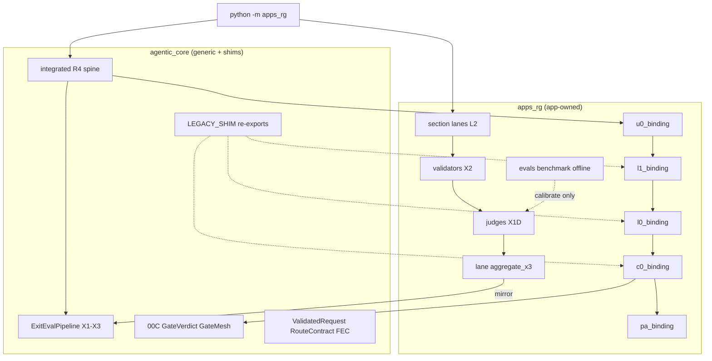

# apps_rg ↔ agentic_core Binding Overlap Review

**Generated:** 2026-05-22  
**Scope:** L0, L1, L2, Evals, Exit (X1–X3) — roles and responsibilities when `apps_rg` binds to `agentic_core`  
**Status:** W-A critical binding hardening **COMPLETE** (2026-05-22) — see [closeout receipt](apps_rg_binding_hardening_critical_closeout_receipt.md) and [plan](.cursor/plans/apps-rg-agentic-core-binding-hardening-b7e3f1.md). Waves W-B..W-E remain deferred.  
**Audience:** Binding remediation planning, one-spine convergence, substitute burndown follow-on

---

## Executive summary

Binding confusion comes from **three parallel stories** that are only partly documented:

1. **Canonical app bindings** live under `apps_rg/runtime/bindings/` (L0, L1, C0, PA, L2, Exit).
2. **Legacy shims** in `agentic_core` still re-export those bindings (`*_apps_rg_*_binding.py`) with `LEGACY_SHIM` markers.
3. **Two runtime paths** — section CLI lanes vs integrated R4 spine — use different Exit/X2/C0 surfaces ([one_spine_inventory.py](../../apps_rg/runtime/one_spine_inventory.py), [section_spine_terminology.py](../../apps_rg/runtime/section_spine_terminology.py)).

Until shims are removed and one import/disposition SSOT is enforced, engineers cannot tell whether they are on **spine Exit** (`ExitEvalPipeline`) or **lane Exit** (`aggregate_x3` + mirror receipts).

### Spine law (reference)

| Layer | apps_rg owns | agentic_core owns |
|-------|----------------|-------------------|
| L0 route policy | `route_profiles.yaml`, `l0_binding` | Generic route interpreter, contracts |
| L1 planning | `l1_binding` (deterministic plan) | `L1PlanContract` shape |
| L2 body execute | Section lanes + Qwen/vLLM (default product) | Gateway/healers, integrated executor |
| Evals | Offline benchmark + runtime X1D judges | `ExitEvalPipeline` (spine X1–X3), generic judge gateway |
| Exit X3 | Lane disposition + app exit gates | Exactly one spine X3 per integrated run |

See also: [apps_rg_canonical_runtime_boundary.md](../agent_inventory/apps_rg_canonical_runtime_boundary.md), [agentic_core/AGENTS.md](../../agentic_core/AGENTS.md).

---

## Issues by layer

| Layer | Issue ID | Overlap / confusion | Evidence | Proposed remediation |
|-------|----------|---------------------|----------|-------------------|
| **L0** | L0-1 | **Dual import surface** — canonical `l0_route_apps_rg` in app binding; core shim re-exports with `DeprecationWarning` on every call. | [l0_binding.py](../../apps_rg/runtime/bindings/l0_binding.py), [apps_rg_l0_binding.py](../../agentic_core/L0_routing/apps_rg_l0_binding.py) | CI import-lint: forbid new imports from `agentic_core.L0_routing.apps_rg_l0_binding`. Delete shim after zero callers. SSOT: `apps_rg.runtime.bindings.l0_binding` only. |
| **L0** | L0-2 | **Generic vs app route interpreter** — `package_driven_l0_binding` (core) vs profile-driven `route_profiles.yaml` (apps_rg). Unclear which path integrated spine vs `--section` lanes use. | [package_driven_l0_binding.py](../../agentic_core/L0_routing/package_driven_l0_binding.py), [route_profiles.yaml](../../apps_rg/config/domain_contract/route_profiles.yaml) | Trace both paths in one diagram. Wire integrated spine to U0 package `route_profile` ref; keep section lanes on app binding until parity. |
| **L0** | L0-3 | **Prerequisite gate in core** — `apps_rg_prerequisite_gate` under core L0 while route policy is app-owned. | [apps_rg_prerequisite_gate.py](../../agentic_core/L0_routing/gates/apps_rg_prerequisite_gate.py) | Move gate policy to `apps_rg/config/domain_contract/`; core keeps generic evaluator only. Migration receipt in `artifacts/governance/migration_receipts/`. |
| **L1** | L1-1 | **Same shim pattern as L0** — `l1_plan_apps_rg` canonical in app; core `apps_rg_l1_binding` is re-export only. | [l1_binding.py](../../apps_rg/runtime/bindings/l1_binding.py), [apps_rg_l1_binding.py](../../agentic_core/L1_cognition/apps_rg_l1_binding.py) | Lint + delete core shim. Single symbol: `apps_rg.runtime.bindings.l1_binding.l1_plan_apps_rg`. |
| **L1** | L1-2 | **Ingress contract location** — `ValidatedRequest` under `agentic_core.runtime.contracts.apps_rg_ingress_payload` while U0 validation is app-owned. Reads as “core owns apps_rg intake.” | [apps_rg_ingress_payload.py](../../agentic_core/runtime/contracts/apps_rg_ingress_payload.py), [u0_binding.py](../../apps_rg/runtime/bindings/u0_binding.py) | Move payload types to `apps_rg/schemas/` **or** document as cross-app DTO only (no resume logic in core). Contract test: L1 never imports L2/C0/PA. |
| **L1** | L1-3 | **Advisory vs authoritative routing** — L1 emits `route_hints`; L0 emits `RouteContract`. Easy to treat L1 hints as route authority. | [l1_binding.py](../../apps_rg/runtime/bindings/l1_binding.py) | Add `authority_class: ADVISORY_ONLY` on L1 receipts. Test: no gate reads `route_hints` without L0 `RouteContract`. |
| **L2** | L2-1 | **Two L2 execution owners** — Section lanes call apps_rg Qwen/vLLM; integrated spine uses core `L2_execution` + adapters. Docs say core L2 is “gateway/health only” but bindings exist both sides. | [apps_rg_canonical_runtime_boundary.md](../agent_inventory/apps_rg_canonical_runtime_boundary.md), [one_spine_inventory.py](../../apps_rg/runtime/one_spine_inventory.py) | Binding matrix: **Product body L2 = apps_rg sections**; **Spine L2 = core executor + app adapter**. Retire `l2_envelope_adapter` from product path. |
| **L2** | L2-2 | **Thin re-export stack** — `l2_binding.py` → `l2_binding_adapter` → core healers. Hard to see precheck vs generation vs seal. | [l2_binding.py](../../apps_rg/runtime/bindings/l2_binding.py) | Collapse to one module with phases: `precheck`, `execute`, `seal`. No new app logic in `agentic_core/L2_execution`. |
| **L2** | L2-3 | **AG-2 wiring imports core shims** — `apps_rg_dispatch.run_ag2_retrieval_and_prompt` uses `agentic_core...apps_rg_c0_binding` / `apps_rg_pa_binding`. | [apps_rg_dispatch.py](../../agentic_core/runtime/entry/apps_rg_dispatch.py) | Point integrated entry at `apps_rg.runtime.bindings.c0_binding` / `pa_binding`; deprecate shims one release, then delete. |
| **L2** | L2-4 | **Healers at app edge** — e.g. `vllm_health_probe` from `agentic_core.L2_execution.healers` in apps_rg restart helper. | [qwen_vllm_docker_restart.py](../../apps_rg/runtime/qwen_vllm_docker_restart.py) | Document as generic infra **or** wrap in `apps_rg/runtime/providers/health.py`. |
| **Evals** | EV-1 | **Three “evaluation” layers** — (1) `apps_rg/evals/section_quality_benchmark` offline; (2) `runtime/judges/*_x1d.py` runtime semantic; (3) `L3_orchestration/exit_eval` spine X1–X3. Names collide. | [evals README](../../apps_rg/evals/section_quality_benchmark/README.md), [exit_eval/](../../agentic_core/L3_orchestration/exit_eval/) | Glossary doc: Benchmark evals / X1D judges / Exit eval pipeline. |
| **Evals** | EV-2 | **Resume judges still in core** — `resume_judges/executive_positioning.py` flagged MOVE to apps_rg. | [w1_agentic_core_apps_rg_surfaces_f8e3c1.csv](../../artifacts/apps_rg/boundary_remediation/w1_agentic_core_apps_rg_surfaces_f8e3c1.csv) | Rubric/prompt packs under `apps_rg/config/domain_contract/judges/`; core keeps `llm_judge_gateway` only. |
| **Evals** | EV-3 | **X1D vs lane disposition** — README says X1D not release approval; lanes aggregate X1D+X2 into `aggregate_x3` with `proceed_to_runtime`. | [executive_summary_x3.py](../../apps_rg/runtime/exit/executive_summary_x3.py) | Rename in docs: lane X3 = **lane disposition**, not spine X3. |
| **Evals** | EV-4 | **L5 validators with resume semantics in core** — risk of using L5 as runtime gates. | [agentic_core/AGENTS.md](../../agentic_core/AGENTS.md) | Test: section lanes must not import `L5_safety` for proceed/stop. |
| **Exit** | X-1 | **Three X3 type systems** — `ExitGateVerdict`, `GateVerdict` (00C), section `X3Disposition`, core `ExitEvalPipeline` V6. | [exit_binding.py](../../apps_rg/runtime/bindings/exit_binding.py), [x3_disposition.py](../../agentic_core/runtime/exit/x3_disposition.py) | Receipt field `disposition_authority: spine|lane|binding_helper`. One spine X3 per integrated run (test). |
| **Exit** | X-2 | **Section x3 mirror vs package rollup** — `section_x3_authoritative: False` but `resume_package_disposition` rolls up lane X3 ALLOW. | [section_exit_spine_receipt.py](../../apps_rg/runtime/section_exit_spine_receipt.py), [resume_package_disposition.py](../../apps_rg/runtime/internal/resume_package_disposition.py) | Rollup uses `exit_disposition_receipt.json` when present; lane `x3_disposition.json` for partial runs only. |
| **Exit** | X-3 | **Two Exit paths on section CLI** — Lane: X2 → X1D → `aggregate_x3` → mirror receipts. Integrated: `ExitEvalPipeline` preflight DENY before X1. | [one_spine_inventory.py](../../apps_rg/runtime/one_spine_inventory.py) | Section CLI emits `ExitDispositionReceipt`; `canonical_exit_claimed: true` only when spine consumed receipts. |
| **Exit** | X-4 | **X2 gate enumeration drift** — Rigor registry vs `x2_gate_outputs.json` vs C0 sidecar disagree. | [section_authority_convergence_audit.md](section_authority_convergence_audit.md) | Single `lane_registry` SSOT → test every `rigor_critical` gate in runtime bundle. |
| **Exit** | X-5 | **00C GateMesh absent on section runs** — C0 binding builds `GateVerdict`; section proofs note 00C G01–G29 not in section run. | Runtime proof `spine_subphase_coverage_index.json` | Document: **section X2 ≠ 00C**. Integrated spine runs GateMesh or receipts declare `00C_skipped_reason`. |
| **Exit** | X-6 | **Misleading core comment** — `ExitDispositionEmitter` says apps_rg does not emit exit dispositions; every section lane emits X3 JSON. | [x3_disposition.py](../../agentic_core/runtime/exit/x3_disposition.py) | Fix comment: apps_rg does not emit **spine** X3Disposition; lane files are mirror inputs. |

---

## Cross-cutting binding diagram

---

## Two runtime paths (one-spine)

| Path | Entry | Exit surface | UWG/L4 |
|------|-------|--------------|--------|
| **A — Section CLI** | `python -m apps_rg --section <lane>` | `x3_disposition.json` + optional `exit_disposition_receipt.json` (mirror) | Not invoked |
| **B — Integrated R4** | `python -m apps_rg` (no `--section`) | `ExitEvalPipeline` → spine X3 | UWG when commit path runs |

SSOT: [one_spine_inventory.py](../../apps_rg/runtime/one_spine_inventory.py).

---

## Recommended remediation waves

| Wave | Scope | Outcome |
|------|--------|---------|
| **W-A** | Binding import SSOT | All new code imports `apps_rg.runtime.bindings.*`; delete core `*_apps_rg_*` shims; CI fails on shim imports. |
| **W-B** | Disposition glossary + receipts | `disposition_authority` on artifacts; fix X-6 core comments. |
| **W-C** | One-spine Exit for `--section` | `exit_disposition_receipt.json` authoritative for rollup; lane `x3_disposition.json` mirror-only. |
| **W-D** | X2/rigor convergence | Close [section_authority_convergence_audit.md](section_authority_convergence_audit.md) gaps (X-4). |
| **W-E** | Evals/judge dedup | Move resume judges out of core; clarify offline benchmark vs runtime X1D (EV-1, EV-2). |

---

## What is already healthy (do not regress)

- App-owned bindings under `apps_rg/runtime/bindings/` with explicit cert refs.
- C0 section ownership split — [test_apps_rg_c0_ownership_split.py](../../tests/_apps_contract/test_apps_rg_c0_ownership_split.py).
- Honest one-spine terminology — [section_spine_terminology.py](../../apps_rg/runtime/section_spine_terminology.py).
- W5 vocabulary in [exit_binding.py](../../apps_rg/runtime/bindings/exit_binding.py) (`ExitGateVerdict` ≠ 00C `GateVerdict`).

---

## Related artifacts

| Artifact | Role |
|----------|------|
| [section_authority_convergence_audit.md](section_authority_convergence_audit.md) | X2/rigor drift per section |
| [apps_rg_canonical_runtime_boundary.md](../agent_inventory/apps_rg_canonical_runtime_boundary.md) | Product vs quarantine paths |
| [runtime_substitute_inventory_20260522.md](runtime_substitute_inventory_20260522.md) | Substitute authority burndown |
| [w1_agentic_core_apps_rg_surfaces_f8e3c1.csv](../../artifacts/apps_rg/boundary_remediation/w1_agentic_core_apps_rg_surfaces_f8e3c1.csv) | Core surface classification |

---

## Explicit non-claims

- No live runtime proof was executed to produce this document.
- C0/PA/U0 overlaps exist but are out of scope for this review (see C0 ownership split plan for C0).
- Shim deletion timelines are recommendations only until caller grep + CI gates land.

---

## Review checklist (for you)

- [ ] Confirm W-A shim deletion order (L0/L1/C0/PA/Exit first?)
- [ ] Decide L1-2: move `ValidatedRequest` to apps_rg vs document as shared DTO
- [ ] Prioritize X-4 rigor gates vs W-C Exit receipt authority
- [ ] Link this review to a new `.cursor/plans/` slug if execution is authorized
