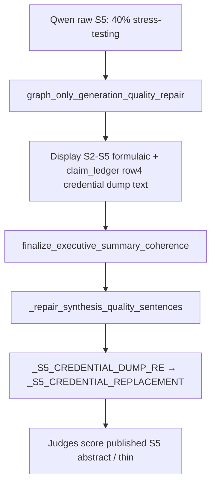

# Executive Summary Regen Voice Repair — W1 Receipt

**Plan:** [exec-summary-regen-voice-repair-unblock-e7c4a2.md](../../.cursor/plans/exec-summary-regen-voice-repair-unblock-e7c4a2.md)  
**Wave:** W1  
**Date:** 2026-05-26

## W1.1 — Trigger chain (baseline run `exec_summary_20260526_213359`)



**Root:** [`executive_summary_voice_repair.py`](../../apps_rg/runtime/sections/executive_summary_voice_repair.py) hardcoded replacements matched judge failure quotes.

## W1.2 — Code changes

| Change | Detail |
|--------|--------|
| Retired `_S5_CREDENTIAL_REPLACEMENT` / `_S6_FORWARD_REPLACEMENT` | Replaced with `build_metric_grounded_s5()` / `build_forward_s6()` |
| Narrowed `_S5_CREDENTIAL_DUMP_RE` | Requires foundation + derivatives + multi-greek + capital/fsa stack |
| Preserve metric S5 | Skip dump rewrite when sentence has `%`/`$` and passes credential-dump check |
| S6 | No `Looking ahead` opener; Basel/lineage grounding from facts |
| Guard | Never emit `capital-markets rigor informs which platform investments` |

## W1.3 — Order

Voice repair runs in `finalize_executive_summary_coherence` **after** `apply_exec_summary_display_authority_repairs` and graph-only quality repair. W1 fix is **post-order safe**: metric preservation and metric-grounded replacements apply regardless of whether graph-only or Qwen authored the display.

## Proof

```bash
PYTEST_DISABLE_PLUGIN_AUTOLOAD=1 python -m pytest \
  tests/unit/apps_rg/test_executive_summary_voice_repair_regen_unblock.py \
  tests/unit/apps_rg/test_executive_summary_voice_repair_synthesis.py \
  tests/_apps_contract/test_apps_rg_executive_summary_voice_repair.py \
  -o addopts= -q
```
