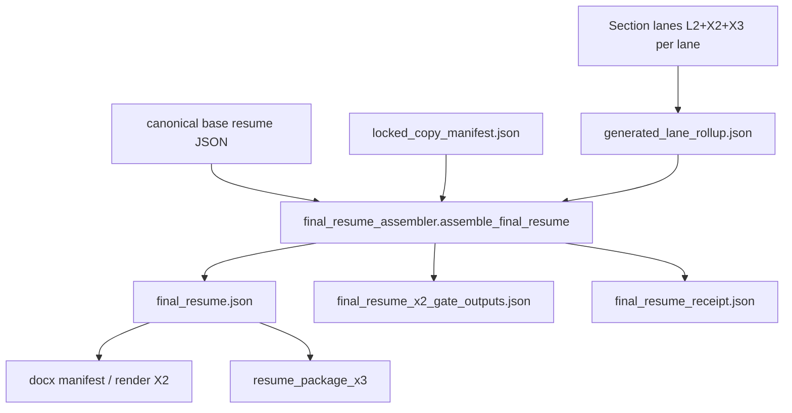

# Final resume aggregation — gap analysis

**Generated:** 2026-05-18T23:16:00Z  
**Scope:** Read-only audit of implemented `apps_rg` final resume aggregation vs target aggregation contract (structural assembly + provenance + overlap + proof survival). No code changes, no `agentic_core` edits, no section prompt changes.

**Target contract references:** [apps_rg_post_section_aggregation_gap_20260517.md](apps_rg_post_section_aggregation_gap_20260517.md), [apps_rg_post_section_aggregation_hardening_20260517.md](apps_rg_post_section_aggregation_hardening_20260517.md), [apps_rg_post_section_aggregation_readiness_audit.md](apps_rg_post_section_aggregation_readiness_audit.md)

**R1B closeout (orthogonal):** [r1b_w7_w12_closeout_manifest.json](r1b_w7_w12_closeout_manifest.json) — semantic cache W7–W12 PASS; does not satisfy resume aggregation contract gaps.

---

## Verdict

**STATUS: PARTIAL**

Deterministic final resume **structural assembly exists** and passes `final_resume_x2` on the current rollup snapshot (`gates_all_pass=True`, `final_resume_hash=35e071b829603b3d5663a6156b86e9248687e6cfcca2f3c4b548d9da7f070d9a`). The implementation **does not** satisfy the full target aggregation contract: no cross-section overlap handling, no aggregate claim-ledger / proof-pool ref survival as first-class refs, no overlap receipt (`kept` / `removed` / `rewritten`), and assembly does not enforce per-lane X2 receipt PASS or blocked X3 before stitch.

This is **not FAIL**: assembly embeds verbatim `l2_output_snapshot` (no claim invention), preserves embedded `jd_alignment.targeting_only`, does not treat JD/briefing as proof at the assembly layer, and does not weaken existing `final_resume_x2` gates. This is **not PASS**: documented contract gaps and thin aggregation-specific test coverage remain.

---

## Canonical aggregation entrypoint

| Entry | Command / module | Role |
|-------|------------------|------|
| **Primary (assembly)** | `python -m apps_rg.runtime.assembly.final_resume_assembler` | `apps_rg/runtime/assembly/final_resume_assembler.py` — writes `artifacts/apps_rg/runtime_proofs/final_resume_assembly/` |
| **Full offline orchestrator** | `python -m apps_rg.runtime.orchestrate_full_resume` | Lanes → rollup → locked copy → assembly → DOCX → `resume_package_x3` |
| **Rollup SSOT** | `python -m apps_rg.runtime.reports.generated_lane_rollup` | `generated_lane_rollup.json` pointer index |
| **Package disposition** | `apps_rg.runtime.package.resume_package_x3` | Whole-resume `final_x3_code` (apps_rg package plane, not spine Exit) |
| **Alternate product path** | `apps_rg.l2_recipe.modular_rg_output_builder` | Integrated `rg_output` — separate grain from `final_resume.json` |
| **SRFS audit only** | `apps_rg.audit.srfs_receipt_aggregator` | Cross-section SRFS structural audit — **not** wired into assembly |

Default assembly inputs (`final_resume_manifest.resolve_default_paths`):

- `artifacts/apps_rg/runtime_proofs/generated_lane_rollup/generated_lane_rollup.json`
- `artifacts/apps_rg/runtime_proofs/locked_copy/locked_copy_manifest.json`
- `apps_rg/resume/base/amit_ayer_base_resume_v1.json` (via active pointer)

---

## Aggregation codepath map



**Assembler behavior (implemented):**

1. Verify `base_resume` sha256 vs `locked_copy_manifest.base_resume_json_hash`.
2. For each id in `CANONICAL_ASSEMBLED_SECTION_ORDER`, either embed **verbatim** `l2_output.json` (generated lanes) or **verbatim** `copied_text` (locked sections).
3. Compute per-section `section_hash` and aggregate `final_resume_hash`.
4. Run `run_final_resume_x2_gates` (structural / provenance only).

**Not implemented on this path:** semantic dedup, cross-section claim merge, aggregate X2 on JD-as-proof, orchestration fingerprint, R1B section cache reads.

---

## Section input matrix

| section_id | kind | rollup resolution | embedded in `final_resume` | `source_artifact_refs` (top-level) |
|------------|------|-------------------|------------------------------|-------------------------------------|
| headline | generated_lane | `latest_successful_real_run.json` → `headline_20260516_130913` | full `l2_output_snapshot` | l2, x2, x1d, x3, l6, rollup |
| executive_summary | generated_lane | `exec_summary_20260516_131111` | full snapshot | same pattern |
| unify_narrative | generated_lane | per rollup | full snapshot | same pattern |
| unify_bullets | generated_lane | per rollup | full snapshot | same pattern |
| ibm_narrative | generated_lane | per rollup | full snapshot | same pattern |
| ibm_bullets | generated_lane | per rollup | full snapshot | same pattern |
| competencies | generated_lane | per rollup | full snapshot | same pattern |
| insurtech, ey, early_career, education, certifications | locked_copy_inline | locked manifest | `copied_text_exact` | locked manifest + base resume |
| company_names, titles, locations, dates | locked invariants | locked manifest | `copied_text_exact` in `locked_copy_invariants` | locked manifest + base resume |

**Rollup note:** All seven generated lanes in the current rollup show `x3_code: X3_REVIEW_JUDGE_PROVIDER_BLOCKED`, `proceed_to_runtime: false`, while `x2_failed: 0` on the **May 16** runs selected by rollup. Latest pointer runs (May 18) can differ — see readiness audit for bullet-lane X2 receipt FAIL on fresher mocks.

---

## Proof source matrix

| Authority | Section lanes (per-run) | Survives in `final_resume.json` | Aggregate re-validation |
|-----------|-------------------------|----------------------------------|-------------------------|
| Canonical base resume | `BASE_RESUME_SOURCE` in usage ledger | Identity block + hash check vs locked manifest | **PASS** (hash gate) |
| SRFS / skills ledger / proof pool | `proof_pool_ref`, `proof_pool_digest` in `section_input_usage_ledger` + `x2_source_fact_pool_receipt` | **Not** as top-level refs; may appear inside embedded L2 `selected_fact_plan` / `claim_ledger` only | **ABSENT** |
| JD text | `TARGETING_INPUT` | `jd_alignment.jd_used_as_proof: false` inside L2 snapshots where present | **ABSENT** at aggregate |
| Briefing | `CONTEXT_INPUT` / non-proof | Not promoted to proof in section X2; not in assembly refs | **ABSENT** at aggregate |
| Claim ledger | `claim_ledger.json`, `canonical_claim_ledger_v2.json` on disk | Rows embedded in `l2_output_snapshot.claim_ledger` | **PARTIAL** (embedded only) |
| Locked copy | manifest `copied_text` | Verbatim inline + invariant gates | **PASS** |

**Cross-section proof pool:** Seven distinct `proof_pool_digest` values across section ledgers (readiness audit). Assembler does **not** bind one orchestration-scoped pool.

---

## JD / briefing targeting-only proof

| Check | Section-level evidence | Aggregate-level evidence |
|-------|------------------------|---------------------------|
| JD not proof | L2 `jd_alignment.jd_used_as_proof: false`, `targeting_only: true` (e.g. headline, ibm_narrative stubs) | Assembler does not ingest JD text; no aggregate gate re-checks JD-as-proof |
| Briefing not proof | Usage ledger: `briefing_research` = `CONTEXT_INPUT`; section X2 families | Not referenced in `final_resume` refs |
| Base resume authority | `base_resume_hash` in usage ledger; X2 allow-lists | `verified_base_resume_hash_matches_locked_manifest: true` in assembled output |

**Gap:** Target contract expects digest coherence for JD/briefing across included lanes at aggregate — **not implemented** (`x2_aggregate_digest_coherence` in hardening blueprint only).

---

## Overlap handling matrix

| Category | Target expectation | Implemented at aggregate | Section-local only |
|----------|-------------------|--------------------------|-------------------|
| Exact duplicate claims | Detect / dedupe with provenance receipt | **ABSENT** | competencies intra-lane dedupe |
| Near duplicate wording | WARN/FAIL deterministic | **ABSENT** | competencies `_structured_terms_near_duplicate` |
| Same claim, different wording | Cross-section budget | **ABSENT** | — |
| Repeated metric across sections | Budget / WARN | **ABSENT** | readiness audit: none ≥3 sections on audited set |
| Unsupported carryover | FAIL if claim ∉ pool | **ABSENT** aggregate | bullet lanes: receipt FAIL on latest mocks (pool vs `bul_*` ids) |
| Section-intent conflict | FAIL/WARN (e.g. narrative vs bullets) | **ABSENT** | unify_narrative X2 n-gram vs companion; ibm L6 overlap notes |

`final_resume_x2` explicitly validates order, snapshot equality, hashes, and artifact refs — **not** semantic overlap.

---

## Claim provenance survival matrix

| Field | In section run dir | In rollup `artifact_refs` | In `final_resume` top-level | In embedded `l2_output_snapshot` |
|-------|--------------------|---------------------------|------------------------------|----------------------------------|
| `section_hash` | — | — | per section | — |
| `section_digest` (named field) | — | — | **ABSENT** (use `section_hash` only) | — |
| `claim_ledger` | yes | **no** | **no** | **yes** |
| `canonical_claim_ledger_v2.json` | yes | **no** | **no** | partial via L2 only |
| `source_fact_ids` | in ledger rows | — | via ledger in snapshot | **yes** |
| `proof_pool_ref` / digest | usage ledger + receipt | **no** | **no** | **no** |
| `section_input_usage_ledger` | yes | **no** | **no** | **no** |
| `x2_source_fact_pool_receipt` | yes | **no** | **no** | **no** |
| X3 disposition path | yes | yes (`x3_disposition.json`) | `disposition_refs` | — |

**Provenance retained** inside embedded L2 JSON; **not** promoted to aggregate sidecar index or hashed refs for claim ledger / proof pool files.

---

## Final aggregation receipt coverage

Current `final_resume_receipt.json` (`final_resume_assembly_receipt_v1`) fields:

- `final_resume_json`, `final_resume_manifest_json`, `final_resume_x2_gate_outputs_json`
- `final_resume_hash`, `gates_all_pass`, `failed_gate_ids`

**Missing vs target contract:**

| Receipt field | Status |
|---------------|--------|
| `kept_claims` | **ABSENT** |
| `removed_claims` | **ABSENT** |
| `rewritten_claims` | **ABSENT** (L2 may contain `change_log` / `removed_or_rewritten_terms` per section inside snapshot only) |
| `overlap_decisions` | **ABSENT** |
| Per-lane claim_ledger digests | **ABSENT** |
| Cross-section X2 gate bundle | **ABSENT** |
| Orchestration fingerprint | **ABSENT** |

---

## X2 / X3 coverage matrix

| Layer | Scope | Present | Gaps |
|-------|-------|---------|------|
| Section X2 | Per lane | yes (files on disk) | Latest mock bullet lanes can FAIL pool membership (readiness audit) |
| `final_resume_x2` | Assembly | 16 gates, all PASS on current run | No blocked-section check; no claim ledger ref gate; no overlap |
| DOCX X2 | Render fidelity | exists (separate modules) | Substring order only, not semantic overlap |
| Section X3 | Per lane | `x3_disposition.json` linked | Rollup lanes REVIEW/BLOCKED not rejected by assembler |
| `resume_package_x3` | Package | `final_x3_code` rollup | Orthogonal to assembly; not run in this audit pass |

**X2/X3 not weakened** by this audit pass (no gate or prompt edits).

---

## Test coverage matrix

| Command | Result |
|---------|--------|
| `python -m compileall apps_rg -q` | exit 0 |
| `pytest tests/unit/apps_rg -k "aggregation or overlap or final_resume or claim_ledger" -q --tb=short` | 5 passed, 6 skipped |
| `pytest tests/_apps_contract -k "apps_rg and (aggregation or overlap or final_resume or claim_ledger)" -q --tb=short` | 9 passed, 1 skipped |
| `git diff HEAD -- agentic_core` | empty |

**Aggregation-specific tests:** `tests/_apps_contract/test_final_resume_assembly.py` — module-scoped; under the `-k` filter only `test_assembler_lives_under_apps_rg_overlay_only` ran. Full assembly tests (artifacts exist, gates pass, section order) require prerequisites and were **not** exercised in the filtered run.

**Missing tests (target):**

- `test_apps_rg_aggregation_run_fingerprint.py` — **ABSENT**
- `test_apps_rg_cross_section_x2.py` — **ABSENT**
- Aggregate negative controls for overlap / em-dash / competency-bullet bleed — **ABSENT**
- Gate: `x2_aggregate_claim_ledger_refs_present_when_lane_emits_ledger` — **ABSENT**

---

## Gap list (ranked)

### P0

1. **No cross-section overlap or dedup engine** at assembly — duplicate metrics/phrasing can pass structural X2.
2. **Final assembly receipt** lacks `kept_claims` / `removed_claims` / `rewritten_claims` / overlap provenance — cannot audit aggregate decisions.
3. **`source_artifact_refs` omit** `section_input_usage_ledger`, `x2_source_fact_pool_receipt`, `canonical_claim_ledger_v2.json` — proof-pool survival not first-class at package boundary.
4. **Assembler does not reject** lanes with failing section X2 pool receipt or blocked X3 when rollup still points at older successful runs.
5. **No `section_digest` field** — only `section_hash`; contract naming/semantics for digest plane not implemented.

### P1

6. **No orchestration run fingerprint** — per-lane `run_id` timestamps can differ (rollup `20260516` vs latest `20260518` mocks).
7. **`apps_rg/runtime/aggregation/`** modules (`cross_section_x2`, `section_sealed_index`, `run_fingerprint`) — **spec only**, not implemented.
8. **Thin pytest surface** for assembly under keyword filters; full `test_final_resume_assembly` module not proven in scoped test run.
9. **Dual output paths** — `final_resume.json` vs modular `rg_output` without single SSOT for downstream consumers.

### P2

10. **`srfs_receipt_aggregator`** — audit-only, not consumed by assembler or package X3.
11. **R1B W7–W12** — PASS for semantic cache lifecycle; **orthogonal** to resume aggregation (no regression, no fix for aggregation gaps).
12. **Package `final_x3_code` vs spine Exit X3** — nomenclature binding documented as risk in prior gap analysis.

---

## Recommended follow-up prompt

> Implement **Option B then A** from [apps_rg_post_section_aggregation_hardening_20260517.md](apps_rg_post_section_aggregation_hardening_20260517.md): add `apps_rg/runtime/aggregation/{run_fingerprint,section_sealed_index,cross_section_x2}.py` with contract tests; extend `final_resume_receipt.json` with overlap/claim decision fields; wire optional `cross_section_x2_gate_outputs.json` beside assembly; add `final_resume_x2` gate to FAIL when pointed lane `x2_source_fact_pool_receipt` is FAIL or `x3` is BLOCK-family; regenerate rollup from a single orchestration pass before assembly proof. Do not modify `agentic_core`, section prompts, or weaken section/assembly X2.

---

## Runtime proof (this audit)

```text
python -m apps_rg.runtime.assembly.final_resume_assembler
→ ASSEMBLY_DONE gates_all_pass=True final_resume_hash=35e071b829603b3d5663a6156b86e9248687e6cfcca2f3c4b548d9da7f070d9a
```

Artifacts: [final_resume.json](artifacts/apps_rg/runtime_proofs/final_resume_assembly/final_resume.json), [final_resume_x2_gate_outputs.json](artifacts/apps_rg/runtime_proofs/final_resume_assembly/final_resume_x2_gate_outputs.json), [final_resume_receipt.json](artifacts/apps_rg/runtime_proofs/final_resume_assembly/final_resume_receipt.json)

---

## Explicit non-claims

- Does not assert product ALLOW or runtime certification.
- Does not assert all latest pointer runs (May 18) are assembly-safe — rollup may reference older runs.
- Does not assert R1B cache hit/miss behavior for resume assembly (R1B is whole-run preflight only; assembly does not call R1B section cache).
- Does not rewrite or regenerate section outputs.
- Does not claim cross-section duplicate-freedom on assembled resume text.

Machine-readable SSOT: [final_resume_aggregation_gap_analysis_manifest.json](final_resume_aggregation_gap_analysis_manifest.json)
