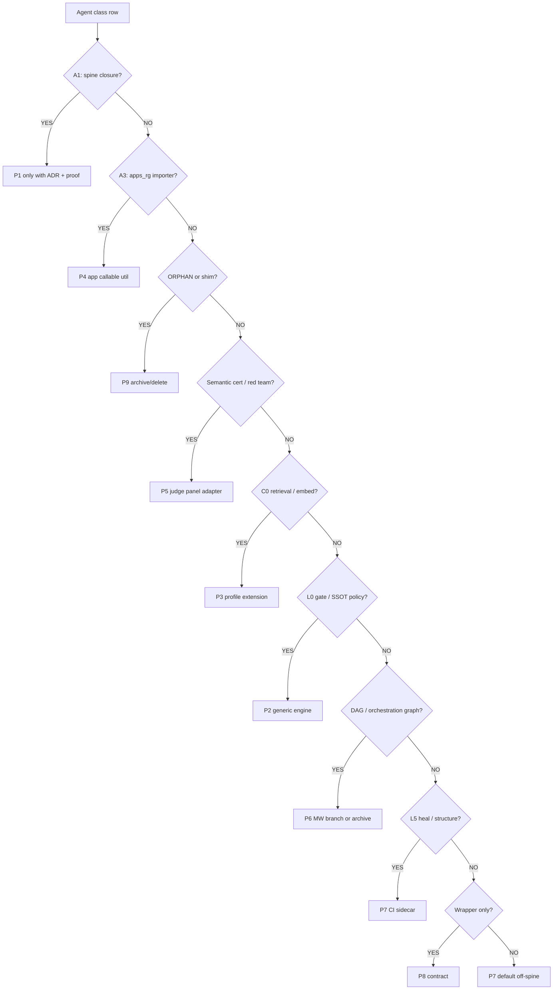

# Agent Capability Decision Model (v1)

**Generated:** 2026-05-25  
**Matrix SSOT:** [agent_capability_decision_matrix.json](agent_capability_decision_matrix.json)  
**Inputs:** [agentic_core_agent_inventory_runtime_assessment.json](../agentic_core_agent_inventory_runtime_assessment.json), [agent_spine_trace_per_agent.json](agent_spine_trace_per_agent.json)  
**Execution plan:** [agent-capability-spine-harvest-e8f4a2.md](../../.cursor/plans/agent-capability-spine-harvest-e8f4a2.md) (harvest-hardened-v3: YAML diff gate, archive-first W1, grep proof set, contract validation, W5 strict status)

---

## Purpose

This model answers: *given 118 `*Agent` classes in `agentic_core`, what are the **only legitimate ways** their capabilities can improve the current product spine and future `apps_*` overlays — without reintroducing a parallel agent runtime on the spine?*

It separates three concepts that the inventory work conflated in conversation:

| Concept | Definition | Current state |
|---------|------------|---------------|
| **Taxonomy inventory** | AST-discovered `*Agent` classes with four axes | 118 rows, CI-enforced |
| **Product spine** | Function graph from `run_integrated_single_action_spine` → Exit | **0** agents in import closure |
| **Capability harvest** | Extract algorithms/policies into engines, profiles, panel adapters, or CI | This model |

**Law (ADR-088):** Registration or class existence does not imply spine invocation. Harvest must target **functions, engines, and profile hooks** — not remounting agent classes.

---

## Decision axes (scoring dimensions)

Each agent row is scored on six axes. The matrix stores the outcome; waves execute changes.

| Axis | Question | Evidence source |
|------|----------|-----------------|
| **A1 Spine reach** | Is the module in transitive spine import closure? | `agent_spine_trace_per_agent.json` |
| **A2 Runtime proof** | Did a live run emit `invoked_class` for this agent? | W3 report, `ARTIFACT_PROVEN=0` |
| **A3 Consumer graph** | Who imports it (prod / ops / test / apps_rg)? | ADG + trace importers |
| **A4 Capability value** | Is there reusable policy/algorithm vs shell? | Code review + subpackage extract (e.g. `file_classification/`) |
| **A5 Substitute maturity** | Does a core substitute already exist? | `runtime/judges/panel/`, route gates, L6 buses, U0 profiles |
| **A6 Refactor cost** | S/M/L/XL by LOC and fan-in | Matrix `loc_estimate`, importer counts |

**Disqualifier:** If A1=NO and A2=NO and A3=ops-only or orphan → default **P9** or **P7**, not P1 spine mount.

---

## Integration patterns (P1–P9)

These are the **only** allowed leverage modes into modern `agentic_core`.

| ID | Pattern | Spine / apps touchpoint | When to use |
|----|---------|-------------------------|-------------|
| **P1** | `SPINE_FUNCTION_EXTENSION` | Extend existing spine **functions** (intake, route gates, L2 executor, Exit) | Rare; requires ADR amendment + A1 proof. **Discouraged** for new agent classes. |
| **P2** | `GENERIC_ENGINE_NEW` | New util/engine under `runtime/`, L0 gates, L6 post-run | Reusable policy without `*Agent` shell (SemanticGatekeeper, MetaLearning observer). |
| **P3** | `PROFILE_EXTENSION` | U0 / C0 retrieval profiles consumed by spine | Embedding/RAG/sovereign retrieval config. |
| **P4** | `APP_OWNED_CALLABLE` | `apps_*` calls core util at validator boundary | IntegrityGate-style typing default in apps_rg. |
| **P5** | `EXIT_JUDGE_PANEL_ADAPTER` | `JudgePanelRunner` + provider adapters | Adversarial/safety **semantic** checks at X3. |
| **P6** | `MANAGED_WORKFLOW_BRANCH` | `managed_workflow_runner` + DAG adjunct | Only if product adopts MW spine branch. |
| **P7** | `CI_OPS_SIDECAR` | ADG, structure scripts, heal reports | L5 heal zoo, FCA cluster, structure enforcers. |
| **P8** | `CONTRACT_ONLY` | ABCs / protocols (`IOrchestratorAgent`, L2 contracts) | Keep interface; delete fat unused impl. |
| **P9** | `ARCHIVE_DELETE` | None | Orphan, shim, duplicate module, zero fan-in. |



---

## Recommendation tiers

| Tier | Count (v1 matrix) | Meaning |
|------|-------------------|---------|
| **TIER_A_HARVEST_NOW** | 6 | Extract to P2/P3 in next harvest wave; high apps payoff |
| **TIER_B_APP_OPTIONAL** | 20 | P4/P5/P6 when product needs; judge panel or MW |
| **TIER_C_CI_ONLY** | 76 | Keep as ops/CI or defer; no spine mount |
| **TIER_D_DELETE** | 16 | Archive/delete (orphans + FCA shell + dead shims) |

### Tier A — immediate harvest candidates

| Agent | Pattern | Substitute target |
|-------|---------|-------------------|
| `SemanticGatekeeperAgent` | P2 | `L0_routing/reasoning/route_gates` policy util |
| `AutonomyGuardianAgent` | P2 | autonomy caps in route profiles |
| `SSOTFolderCleanupAgent` | P2 | SSOT folder gate + `ops_scripts` CI |
| `EmbeddingSovereignAgent` | P3 | C0 retrieval profile + semantic cache |
| `SovereignRAGManager` | P3 | RAG coordinator in profile layer |
| `RedisSovereignAgent` | P3 | cache namespace policy in profile |

### Tier D — delete/archive cluster (13 P9 + 3 contract-fat)

- **12× `ORPHAN_NO_REF`** — no prod importer (see matrix rows).
- **`RootCustomsAgent`** — shim after W2 archive.
- **`FileClassificationHealerAgent`** — extract `file_classification/*` to CI; delete ~5.7k-line agent shell (user must confirm heal scripts unused).

### Special case: File Classification Agent (FCA)

| Layer | Recommendation |
|-------|----------------|
| `FileClassificationAgent.py` (monolith) | **P9** after subpackage extract |
| `file_classification/*` | **P7** → promote rules to ADG/structure CI gates |
| Heal subgraph importers | **P7** only; not spine |

---

## Matrix summary (118 agents)

| Integration pattern | Count |
|---------------------|------:|
| P7 CI/Ops sidecar | 66 |
| P8 Contract only | 13 |
| P9 Archive/delete | 13 |
| P2 Generic engine | 8 |
| P5 Judge panel adapter | 7 |
| P6 Managed workflow | 7 |
| P3 Profile extension | 3 |
| P4 App-owned callable | 1 |

| Spine closure agents | **0** |
| apps_rg-only reference | **1** (`IntegrityGateExecutorAgent`) |

---

## Relationship to other plans

| Plan | Relationship |
|------|----------------|
| [agent-inventory-spine-taxonomy-b4e9f2](../../.cursor/plans/agent-inventory-spine-taxonomy-b4e9f2.md) | **Completed** — taxonomy + W3 proof |
| [agent-inventory-deferred-followup-c2a8f1](../../.cursor/plans/agent-inventory-deferred-followup-c2a8f1.md) | DS-1..DS-5 product proof + moves; **parallel** |
| **agent-capability-spine-harvest-e8f4a2** | Owns harvest model execution (this doc) |

**Non-goal:** Re-litigate taxonomy axes or claim agents "enhance spine" as classes without A1/A2 proof.

---

## Regeneration

```bash
python tools/governance/build_agent_capability_decision_matrix.py
```

Updates [agent_capability_decision_matrix.json](agent_capability_decision_matrix.json).
