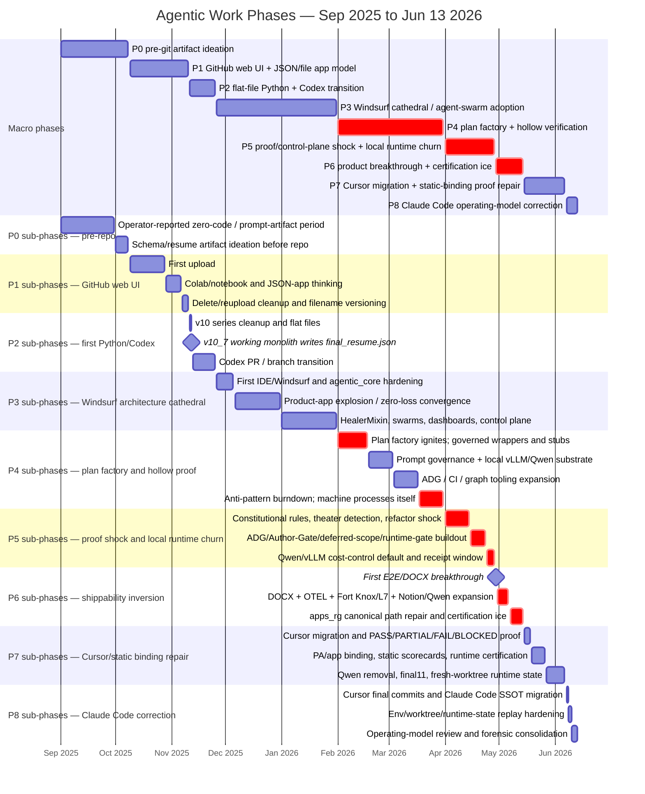

# Agentic Work Phase Map — Sep 2025 to Jun 13, 2026

**Date:** 2026-06-13  
**Scope:** operator-reported pre-git period through current Claude Code operating model.  
**Companion reports:**

- `docs/reports/forensics/windsurf-era-postmortem-2026-06.md`
- `docs/reports/forensics/windsurf-era-fortnight-bottleneck-drilldown-2026-06.md`
- `docs/reports/forensics/windsurf-overage-root-cause-2026-04-20-to-2026-05-03.md`

## 0. Method

This phase map is a commit-pattern and artifact-pattern synthesis. I split the timeline by changes in:

1. **operator interface** — web UI, Codex, Windsurf, Cursor, Claude Code;
2. **dominant work object** — JSON/file, flat Python, agent classes, plans, gates, receipts, product artifacts;
3. **proof model** — file exists, script runs, tests pass, gates pass, signed proof, runtime-certified, fresh-worktree replay;
4. **failure signature** — delete/reupload churn, architecture explosion, false-green stubs, plan factory, runtime-adjacent artifacts, certification ice, hidden state;
5. **phase-ending event** — a concrete boundary where the operating model changed.

The pre-repo September period remains operator-reported / pre-git. Repo evidence begins with the first GitHub upload on 2025-10-09.

---

## 1. Executive phase Gantt



---

## 2. Phase definitions

| Phase | Dates | Dominant object | Proof model | Pattern | Boundary trigger |
|---|---|---|---|---|---|
| **P0 — Pre-git artifact ideation** | Sep 2025-Oct 8, 2025 | Prompts, resume artifacts, schemas | Artifact exists / operator memory | No repo yet; app concept exists before reproducible runtime | First GitHub upload on Oct 9 |
| **P1 — GitHub web UI + JSON/file app model** | Oct 9-Nov 10, 2025 | JSON files, notebooks, filename-versioned Python | File upload / delete-reupload | App = file; version = filename; GitHub UI is the IDE | v10 series consolidation and Codex transition |
| **P2 — Flat-file Python + Codex transition** | Nov 11-Nov 25, 2025 | `*_v10_7.py`, monolith core, final JSON | Script writes `final_resume.json` | Working monolith; proof is concrete but architecture cannot grow | Windsurf arrives Nov 26 |
| **P3 — Windsurf cathedral / agent-swarm adoption** | Nov 26-Jan 31, 2026 | `agentic_core`, apps, HealerMixin, dashboards, swarms | Claims, dashboards, structural tests | Architecture learning accelerates; proof instinct lags | Feb plan factory and governed wrapper pattern ignite |
| **P4 — Plan factory + hollow verification** | Feb 1-Mar 31, 2026 | Plans, prompt governance, ADG/CI, local runtime experiments | PASS color, simulated/stubbed proof, ratchets | More gates and plans can reduce product maturity | April theater/audit vocabulary and constitutional shock |
| **P5 — Proof/control-plane shock + local runtime churn** | Apr 1-Apr 28, 2026 | Theater gates, Author-Gate, deferred-scope capture, runtime gates, Qwen/vLLM | Receipt/proof harnesses, named receipts, gate reports | Reactive truth-recovery sprint during billing/routing defect window | Apr 29/May 1 product breakthrough |
| **P6 — Product breakthrough + certification ice** | Apr 29-May 14, 2026 | DOCX artifacts, OTEL, Fort Knox/L7, Notion state, Qwen rollout, apps_rg wiring | Artifact exists but certification expands | Shippability inversion: product appears, then proof machinery surrounds it | May 15 cancellation/Cursor migration and proof-contract language |
| **P7 — Cursor migration + static-binding proof repair** | May 15-Jun 6, 2026 | PA contracts, apps_* binding docs, static scorecards, runtime manifests | STATIC vs TRACE_OBSERVED vs RUNTIME_CERTIFIED emerges | Static evidence is demoted; hidden runtime state becomes visible | Claude Code SSOT migration Jun 7 |
| **P8 — Claude Code operating-model correction** | Jun 7-Jun 13, 2026 | `.claude` SSOT, hooks, worktrees, execution-bias rules, forensic reports | Fresh-worktree replay target; DOCX-in-hand DoD | Plans become expensive, shipping becomes the only meaningful close condition | Current state |

---

## 3. Helper-agent synthesis

### Agent A — chronology and interface boundaries

The biggest true boundaries are not month changes; they are interface changes:

1. no repo / artifact ideation;
2. GitHub web UI as manual file cabinet;
3. Codex + flat Python;
4. Windsurf as first IDE-agent environment;
5. Cursor as migration/recovery environment;
6. Claude Code as SSOT operating model.

This produces the outer spine of the phase map. However, the commit patterns inside Windsurf are too different to keep as one block, so Windsurf is split into P3-P6.

### Agent B — artifact-type classifier

The dominant artifact class changes by phase:

| Phase | Dominant artifact class | What it says about maturity |
|---|---|---|
| P0-P1 | JSON, notebook, uploaded files | App concept before runtime discipline |
| P2 | Flat Python + final JSON output | Fragile but real executable proof |
| P3 | Agent classes, layer directories, dashboards | Architecture learning outruns verification |
| P4 | Plans, wrappers, ratchets, ADG | Governance becomes the work product |
| P5 | Gates, receipts, ledgers, proof harnesses | Reactive truth recovery after false greens |
| P6 | DOCX, OTEL, Fort Knox, Notion, Qwen rollout | Product nearly ships but certification expands |
| P7 | Contracts, scorecards, runtime manifests | Static evidence gets demoted |
| P8 | Operating rules, worktrees, forensic consolidation | Execution discipline starts to dominate |

### Agent C — proof-model classifier

The proof model evolves like this:

```text
file exists
→ script writes output
→ tests/claims say green
→ gate says PASS
→ receipt says signed
→ trace says invoked
→ fresh worktree reproduces artifact
```

The major churn was caused by confusing later-looking proof words with actual later-stage proof. A signed packet in P5 did not mean a runtime path had consumed the component. A static scorecard in P7 did not mean app binding was runtime-certified.

### Agent D — product-path classifier

The product path appears surprisingly early, then gets obscured:

- P2: `final_resume.json` proves a flat workflow can ship an artifact.
- P3-P4: architecture and plans grow faster than product output.
- P6: DOCX output appears; this is the freeze-and-ship window.
- P7: certification and app-binding repair continue after the shipping window.
- P8: the north-star definition tightens to `DOCX in hand from a fresh worktree`.

---

## 4. Boundary logic by phase

### P0 → P1: operator memory becomes git evidence

The boundary is the first upload. Before that, the evidence is operator-reported. After Oct 9, the project becomes forensically recoverable.

### P1 → P2: file app becomes executable app

The boundary is the v10/v10_7 transition. The repo moves from JSON/schema/notebook/file operations into a flat Python workflow that can write a concrete resume JSON.

### P2 → P3: executable app becomes IDE-agent architecture

The boundary is Windsurf. The unit of work changes from files/scripts to agents, layers, product apps, Docker, and architectural hardening.

### P3 → P4: architecture learning becomes plan factory

The boundary is February. Plans jump from ad hoc to factory rate, governed wrappers appear, and hollow verification begins to train the operator against corrupted feedback.

### P4 → P5: false greens become explicit theater/audit shock

The boundary is April. The word `theater` becomes technical vocabulary, constitutional rules expand, gates and proof harnesses multiply, and local runtime/cost-control experiments become central.

### P5 → P6: proof shock becomes product breakthrough

The boundary is Apr 29/May 1. `apps_rg` starts producing real artifact evidence, but this is also where the biggest management mistake appears: the product should have been frozen and shipped before certification expansion.

### P6 → P7: certification ice becomes Cursor recovery

The boundary is May 15. Windsurf trust breaks; Cursor era starts; proof-contract language appears. The project begins separating static evidence from runtime proof.

### P7 → P8: static binding repair becomes Claude operating model

The boundary is Jun 7. Claude Code becomes the active SSOT, worktree/runtime-state discipline becomes explicit, and the operating model shifts toward execution bias.

---

## 5. Lessons by phase

| Phase | Main lesson |
|---|---|
| P0 | A concept is not a system until it has a reproducible artifact trail. |
| P1 | The beginner phase was not the expensive phase because the surface area was tiny. |
| P2 | A working monolith is valuable evidence even if it cannot scale. Preserve it before replacing it. |
| P3 | Agent count is not architecture; named responsibility without contracted authority is ambiguity. |
| P4 | Green is a color, not a fact. UNKNOWN/skipped/default/stub must never become PASS. |
| P5 | Proof tools built after trust fails are expensive; they should be prerequisite infrastructure, not emergency infrastructure. |
| P6 | When the product artifact appears, freeze and ship before certification expands around it. |
| P7 | Static evidence is useful only when labeled static. Import graphs and manifests are not runtime certification. |
| P8 | The correct final operating rule is simple: one live trace, fresh-worktree replay, DOCX in hand, then certify. |

---

## 6. Report-ready insertion

### Full-project phase map — Sept 2025 to Jun 13, 2026

The work breaks into nine phases. The first three are learning-to-build phases: pre-git artifact ideation, GitHub web-UI/file-versioning, and a flat-file Python/Codex transition that produced the first real executable proof. The next four are the Windsurf learning/churn arc: architecture cathedral, plan factory/hollow verification, proof-control shock, and product breakthrough/certification ice. The final two are recovery/correction phases: Cursor/static-binding proof repair and Claude Code operating-model correction.

The central pattern is not linear progress. Some phases increased code volume while reducing product maturity. The phase boundary that matters most is not `Windsurf` vs `Cursor` vs `Claude`; it is whether the live product trace consumed the work. Whenever plans, gates, agents, receipts, Docker containers, scorecards, or signed packets outran the live product trace, churn increased. Whenever the system forced one replayable artifact path, maturity increased.

---

## 7. One-sentence takeaway

> The project matured when the unit of progress changed from **artifact exists** to **fresh-worktree product trace ships**, and every phase boundary marks a different misunderstanding of what proof meant at the time.
