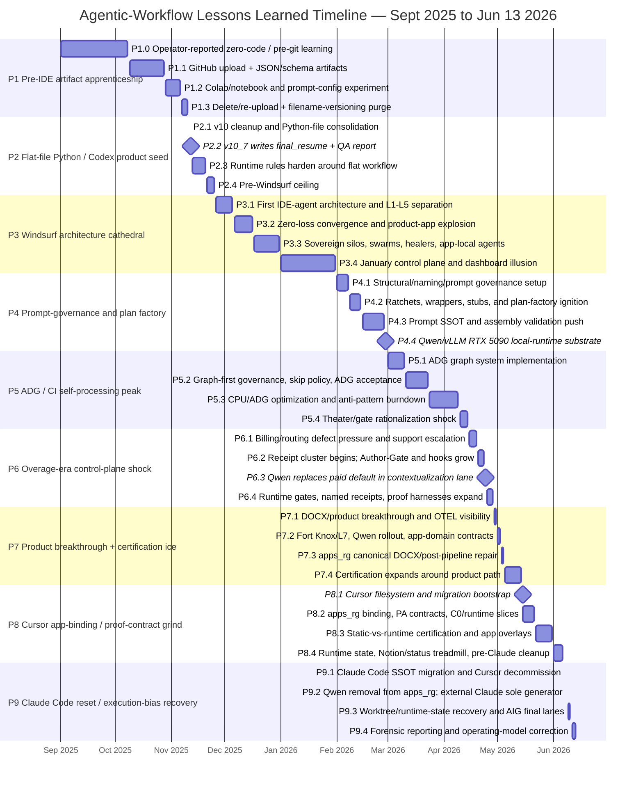

# Agentic Workflow Lessons Learned — Consolidated Forensic Phase Report

**Date:** 2026-06-13  
**Scope:** September 2025 through June 13, 2026  
**Primary focus:** lessons learned from commit patterns, artifact churn, runtime/proof failures, IDE transitions, Windsurf overages, local-runtime experimentation, and the eventual move toward execution-truth discipline.

---

## Executive bottom line

The project did not fail because there was too little architecture, too little ambition, or too little effort. The repeated failure mode was allowing **architecture artifacts, control planes, local-runtime experiments, and proof-shaped evidence to outrun the one live product trace they were supposed to serve**.

The mature lesson is simple:

```text
Deterministic workflow first.
Single bounded agent second.
Multi-agent systems only after contracts, gates, replay, and state authority.
```

The project matured as the operating model moved from:

```text
file exists
→ code exists
→ gate exists
→ receipt exists
→ dashboard says green
→ plan marked complete
```

toward:

```text
fresh-worktree product packet
→ live spine traversal
→ Runtime Gates decide proceed/stop
→ L2 proposes
→ Exit clears
→ UWG commits
→ L4 stores
→ L6 learns after the run boundary
```

The practical lesson:

> **A plan, prompt, route, cache, dashboard, proof packet, Docker container, GPU benchmark, Notion row, or static app manifest is not product progress until the live product trace consumes it and leaves replayable evidence.**

---

## Process-map yardstick

This report uses the v40 process-map standard as the interpretive yardstick:

```text
deterministic workflow first -> single agent -> multi-agent only
L2 proposes -> Exit clears -> UWG commits -> L4 stores
Runtime Gates decide live proceed/stop
UNKNOWN is never PASS
L6 learns only after the current run boundary
```

The question for every phase is therefore:

```text
Did this phase move the live product trace closer to a replayable artifact,
or did it create architecture/control-plane objects before runtime consumption?
```

---

## Phase overview

| Phase | Dates | Name | Dominant artifact | Key lesson |
|---:|---|---|---|---|
| 1 | 2025-09-01 to 2025-11-10 | Pre-IDE artifact apprenticeship | JSON, Colab, GitHub uploads, filename versions | Small surface area is a virtue. Beginner mistakes are cheap until agents multiply them. |
| 2 | 2025-11-11 to 2025-11-25 | Flat-file Python / Codex product seed | `v10_*` Python, `final_resume.json`, `qa_report.json` | Protect the first working trace before expanding architecture. |
| 3 | 2025-11-26 to 2026-01-31 | Windsurf architecture cathedral | `agentic_core`, `apps_*`, swarms, dashboards, Docker/config | Architecture learning was real; verification instinct lagged. |
| 4 | 2026-02-01 to 2026-02-28 | Prompt-governance and plan factory | prompt governance, plans, ratchets, Qwen/vLLM substrate | Governance folders and local runtime capability are not runtime binding. |
| 5 | 2026-03-01 to 2026-04-14 | ADG / CI self-processing peak | ADG SQLite, CI gates, baselines, anti-pattern burndown | Graph/gate truth is not product-path truth unless consumed by the product run. |
| 6 | 2026-04-15 to 2026-04-28 | Overage-era control-plane shock | Author-Gate, receipts, runtime gates, Qwen cost-control workaround | Reactive truth-recovery is expensive; the proof system should predate costly execution. |
| 7 | 2026-04-29 to 2026-05-14 | Product breakthrough + certification ice | DOCX path, OTEL, Fort Knox/L7, Qwen rollout, app-domain contracts | When the artifact appears, freeze and ship before widening certification. |
| 8 | 2026-05-15 to 2026-06-06 | Cursor app-binding / proof-contract grind | Cursor filesystem, PA contracts, C0/runtime slices, Notion/status work | Static evidence, imports, manifests, and scorecards must not be called runtime certification. |
| 9 | 2026-06-07 to 2026-06-13 | Claude Code reset / execution-bias recovery | `.claude`, Qwen removal, worktrees, final-lane proofs, postmortems | Mature operating model: make plans expensive, shipping cheap, and provider topology demotable. |

---

## Expanded Gantt



---

## Phase-by-phase lessons learned

### Phase 1 — Pre-IDE artifact apprenticeship  
**Dates:** 2025-09-01 to 2025-11-10

**Phase lesson:** tiny systems are safer than clever systems. Beginner mistakes are embarrassing in the log, but cheap in consequence when there is no agent swarm, no autonomous write path, and no expensive runtime loop.

| Subphase | Dates | Pattern / artifacts | Lesson learned |
|---|---|---|---|
| P1.0 | 2025-09-01 to 2025-10-08 | Operator-reported zero-code / pre-git learning. | Mark pre-git context as operator-reported. Do not over-claim evidence before the first commit. |
| P1.1 | 2025-10-09 to 2025-10-28 | First GitHub uploads: JSON, schemas, resume artifacts, prompt/config files. | App-as-file thinking is normal at the start. Keep the surface small until Git and execution are understood. |
| P1.2 | 2025-10-29 to 2025-11-06 | Colab/notebook experiment and file-based “app” thinking. | A notebook is a lab, not a governed runtime. Preserve it as learning evidence, not product proof. |
| P1.3 | 2025-11-07 to 2025-11-10 | Delete/re-upload churn, filename versioning, early swarm/file cleanup. | Deleting files is not version control. But cheap deletion is still safer than autonomous repo mutation. |

**Corrective rule:** before adding agents, first learn Git, repeatable execution, artifact paths, and minimal tests.

---

### Phase 2 — Flat-file Python / Codex product seed  
**Dates:** 2025-11-11 to 2025-11-25

**Phase lesson:** the first working trace should become the protected baseline before architecture expands.

| Subphase | Dates | Pattern / artifacts | Lesson learned |
|---|---|---|---|
| P2.1 | 2025-11-11 | `v10_*` cleanup and transition from file artifacts to runnable Python workflow. | The first important shift was not “AI architecture”; it was moving from file manipulation to executable substrate. |
| P2.2 | 2025-11-12 | `v10_7` writes `final_resume.json` and `qa_report.json`. | A product trace that writes to disk is more valuable than a beautiful unwired architecture. |
| P2.3 | 2025-11-13 to 2025-11-20 | Runtime-rule refinement around the flat workflow; tool/sandbox boundaries debated. | Boundary discipline was right, but the system needed one replay test around the working trace. |
| P2.4 | 2025-11-21 to 2025-11-25 | Pre-Windsurf ceiling: product trace existed, but was hard to safely modify. | Replace the author’s limitations, not the product trace. Freeze baseline, then refactor outward. |

**Corrective rule:** the first runnable trace should become the golden path:

```text
fresh checkout -> run command -> final artifact emitted -> QA artifact emitted
```

No architecture expansion until that replay is protected.

---

### Phase 3 — Windsurf architecture cathedral  
**Dates:** 2025-11-26 to 2026-01-31

**Phase lesson:** agentic architecture learning was real, but “architecture exists” became confused with “runtime truth exists.”

| Subphase | Dates | Pattern / artifacts | Lesson learned |
|---|---|---|---|
| P3.1 | 2025-11-26 to 2025-12-05 | First IDE-agent architecture, early `agentic_core`, L1-L5 separation, Docker/config work. | Using an IDE agent changed throughput before verification instinct caught up. |
| P3.2 | 2025-12-06 to 2025-12-16 | Zero-loss convergence, app explosion, thousands of files, “all folders populated.” | Volume is not architecture. A large merge must be judged by one live product trace. |
| P3.3 | 2025-12-17 to 2025-12-31 | Sovereign silos, swarms, healers, app-local agents, direct provider patterns. | Agent count is not architecture. Responsibility must be contracted before it is delegated. |
| P3.4 | 2026-01-01 to 2026-01-31 | Dashboard/control-plane expansion and correction of false health metrics. | Observability is dangerous when it is not independent. A dashboard can become narrative theater. |

**Corrective rule:** any architecture commit over a size threshold must include:

```text
one live product command
one emitted artifact
one negative test
one replay note
```

If it cannot produce that, label it architecture-only, not product progress.

---

### Phase 4 — Prompt-governance and plan factory  
**Dates:** 2026-02-01 to 2026-02-28

**Phase lesson:** prompt governance and local runtime capability are useful only when bound to the live trace.

| Subphase | Dates | Pattern / artifacts | Lesson learned |
|---|---|---|---|
| P4.1 | 2026-02-01 to 2026-02-07 | Structural/naming/prompt-governance setup, folder and import discipline. | Naming/folder correctness is not prompt authority. It is only a prerequisite. |
| P4.2 | 2026-02-08 to 2026-02-14 | Ratchets, governed wrappers, stubs, and plan-factory ignition. | UNKNOWN, stub, skipped, simulated, or default must never become PASS. |
| P4.3 | 2026-02-15 to 2026-02-27 | Prompt SSOT, assembly validation, orphan removal, governance boundary hardening. | A prompt SSOT must be consumed by compile/runtime path. Otherwise it is labeled text. |
| P4.4 | 2026-02-28 | Qwen/vLLM RTX 5090 substrate lands. | Local inference can be tuition. Product-default status requires a promotion scorecard. |

**Corrective rule:** every prompt-governance object must answer:

```text
who consumes this?
at compile time or runtime?
how do we know?
what breaks if it is stale?
```

If there is no consuming path, it is a reference document, not an SSOT.

---

### Phase 5 — ADG / CI self-processing peak  
**Dates:** 2026-03-01 to 2026-04-14

**Phase lesson:** graph and CI systems only matter when they protect the live product trace.

| Subphase | Dates | Pattern / artifacts | Lesson learned |
|---|---|---|---|
| P5.1 | 2026-03-01 to 2026-03-10 | ADG schema, scanner, persister, CI invariants, graph-first controls. | ADG is valuable because it can reveal structure, not because its existence proves correctness. |
| P5.2 | 2026-03-11 to 2026-03-23 | Graph-first governance, zero-skip policy, acceptance commands, CI hardening. | A CI gate must block or report truthfully. PASS with stale or skipped evidence is poison. |
| P5.3 | 2026-03-24 to 2026-04-09 | CPU/ADG optimization, anti-pattern burndown, baseline churn. | Optimize measured bottlenecks, not generalized machinery. Baseline moves must read DEBT ABSORBED, not PASS. |
| P5.4 | 2026-04-10 to 2026-04-14 | Theater language, gate rationalization, unwired-script discovery. | A script is not a gate unless a live chain invokes it. An unwired gate is worse than no gate. |

**Corrective rule:** separate three classes:

```text
STATIC_ANALYSIS
CI_BLOCKING_GATE
RUNTIME_GATE
```

Only the third can claim current-run proceed/stop authority.

---

### Phase 6 — Overage-era control-plane shock  
**Dates:** 2026-04-15 to 2026-04-28

**Phase lesson:** building truth machinery after paid-runtime defects are already live is expensive and stressful.

| Subphase | Dates | Pattern / artifacts | Lesson learned |
|---|---|---|---|
| P6.1 | 2026-04-15 to 2026-04-19 | Billing/routing defect pressure; lower-cost routes reported unreliable. | Cost-control lanes must be observable and auditable before expensive use. |
| P6.2 | 2026-04-20 to 2026-04-23 | Receipt cluster begins; Author-Gate, hooks, deferred-scope capture, miss detectors grow. | Reactive control planes are a symptom. The tool loop had already lost execution-truth trust. |
| P6.3 | 2026-04-24 | Qwen/vLLM replaces paid Anthropic default in contextualization lane. | A cost workaround becomes product risk if the substitute runtime is still unstable. |
| P6.4 | 2026-04-25 to 2026-04-28 | Runtime gates, typed receipts, prompt/intake proof harnesses expand. | Receipts should preserve runtime truth, not create the impression that truth exists. |

**Corrective rule:** when paid-runtime defects are active, freeze architecture expansion:

```text
fix provider route
or demote provider
or ship via known-good route
```

Do not build new certification machinery while the tool is charging for uncertain execution.

---

### Phase 7 — Product breakthrough + certification ice  
**Dates:** 2026-04-29 to 2026-05-14

**Phase lesson:** when the product artifact appears, freeze, polish, and ship before certifying the universe.

| Subphase | Dates | Pattern / artifacts | Lesson learned |
|---|---|---|---|
| P7.1 | 2026-04-29 to 2026-04-30 | DOCX/product breakthrough, OTEL visibility, `apps_rg` success evidence. | Product output should immediately trigger a freeze rule. |
| P7.2 | 2026-05-01 to 2026-05-02 | Fort Knox/L7, app-domain contracts, Qwen rollout, proof/certification expansion. | Auditability can preserve truth, but cannot create runtime substrate. |
| P7.3 | 2026-05-03 to 2026-05-04 | Canonical `apps_rg` DOCX/post-pipeline repair; stubbed canonical path exposed. | False adjacency is as dangerous as false completion: code near the path is not path execution. |
| P7.4 | 2026-05-05 to 2026-05-14 | Certification and local-provider operations grow around the product path. | Certify one route family after shipping; do not let certification freeze the artifact. |

**Corrective rule:** use the artifact-freeze protocol:

```text
artifact appeared
-> stop route expansion
-> run one fresh-worktree replay
-> ship artifact
-> then certify one route family
```

---

### Phase 8 — Cursor app-binding / proof-contract grind  
**Dates:** 2026-05-15 to 2026-06-06

**Phase lesson:** app binding is live packet traversal, not imports, manifests, scorecards, or static overlays.

| Subphase | Dates | Pattern / artifacts | Lesson learned |
|---|---|---|---|
| P8.1 | 2026-05-15 | Cursor filesystem and migration bootstrap. | Tool migration is never free; each migration needs a product-trace preservation test. |
| P8.2 | 2026-05-15 to 2026-05-21 | `apps_rg` binding, prompt authority, C0/runtime slices, contract tests. | Static contract surfaces are useful diagnostics, not certification. |
| P8.3 | 2026-05-22 to 2026-05-31 | Static-vs-runtime distinction, app overlays, prompt/app binding cleanup. | Use three statuses: STATIC_EVIDENCE, TRACE_OBSERVED, RUNTIME_CERTIFIED. |
| P8.4 | 2026-06-01 to 2026-06-06 | Runtime state, Notion/status treadmill, pre-Claude cleanup. | Mirrors are not truth. Filesystem/git and replayable artifacts remain SSOT. |

**Corrective rule:** every app-binding claim must include:

```text
file exists
import exists
call-site exists
runtime path hit
artifact emitted
trace captured
fresh-worktree replay passes
```

Anything less is static evidence.

---

### Phase 9 — Claude Code reset / execution-bias recovery  
**Dates:** 2026-06-07 to 2026-06-13

**Phase lesson:** mature agentic work makes plans expensive, product traces cheap, and local/runtime/provider complexity demotable.

| Subphase | Dates | Pattern / artifacts | Lesson learned |
|---|---|---|---|
| P9.1 | 2026-06-07 | `.claude` SSOT migration and Cursor decommission. | Operating rules should live where the active tool actually reads them. |
| P9.2 | 2026-06-08 | Qwen/vLLM removed from `apps_rg`; external Claude becomes sole generator. | Demotion is a strength. Local runtime should not own product default until it wins the scorecard. |
| P9.3 | 2026-06-09 to 2026-06-10 | Worktree/runtime-state recovery and AIG final lanes. | Fresh-worktree replay is the product-proof standard. Hidden state is not proof. |
| P9.4 | 2026-06-11 to 2026-06-13 | Forensic reports, phase map, operating-model correction. | L6 learns after the run boundary. Postmortem learning should produce future-run constraints, not current-run rescue theater. |

**Corrective rule:** make the default unit of work:

```text
one worktree
one plan
one live trace
one artifact
one report
```

---

## Merged Windsurf overage lesson

The Windsurf overage period was not ordinary high usage. It was the financial surface of two overlapping failures:

1. **Product-routing failure:** lower-cost/free/Adaptive routes did not behave as reliable cost-control lanes.
2. **IDE-agent execution-truth failure:** the tool repeatedly treated adjacent artifacts as proof of the live product path.

### Receipt-window split

| Window | Cost signal | Repo signal | Refined lesson |
|---|---:|---|---|
| Apr 20-Apr 28 | 12 receipts / $3,600 | Author-Gate, hooks, deferred-scope capture, named receipts, runtime gates, Qwen cost workaround | This was a control-plane shock. The project paid to build truth instruments after trust had already failed. |
| Apr 29-May 3 | 8 receipts / $3,448 | DOCX breakthrough, OTEL, Fort Knox/L7, `apps_rg` canonical repair, Qwen rollout | This was a shippability inversion. The artifact was near, but certification and runtime work surrounded it. |

### The decisive product-path lesson

The May 3 canonical repair showed the central failure pattern: `main_canonical()` had skipped actual DOCX/post-pipeline work. That means adjacent success existed, but the real canonical path had not consumed the real post-pipeline.

The refined verdict:

> Windsurf/Cascade’s failure was not only false completion. It was false adjacency: code, plans, receipts, gates, tests, demos, and sidecar proof could sit next to the product path while the live path remained unproven, skipped, mocked, provider-fragile, or hidden behind local runtime state.

---

## Runtime/GPU/parallelization lessons

### Docker / WSL / Windows / vLLM

**Pattern:** local Qwen/vLLM moved through WSL2 Ubuntu native venv/systemd, Windows launchers, Docker Desktop, WSL2 CUDA passthrough, and finally Docker canonicalization.

**Lesson:** local runtime topology is product architecture once the app depends on it. It needs one SSOT, one boot command, one health contract, one model-id readiness check, one mount verification, and one retirement rule for the previous stack.

**Correction:**

```text
Docker or native WSL, not both.
One start command.
One stop command.
One health command.
One exact /v1/models expected ID.
One demotion switch.
```

### CPU vs GPU optimization

**Pattern:** CPU optimization, ADG scanner speedups, Redis batching, GPU embeddings, Qwen inference, and pytest parallelism were initially treated as one “use the machine better” problem.

**Lesson:** CPU and GPU optimization are not one knob.

| Workload | Correct strategy |
|---|---|
| Python AST/file/hash loops | profile first, algorithmic simplification, ProcessPool only for large independent batches |
| Native/Rust/C-extension work | batch size and I/O layout matter more than Python thread count |
| Redis/SQLite | batch writes, connection discipline, serial tests where shared state exists |
| GPU embeddings/rerank | GPU FAISS / BGE / reranker profile, memory headroom |
| vLLM generation | continuous batching, model-fit matrix, provider readiness |
| pytest | xdist only where fixtures are isolated and Redis/Docker state is not shared |

**Correction:** no optimization module lands unless a before/after benchmark and live consumer are both present.

### RTX 5090 / Qwen model fitting

**Pattern:** “32GB GPU” was treated as a capability fact, but the actual constraint was usable VRAM after Windows reserve, Docker/WSL overhead, KV cache, context length, quantization kernel support, and HF cache/download behavior.

**Lesson:** fitting a model is not promoting a provider.

Promotion requires:

```text
served model ID
quantization
context length
max sequences
VRAM headroom
cold-start time
warm-start latency
p50/p95 generation time
quality comparison
failure taxonomy
one-config demotion
fresh-worktree product proof
```

---

## Cross-phase lesson index

| Lesson | Where it appeared | Mature rule |
|---|---|---|
| File exists looked like progress | P1, P3, P4, P6 | File exists ≠ runtime consumed ≠ product shipped. |
| Agent count looked like architecture | P3, P4 | Deterministic workflow first, single bounded agent second, multi-agent later. |
| Gates looked like truth | P5, P6, P7 | Runtime Gates decide live proceed/stop; static scripts are not Runtime Gates. |
| Receipts looked like proof | P6, P7 | A receipt must bind to a live run, evidence, trace, and replay. |
| Local runtime looked like cost control | P4, P6, P7 | Provider promotion requires quality, latency, reliability, readiness, demotion. |
| Static app binding looked like runtime certification | P7, P8 | Only live packet traversal through spine contracts certifies runtime binding. |
| Plans became cheap and shipping expensive | P4-P8 | Plan minting must be gated; product artifacts must be cheap to produce. |
| Learning tried to rescue current run | P5-P7 | L6 learns only after the current run boundary. |
| Dashboards became narrative | P3, P5 | Observability must be independent and source-bound. |
| Certification froze shipping | P7 | Ship one route, then certify one route family. |

---

## Operating rules going forward

### Rule 1 — Golden trace before architecture

```text
No architecture expansion until:
fresh checkout -> command -> product artifact -> QA/proof artifact
```

### Rule 2 — UNKNOWN is never PASS

```text
PASS means observed.
UNKNOWN means blocked.
SKIPPED means blocked.
DEFAULT means not certified.
STUB means not certified.
```

### Rule 3 — One product path beats many control planes

```text
One route.
One provider.
One artifact.
One replay.
Then expand.
```

### Rule 4 — Provider promotion scorecard

A local or cloud provider becomes product-default only after:

```text
quality >= baseline
latency within budget
runtime topology stable
exact model ID observed
failure taxonomy known
demotion path tested
fresh-worktree replay green
```

### Rule 5 — Artifact freeze protocol

When a product artifact appears:

```text
stop architecture expansion
freeze provider topology
run fresh-worktree replay
ship artifact
then certify one route family
```

### Rule 6 — App runtime certification vocabulary

Use only these states:

```text
STATIC_EVIDENCE
TRACE_OBSERVED
RUNTIME_CERTIFIED
```

Never call imports, manifests, scorecards, or generated proof bundles runtime certification unless a live packet traversed the path.

### Rule 7 — L6 learning boundary

Postmortems, RCAs, scorecards, and lessons are future-run constraints. They must not become current-run rescue theater.

---

## Report-ready conclusion

The project matured when it stopped treating architecture artifacts as progress and started judging every phase by whether a live product packet could traverse the spine, reach Exit, and leave a replayable artifact.

The best future operating posture is:

```text
deterministic workflow first
single bounded agent second
multi-agent only later
Runtime Gates decide live proceed/stop
L2 proposes
Exit clears
UWG commits
L4 stores
L6 learns after the run
```

If the next phase obeys that, the system can keep the ambition without repeating the churn.
