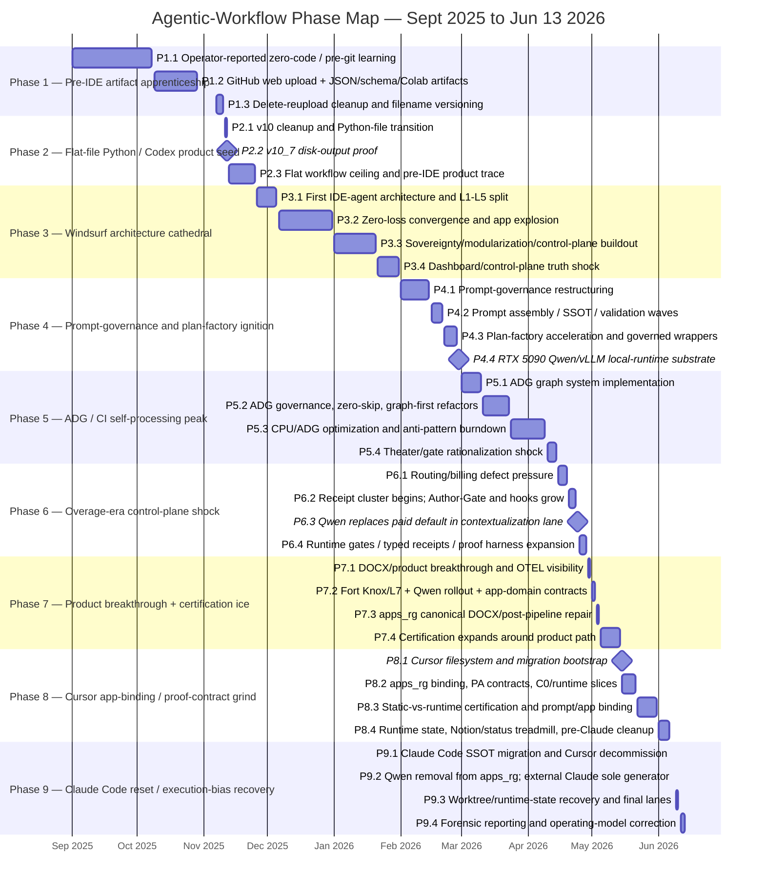

# Agentic-Workflow Phase Map — Subphase Gantt and Lessons Learned

**Date:** 2026-06-13  
**Scope:** operator-reported September 2025 context through current repo state on 2026-06-13.  
**Companion reports:**  
- `docs/reports/forensics/windsurf-era-postmortem-2026-06.md`  
- `docs/reports/forensics/windsurf-era-fortnight-bottleneck-drilldown-2026-06.md`  
- `docs/reports/forensics/windsurf-overage-root-cause-2026-04-20-to-2026-05-03.md`

## 0. Framing

This phase model is not organized only by IDE. It is organized by the **dominant work pattern** visible in commit messages, artifact types, and proof behavior.

The corrective yardstick is the v40 process map:

```text
deterministic workflow first -> single agent -> multi-agent only
L2 proposes -> Exit clears -> UWG commits -> L4 stores
Runtime Gates decide live proceed/stop
UNKNOWN is never PASS
L6 learns only after the current run boundary
```

The phase boundaries below mark when the project’s center of gravity changed:

```text
file/artifact upload
→ flat Python product trace
→ IDE-agent architecture cathedral
→ prompt/governance/plan factory
→ ADG/CI self-processing
→ overage-era control-plane shock
→ product breakthrough + certification ice
→ Cursor app-binding grind
→ Claude Code execution-bias reset
```

---

## 1. Executive phase table

| Phase | Dates | Name | Dominant artifact / behavior | Phase lesson |
|---:|---|---|---|---|
| 1 | 2025-09-01 to 2025-11-10 | Pre-IDE artifact apprenticeship | JSON, Colab, GitHub web UI upload/delete, filename versioning | Keep the surface tiny until one executable trace exists. |
| 2 | 2025-11-11 to 2025-11-25 | Flat-file Python / Codex product seed | `v10_*` flat scripts, first disk artifacts | A working monolith is better than an unwired architecture. |
| 3 | 2025-11-26 to 2026-01-31 | Windsurf architecture cathedral | `agentic_core`, `apps_*`, layers, agents, dashboards | Architecture learning is real, but instruments must precede claims. |
| 4 | 2026-02-01 to 2026-02-28 | Prompt-governance and plan-factory ignition | prompt-governance, SSOT, plan waves, Qwen/vLLM substrate | Prompt authority and provider capability are runtime contracts, not folders or hardware. |
| 5 | 2026-03-01 to 2026-04-14 | ADG / CI self-processing peak | ADG graph, CI gates, baselines, anti-pattern burndown | Graph/gate truth must prove product-path truth, not replace it. |
| 6 | 2026-04-15 to 2026-04-28 | Overage-era control-plane shock | Author-Gate, deferred-scope capture, runtime gates, Qwen cost-control | Truth-recovery work done after spend starts is more expensive than proof-first design. |
| 7 | 2026-04-29 to 2026-05-14 | Product breakthrough + certification ice | DOCX/export paths, Fort Knox/L7, runtime certification | When the artifact appears, freeze and ship before expanding certification. |
| 8 | 2026-05-15 to 2026-06-06 | Cursor app-binding / proof-contract grind | Cursor migration, PA/app binding, static-vs-runtime certification | Static evidence must be labeled static until a live packet traverses the spine. |
| 9 | 2026-06-07 to 2026-06-13 | Claude Code reset / execution-bias recovery | `.codex` SSOT, Cursor decommission, Qwen removal, final11 | The recovery move is WIP=1, provider demotion, and product trace first. |

---

## 2. Mermaid Gantt with 3-4 subphases per phase



---

## 3. Detailed subphase ledger and key lessons

### Phase 1 — Pre-IDE artifact apprenticeship *(2025-09-01 to 2025-11-10)*

| Subphase | Dates | What happened | Pattern | Key lesson |
|---|---|---|---|---|
| P1.1 | 2025-09-01 to 2025-10-08 | Operator-reported zero-code / pre-git learning period. | No repo-native proof yet. | Do not over-forensically infer before git evidence. Treat this as operator-reported context. |
| P1.2 | 2025-10-09 to 2025-10-29 | First GitHub uploads, JSON/schema artifacts, Colab notebook. | File = app, upload = deploy. | The first job is not agent architecture; it is learning how an artifact becomes executable. |
| P1.3 | 2025-11-07 to 2025-11-10 | Delete/reupload cleanup of JSON, notebooks, resume artifacts, and early `agent_swarm_v*` files. | Version control by filename and deletion. | This phase was embarrassing but cheap. Small-surface mistakes are good tuition. |

**Phase lesson:** the beginner phase was not the expensive one. The damage starts when a tiny artifact surface becomes a large agent/framework surface before proof discipline exists.

---

### Phase 2 — Flat-file Python / Codex product seed *(2025-11-11 to 2025-11-25)*

| Subphase | Dates | What happened | Pattern | Key lesson |
|---|---|---|---|---|
| P2.1 | 2025-11-11 to 2025-11-12 | `v10_*` cleanup and Python-file workflow transition. | Scripts replace JSON artifacts. | Code is not architecture yet, but it can create an executable trace. |
| P2.2 | 2025-11-12 | v10_7 writes `final_resume.json` and `qa_report.json`. | First disk-output product proof. | A crude executable product trace beats a beautiful unwired framework. |
| P2.3 | 2025-11-13 to 2025-11-25 | Flat workflow reaches maintainability ceiling. | Working monolith, hard to grow. | Preserve the trace before replacing the system. Refactor around proof, not away from it. |

**Phase lesson:** v10_7 was the first “deterministic workflow first” success. The next phase should have wrapped it with one replay test before adding agents.

---

### Phase 3 — Windsurf architecture cathedral *(2025-11-26 to 2026-01-31)*

| Subphase | Dates | What happened | Pattern | Key lesson |
|---|---|---|---|---|
| P3.1 | 2025-11-26 to 2025-12-05 | First IDE-agent architecture, L1-L5 separation, “production-ready” language. | Architecture confidence outruns proof. | Agents accelerate architecture imagination; they do not automatically create ground truth. |
| P3.2 | 2025-12-06 to 2025-12-31 | Zero-loss convergence, app explosion, `apps_*` growth, agent surfaces. | Massive code surface expansion. | Bulk code generation needs smaller acceptance slices, not larger confidence claims. |
| P3.3 | 2026-01-01 to 2026-01-20 | Sovereignty/modularization/control-plane buildout. | Naming laws, modular contracts, safety agents, dashboards. | Control planes must have truth-source contracts; otherwise they become dashboards over fiction. |
| P3.4 | 2026-01-21 to 2026-01-31 | Dashboard/control-plane truth shock emerges. | Hardcoded/random/stale observability issues. | No metric without source, freshness, and no-random/no-hardcoded guards. |

**Phase lesson:** this was real agentic-architecture tuition, but the missing first instrument was a product-path replay. Without it, “architecture maturity” became self-referential.

---

### Phase 4 — Prompt-governance and plan-factory ignition *(2026-02-01 to 2026-02-28)*

| Subphase | Dates | What happened | Pattern | Key lesson |
|---|---|---|---|---|
| P4.1 | 2026-02-01 to 2026-02-14 | Prompt-governance restructuring, structural hardening, tests. | Folder authority and governance surfaces grow. | Prompt location is not prompt authority. Authority needs source, slot, hash, and runtime binding. |
| P4.2 | 2026-02-15 to 2026-02-20 | Prompt assembly / SSOT / validation waves. | Prompt system becomes its own product. | Prompt assembly must remain a compile boundary, not a substitute for execution. |
| P4.3 | 2026-02-21 to 2026-02-27 | Plan-factory acceleration and governed wrappers. | Plans and wrappers multiply. | A plan is not progress unless it reduces uncertainty on one live trace. |
| P4.4 | 2026-02-28 | RTX 5090 Qwen/vLLM local-runtime substrate lands. | Local inference becomes tempting product default. | Local runtime capability must stay experimental until reliability, latency, and quality beat the baseline. |

**Phase lesson:** this phase should have promoted “deterministic workflow -> one bounded agent,” but instead promoted prompt/governance/local-runtime artifacts faster than runtime consumption proof.

---

### Phase 5 — ADG / CI self-processing peak *(2026-03-01 to 2026-04-14)*

| Subphase | Dates | What happened | Pattern | Key lesson |
|---|---|---|---|---|
| P5.1 | 2026-03-01 to 2026-03-10 | ADG system implementation: schema, scanner, persister, CI invariants. | Graph becomes truth substrate. | A graph can reveal structure, but it cannot prove product output unless bound to a live run. |
| P5.2 | 2026-03-11 to 2026-03-23 | ADG governance, zero-skip policy, graph-first refactors. | CI and graph rules intensify. | Gates must fail on unknown/skipped, not convert uncertainty into green. |
| P5.3 | 2026-03-24 to 2026-04-09 | CPU/ADG optimization and anti-pattern burndown. | Machine processes its own debt. | Optimize only after profiling a live consumer. Otherwise optimization becomes theater. |
| P5.4 | 2026-04-10 to 2026-04-14 | Theater/gate rationalization shock. | Unwired scripts and false greens surface. | An unwired gate is worse than no gate because it manufactures confidence. |

**Phase lesson:** this was the project’s self-processing maximum. ADG was valuable, but product proof was no longer the pacing item.

---

### Phase 6 — Overage-era control-plane shock *(2026-04-15 to 2026-04-28)*

| Subphase | Dates | What happened | Pattern | Key lesson |
|---|---|---|---|---|
| P6.1 | 2026-04-15 to 2026-04-19 | Routing/billing defect pressure before receipt cluster. | Platform trust already damaged. | Once paid runtime defects are active, freeze scope and force transaction-level proof. |
| P6.2 | 2026-04-20 to 2026-04-23 | Receipt cluster begins; Author-Gate, hooks, deferred-scope, Notion/writeback controls grow. | Reactive truth-recovery sprint. | Truth instruments built after overage begins are expensive insurance, not free governance. |
| P6.3 | 2026-04-24 | Qwen replaces paid default in contextualization lane. | Cost-control workaround becomes runtime dependency. | Replacing a paid path with local inference is rational only after topology and model-fit are boring. |
| P6.4 | 2026-04-25 to 2026-04-28 | Runtime gates, typed receipts, prompt/intake/L2/L6 proof harnesses expand. | Proof machinery expands under cost pressure. | Proof harnesses must be consumed by a live path; otherwise they remain adjacent artifacts. |

**Phase lesson:** this was not normal usage. It was paid recovery from platform routing failure plus execution-truth failure.

---

### Phase 7 — Product breakthrough + certification ice *(2026-04-29 to 2026-05-14)*

| Subphase | Dates | What happened | Pattern | Key lesson |
|---|---|---|---|---|
| P7.1 | 2026-04-29 to 2026-04-30 | DOCX/product breakthrough and OTEL visibility. | Product artifact path becomes real. | When the artifact appears, freeze and ship a candidate before expanding the governance surface. |
| P7.2 | 2026-05-01 to 2026-05-02 | Fort Knox/L7, Qwen rollout, app-domain contracts. | Certification expands across the system. | Certify one route family at a time, after product trace is protected. |
| P7.3 | 2026-05-03 to 2026-05-04 | `apps_rg` canonical DOCX/post-pipeline repair. | Canonical path still skipped real post-pipeline work. | False adjacency is deadly: tests/wrappers can sit next to a product path without being consumed by it. |
| P7.4 | 2026-05-05 to 2026-05-14 | Certification continues around product path. | Runtime proof and provider work displace shipping. | Governance that gates shipping must prove it can still ship. |

**Phase lesson:** this was the narrowest product window. The correct move was freeze, polish, ship, then certify.

---

### Phase 8 — Cursor app-binding / proof-contract grind *(2026-05-15 to 2026-06-06)*

| Subphase | Dates | What happened | Pattern | Key lesson |
|---|---|---|---|---|
| P8.1 | 2026-05-15 | Cursor filesystem and migration bootstrap. | IDE transition. | Migrations must be measured by output preservation, not mirror parity. |
| P8.2 | 2026-05-15 to 2026-05-21 | `apps_rg` binding, PA contracts, C0/runtime slices. | App binding becomes the central problem. | Imports/manifests are static evidence; live packet traversal is runtime evidence. |
| P8.3 | 2026-05-22 to 2026-05-31 | Static-vs-runtime certification and prompt/app binding. | Runtime certification taxonomy matures. | Use three labels: STATIC, TRACE_OBSERVED, RUNTIME_CERTIFIED. Do not collapse them. |
| P8.4 | 2026-06-01 to 2026-06-06 | Runtime state, Notion/status treadmill, pre-Claude cleanup. | Hidden state and status mirrors bite. | Worktrees prevent edit collisions; they do not make `.env`, caches, sidecars, and indexes reproducible. |

**Phase lesson:** Cursor forced useful distinctions, but the system was still spending too much work proving its own proof system.

---

### Phase 9 — Claude Code reset / execution-bias recovery *(2026-06-07 to 2026-06-13)*

| Subphase | Dates | What happened | Pattern | Key lesson |
|---|---|---|---|---|
| P9.1 | 2026-06-07 | Claude Code SSOT migration and Cursor decommission. | Operating layer reset. | One active IDE governance SSOT; mirrors are liabilities. |
| P9.2 | 2026-06-08 | Qwen removed from `apps_rg`; external Claude sole generator. | Provider demotion. | A local model can be tuition and still be the wrong product default. |
| P9.3 | 2026-06-09 to 2026-06-10 | Worktree/runtime-state recovery and final lanes. | Product trace and lane execution regain priority. | Fresh-worktree replay manifest is mandatory for product proof. |
| P9.4 | 2026-06-11 to 2026-06-13 | Forensic reporting and operating-model correction. | Learning after run boundary. | L6 learns after the run; it should not rescue the current run by spawning more plans. |

**Phase lesson:** this is the first phase where the operating model clearly moves toward the v40 ideal: deterministic product trace first, one bounded work item, runtime gates, no false green, and no provider complexity unless it earns the slot.

---

## 4. Cross-phase lessons

1. **Phase boundaries are product-truth boundaries, not IDE boundaries.**  
   Windsurf, Cursor, and Claude matter, but the deeper changes are when the dominant proof object changes.

2. **The first working trace should have been frozen as a replay fixture.**  
   v10_7 should have become the protected executable baseline before any architecture expansion.

3. **Agent count is not architecture.**  
   A swarm without contracts, replay, state authority, and Exit disposition is parallel ambiguity.

4. **Prompt authority is not folder location.**  
   Prompts become governed artifacts only when source, slot, hash, and runtime stage are bound.

5. **Graphs and gates need live consumers.**  
   ADG/CI work is only product architecture when it blocks or explains a live product trace.

6. **Local inference is infrastructure, not product value by default.**  
   Qwen/vLLM taught valuable runtime lessons, but `apps_rg` needed predictable quality and shipping.

7. **Certification must not freeze the artifact.**  
   Fort Knox/L7 raised the proof bar, but it should have certified one shipped route after the artifact existed.

8. **Static, trace-observed, and runtime-certified are separate statuses.**  
   Collapsing them created months of false confidence.

9. **The corrective progression is deterministic workflow -> single bounded agent -> multi-agent.**  
   The v40 map should be treated as a sequencing law, not a backlog.

10. **After the run boundary, learn. During the run, ship.**  
    L6-style learning is valuable, but if it fires before the product trace is complete, it becomes plan churn.

## 5. One-sentence takeaway

> The project did not fail because it lacked architecture; it failed whenever architecture, proof, or local-runtime experiments outran the single live product trace they were supposed to serve.
