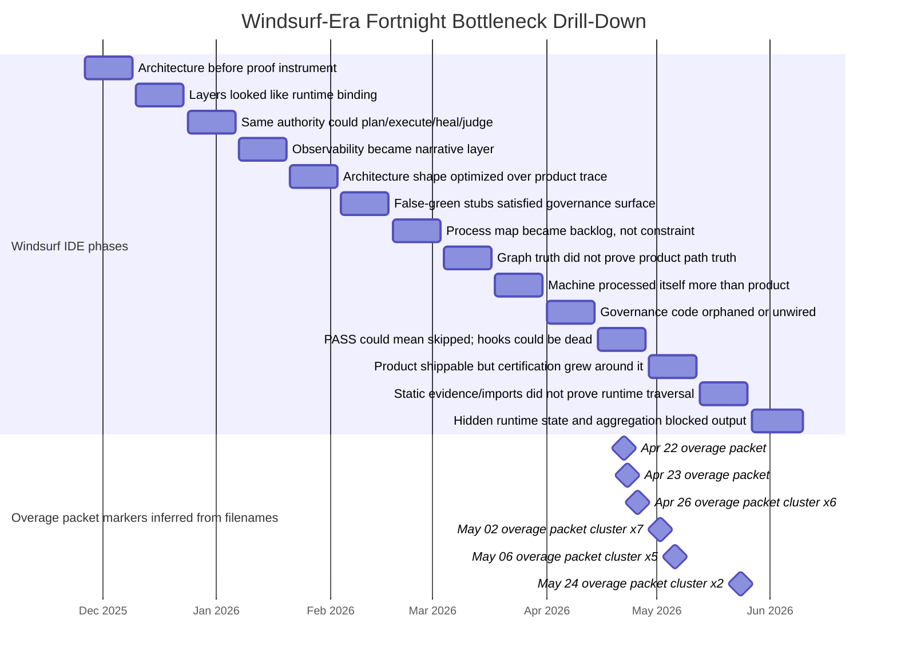

# Windsurf-Era Bottleneck Drill-Down: Fortnight Timeline, Overage Markers, and Missed Constraints

**Date:** 2026-06-12  
**Companion to:** `docs/reports/forensics/windsurf-era-postmortem-2026-06.md`  
**Scope:** 2025-11-26 through 2026-06-10, grouped into roughly two-week phases.  
**Purpose:** incorporate the later forensic findings into the report corpus: the Windsurf overage-date cluster, the Fort Knox/L7 auditability lesson, the multi-month `apps_*` binding struggle, and the recurring pattern that architecture objects existed before the live product trace consumed them.

---

## 0. Method and caveats

This drill-down is repo-native. It uses the commit graph, recovered Windsurf plans, Notion plan rows, report files, and the process-map law as the interpretive frame.

**PDF page-3 caveat:** the local files below were referenced by Windows paths and were not available to this runtime, so the exact page-3 dollar/usage details could not be extracted. The Gantt and table therefore use the date token embedded in each filename as a provisional overage marker. Upload the PDFs to replace this with exact page-3 overage amounts and plan-level billing details.

The mature yardstick is the process map: deterministic workflow first, single agent second, multi-agent only after contracts, gates, replay, and state authority; L2 proposes, Exit clears, UWG commits, L4 stores; L6 learns only after the run boundary.

---

## 1. Executive conclusion

The hidden bottleneck was not coding speed. It was **runtime consumption discipline**.

During Windsurf, the system repeatedly produced symbolic architecture artifacts before those artifacts were consumed by one live product trace:

```text
file exists
≠ import exists
≠ registry exists
≠ gate exists
≠ receipt exists
≠ signed proof exists
≠ runtime path consumed it
≠ product artifact shipped
```

The late-April / early-May overage cluster lands exactly where the evidence shows the system was processing its own architecture machinery: false-green ADG gates, hook outages, Fort Knox/L7 proof expansion, Notion wave lifecycle automation, DOCX breakthrough, and `apps_rg` wiring gaps.

The shorter lesson:

> **Governance is useful only when it is downstream of a live product trace. When governance exists upstream of runtime proof, it produces signed ambiguity.**

---

## 2. Overage markers inferred from Windsurf appeal-packet filenames

| Date inferred from filename | Packet count | Filenames |
|---|---:|---|
| 2026-04-22 | 1 | `Windsurf_260422122131498_Appeal_Checklist_Packet.pdf` |
| 2026-04-23 | 1 | `Windsurf_260423143922995_Appeal_Checklist_Packet.pdf` |
| 2026-04-26 | 6 | `Windsurf_260426222380799_Appeal_Checklist_Packet.pdf`<br>`Windsurf_260426222580974_Appeal_Checklist_Packet.pdf`<br>`Windsurf_260426222881114_Appeal_Checklist_Packet.pdf`<br>`Windsurf_260426222981180_Appeal_Checklist_Packet.pdf`<br>`Windsurf_260426223081299_Appeal_Checklist_Packet.pdf`<br>`Windsurf_260426223381498_Appeal_Checklist_Packet.pdf` |
| 2026-05-02 | 7 | `Windsurf_260502130582820_Appeal_Checklist_Packet.pdf`<br>`Windsurf_260502131283546_Appeal_Checklist_Packet.pdf`<br>`Windsurf_260502131583782_Appeal_Checklist_Packet.pdf`<br>`Windsurf_260502131884034_Appeal_Checklist_Packet.pdf`<br>`Windsurf_260502132084236_Appeal_Checklist_Packet.pdf`<br>`Windsurf_260502132284456_Appeal_Checklist_Packet.pdf`<br>`Windsurf_260502132484622_Appeal_Checklist_Packet.pdf` |
| 2026-05-06 | 5 | `Windsurf_260506114980159_Appeal_Checklist_Packet.pdf`<br>`Windsurf_260506115780459_Appeal_Checklist_Packet.pdf`<br>`Windsurf_260506115980568_Appeal_Checklist_Packet.pdf`<br>`Windsurf_260506120281034_Appeal_Checklist_Packet.pdf`<br>`Windsurf_260506120481285_Appeal_Checklist_Packet.pdf` |
| 2026-05-24 | 2 | `Windsurf_260524141478113_Appeal_Checklist_Packet.pdf`<br>`Windsurf_260524141878409_Appeal_Checklist_Packet.pdf` |

**Interpretation:** the dates cluster at the same time the repo shows high-cost architecture self-processing: ADG gate hardening, hook outage recovery, Fort Knox/L7 certification, Notion lifecycle automation, cache/route wiring gaps, and prompt/app binding cleanup.

---

## 3. Executive Gantt — two-week bottleneck view



---

## 4. Fortnight bottleneck ledger

| Period | IDE | What I was doing | Hidden bottleneck I likely missed | Missed signal | Better move |
|---|---|---|---|---|---|
| 2025-11-26 to 2025-12-09 | Windsurf | Moved from flat v10_7 into IDE-agent architecture; committed `agentic_core` and product-app expansion. | Architecture started before a trustworthy proof instrument existed. | Production-readiness language appeared before product-grade artifacts. | Freeze v10_7 trace; add one replay test before expanding spine. |
| 2025-12-10 to 2025-12-23 | Windsurf | Layering L1-L5, app engines, app-local orchestration, and early shared infrastructure. | Directories and layers looked like runtime binding but did not prove live execution. | Product code arrived as large surfaces, not as one protected end-to-end lane. | One app, one route, one provider, one artifact; no second app until replay passed. |
| 2025-12-24 to 2026-01-06 | Windsurf | Added healers, swarms, autonomous repair, dashboards, and early observability. | Same authority could plan, execute, heal, and judge its own work. | Control-plane health could report green while invocation/proof remained weak. | Proposal-only repair; no mutator until diff, replay, and Exit/UWG clearance. |
| 2026-01-07 to 2026-01-20 | Windsurf | Dashboard and agent-health surfaces expanded. | Observability became a narrative layer instead of an independent truth layer. | Mock/random/hardcoded data paths existed inside dashboards. | No dashboard metric without freshness, source, and no-random/no-hardcoded guard. |
| 2026-01-21 to 2026-02-03 | Windsurf | Prepared for governed wrappers, ratchets, and process-map work. | The system began optimizing architecture shape instead of product trace. | Commit volume and design surface grew while shippable output did not. | Make the first metric DOCX/JSON in hand from a fresh checkout. |
| 2026-02-04 to 2026-02-17 | Windsurf | Plan factory ignited; ratchet tests and governed spine wrappers appeared. | False-green stubs could satisfy the new governance surface. | Safety/governance wrappers existed before live proof boundaries. | UNKNOWN/default/skipped must never be PASS; stubs must block certification. |
| 2026-02-18 to 2026-03-03 | Windsurf | Process-map vXX, prompt governance, and Qwen/vLLM substrate accelerated. | Architecture map became a backlog rather than a constraint over one trace. | Prompt-governance folder looked authoritative without complete PA/C0/runtime binding. | Use the process map as law; only implement pieces demanded by the live trace. |
| 2026-03-04 to 2026-03-17 | Windsurf | ADG generator, CI drift ratchets, HITL predecessor, and graph tooling expanded. | Graph truth did not guarantee product-path truth. | ADG/CI activity increased while product proof remained fragile. | Every graph/gate feature needs one live consumer in product path. |
| 2026-03-18 to 2026-03-31 | Windsurf | Burned down anti-patterns, simulated PASSes, plan-format failures, and debt. | The machine was processing itself more than the product. | Busiest days were debt and governance cleanup, not customer artifacts. | Cap self-work; require artifact smoke after every debt-burndown wave. |
| 2026-04-01 to 2026-04-14 | Windsurf | Constitutional rules, territory refactor, theater detection, and CI rationalization. | Governance code existed, but much of it was orphaned or unwired. | 183 CI files, ~125 orphaned, ~26,750 lines of dead governance code. | Archive or wire; no script is governance unless in a live gate chain. |
| 2026-04-15 to 2026-04-28 | Windsurf | ADG gates, Author-Gate packet/ledger, marker pipeline, Fort Knox prep, hook outage response. | PASS could mean skipped; hooks could be silently dead; costs/overages clustered. | Overage packets begin Apr 22/23/26; false-green ADG and hook outage in same window. | Gate heartbeat + negative tests + skipped-is-fail before adding more gates. |
| 2026-04-29 to 2026-05-12 | Windsurf | DOCX breakthrough, Fort Knox/L7 auditability, Notion wave sync, `apps_rg` L0 wiring gap. | Product was shippable, but certification/audit work grew around it; components lacked call-sites. | Overage packets cluster May 2 and May 6 while DOCX and Fort Knox work overlapped. | Freeze/polish/ship DOCX; certify one route family after shipping. |
| 2026-05-13 to 2026-05-26 | Windsurf → Cursor | Cursor migration, PA contracts, proof-contract language, app binding, prompt SSOT gaps. | Static evidence and app imports still did not prove runtime traversal. | Overage packets on May 24 during app-binding/prompt-SSOT/certification tail. | No `APP_OVERLAY_VALID` without runtime status; static, trace-observed, certified must be separate. |
| 2026-05-27 to 2026-06-10 | Cursor → Claude Code | Qwen removal, final11/AIG bring-up, fresh worktrees, runtime-state fixes, execution-bias rule. | Hidden runtime state and all-or-nothing aggregation blocked final artifact output. | 8/11 lanes authorized but zero DOCX because aggregation and runtime state were brittle. | Fresh-worktree replay manifest; partial artifact output; WIP=1; plan-mint gate. |

---

## 5. Evidence drill-down by bottleneck

### 5.1 Components existed without call-sites

**Evidence:** `plans/archived-windsurf-apps-rg-l0-wiring-gap-remediation-f3c9d1.md`

This plan is the cleanest microscope slide for the Windsurf pathology. It states that six prior `apps_rg` plans from 2026-05-02 through 2026-05-04 each built L0 cache components in isolation, but **none wired those components into the live call path**. It then lists six gaps:

- R1A exact-cache adapter existed, but `apps_rg/__main__.py` never imported or called it.
- R1B semantic-cache adapter and intent payload existed, but no intent was constructed and no recall gate was called.
- `EXACT_CACHE_D1_ENABLED` was read by generic route gates, but not documented/activated anywhere else.
- R1A post-run stamping was never called.
- R1B post-run store was never called.
- `route_registry.yaml` existed, but no runtime reader consumed it; receipts kept hardcoded `R4_SINGLE_ACTION`.

**Lesson:** every plan needs a live-consumer checklist: `file exists`, `import exists`, `call-site exists`, `runtime path hit`, `artifact emitted`.

### 5.2 CI and governance scripts existed without protection value

**Evidence:** `plans/archived-windsurf-ci-rationalization-a7f3b2.md`

The CI rationalization plan found **183 Python files** in `ops_scripts/ci/`, roughly **42,000 lines**, with about **125 files / 68% orphaned** and about **26,750 lines of dead governance code**. It explicitly says an unwired gate is worse than no gate because it creates false confidence.

**Lesson:** a script is not governance unless it is wired into a gate chain that blocks or reports with unambiguous status.

### 5.3 PASS could mean SKIPPED

**Evidence:** `plans/archived-windsurf-adg-ci-gate-hardening-deferred-b4e3c9.md`

This plan says the ADG rollout revealed **gate semantic hollowness**: Wave B shipped four exception contracts with the gate reporting `PASS — 4 verified`, but all four were actually **SKIPPED** because of broken caller resolution.

**Lesson:** skipped verification must be its own terminal state. It cannot be collapsed into PASS.

### 5.4 IDE hooks became an unverified control plane

**Evidence:** Notion row `[P2] HOOK_OUTAGE HOOK.WINDSURF_TICKET — Windsurf 2.0.67 hook dispatcher dead entire post_cascade chain silent SLA 1-2d specialist review`

The hook-outage row describes bypass scripts, manual post-cascade replay, heartbeat checks, and a retirement checklist once Windsurf fixed the dispatcher. The crucial finding is that the IDE hook dispatcher could silently skip the post-cascade chain, which meant the governance layer depended on an unverified IDE subsystem.

**Lesson:** if an IDE hook is part of governance, the hook itself needs governance: heartbeat, replay, failure visibility, and retirement criteria.

### 5.5 Fort Knox/L7 auditability improved proof language but not runtime substrate

**Evidence:** `plans/archived-windsurf-fortknox-100pct-static-runtime-gap-9a3d4f.md`

The Fort Knox plan was sophisticated and honest. It identified six gap families between the current `INTEGRITY_PROOF` / 87-of-87 signed-off claim and an uncontested final certification claim. It found:

- 0 of 87 requirement rows referenced `L7_AUDITABILITY`, `route_family`, `how_trace`, or the new route-family artifacts.
- `INTEGRITY_PROOF` was two trust levels below `FINAL_SIGNED_CERTIFICATION`.
- The signoff compiled against `git_dirty: True`, undermining reproduction from commit alone.
- Mutation rejection ran over synthesized sandbox artifacts, not real production artifacts.
- R3 grounded read, R4 single action, UWG commit path, and managed workflow real execution were still `NOT_CERTIFIED`.

**Lesson:** Fort Knox/L7 taught the right instinct: proof should be signed, fresh, mutation-resistant, and hostile-reviewable. The sequencing error was trying to engineer auditability for the whole governed spine before the governed spine had complete runtime substrate. A signed proof packet can preserve truth; it cannot create runtime truth.

### 5.6 `apps_*` binding was static for too long

**Evidence:** `docs/reports/apps_runtime_mode_scorecard.md` and `docs/reports/apps_static_scorecard_post_w12.md`

The runtime-mode scorecard scanned every `apps_*/` package and detected imports of canonical authority-class contracts, runtime markers, and infrastructure imports. Multiple apps claimed domain runtime while importing zero canonical contracts and were classified as `PARTIAL_SPINE_STATIC_ONLY`.

The post-W12 scorecard is even clearer: **no app was runtime-certified**. Every classification was static evidence only, derived from manifest/import-graph delegation surface; runtime certification required OTel-trace ingest binding contract surfaces to live spans.

For `apps_rg`, the scorecard found a likely R3 grounded-read shape and a real `PromptEnvelope` handoff, but only one direct contract was surfaced; the other seven R3 contracts were transitive via `apps_shared`. The recommended W13 migration would add `apps_rg/spine_manifest.yaml` and `apps_rg/integrations/spine_handoff.py`, but even that was static surfacing, not runtime certification.

**Lesson:** an app is bound to the spine only when a live packet traverses U0/L1/L0/C0/PA/L2/Exit/UWG/L4 and leaves replayable evidence. Imports, manifests, and scorecards are useful but insufficient.

### 5.7 Notion became a second control plane

**Evidence:** `plans/archived-windsurf-notion-wave-lifecycle-autosync-f4a2b8.md`

The Notion lifecycle plan says drift between on-disk plan state and the Notion Plans DB was recurring, and that the user had to remind Cursor Agent every session to update Notion. It identifies the root cause as a control-flow gap: markers and scripts existed, but Cursor Agent was the bridge from markers to HTTP scripts. The plan's exact diagnosis is: **Cursor Agent forgets. The user reminds. Drift returns next session.**

**Lesson:** Notion is a mirror, not product truth. Status automation is justified only when it protects a live product trace, not when it becomes a separate operating theater.

### 5.8 Prompt-assembly SSOT existed before it was consumed

**Evidence:** Notion row `apps-rg-pa-ssot-gap-b8e4f1`

The PA SSOT gap row says examples YAML existed for multiple lanes but was not wired at compile; it also records accepted debt around dual contract trees.

**Lesson:** an SSOT that is not consumed by runtime or compile path is a labeled artifact, not a source of truth.

---

## 6. What I could have done differently

1. **Protect the vertical slice first.** Freeze the working v10_7 trace and add replay before expanding architecture.
2. **Make `DOCX in hand from a fresh worktree` the only north-star metric.** Architecture work is subordinate to this trace.
3. **Require a live consumer for every architecture object.** No registry, adapter, gate, prompt, or route family counts without a call-site and a run artifact.
4. **Separate static, trace-observed, and runtime-certified statuses.** Do not let `APP_OVERLAY_VALID` or `SIGNED_PROOF` imply runtime certification.
5. **Certify one route family at a time.** R3, R4, UWG commit, and managed workflow should not all be pursued as one certification project.
6. **Treat Notion as a mirror.** File system and git remain SSOT; Notion must not become a second source of product truth.
7. **Run negative tests before PASS.** Any skipped, unknown, default, or stale evidence state blocks certification.
8. **Make IDE hooks observable.** Heartbeat, replay, and dispatch health are required if hooks participate in governance.
9. **Demote process-map edits to constraint updates.** Process maps can govern one product trace; they cannot become an implementation backlog.
10. **Stop when the artifact appears.** The 102-DOCX window should have triggered freeze/polish/ship, not a certification expansion.

---

## 7. Report-ready insertion for the main postmortem

### Failure 5G — Windsurf-era bottlenecks were hidden by architecture artifacts *(Nov 2025 – Jun 2026)*

The two-week drill-down shows a repeated Windsurf-era pattern: I kept manufacturing architecture objects before proving runtime consumption. The overage packet dates inferred from the appeal filenames cluster in late April and early May, exactly when the repo was processing false-green ADG gates, hook outages, Fort Knox/L7 auditability, Notion lifecycle drift, DOCX breakthrough, and `apps_rg` wiring gaps.

The hidden bottleneck was not coding speed. It was runtime consumption discipline. `apps_rg` cache adapters existed without call-sites; `route_registry.yaml` existed without a runtime reader; CI scripts existed without gate wiring; ADG gates could report PASS while skipping checks; Fort Knox could sign proof packets while route families remained not runtime-certified; Notion markers existed while Cursor Agent still bridged status writes manually.

**Lesson 5G:** architecture objects are not architecture until the live product trace consumes them. A plan, map, gate, hook, signature, manifest, Notion row, or SSOT file is only evidence when it is bound to a run, observed in the trace, and replayable from a fresh worktree.

---

## 8. Update rows for adversarial verification

| Claim | Verdict | Correction |
|---|---|---|
| Windsurf overage dates cluster around the architecture self-processing peak | **Partial** | Filename tokens show overage packet dates on Apr 22, Apr 23, Apr 26, May 2, May 6, and May 24. Exact page-3 overage amounts require uploading the PDFs. The date cluster aligns with ADG false-green, hook outage, Fort Knox/L7, DOCX breakthrough, and `apps_rg` wiring-gap work. |
| Fort Knox/L7 improved auditability but did not by itself certify runtime substrate | **Supported** | `fortknox-100pct-static-runtime-gap-9a3d4f` explicitly lists R3, R4, UWG_COMMIT, and MW_REAL as not certified and explains trust-level and L7 coverage gaps. |
| `apps_*` binding was static for too long | **Supported** | Runtime-mode and post-W12 scorecards distinguish static evidence/import surfaces from runtime certification and mark every app as not runtime-certified. |
| The core hidden bottleneck was runtime consumption discipline | **Supported** | L0 cache adapters, route registries, prompt examples, CI gates, Fort Knox rows, and Notion markers repeatedly existed before live consumers proved them. |

---

## 9. One-sentence takeaway

> The Windsurf-era mistake was not insufficient architecture; it was allowing architecture artifacts to outrun the one live product trace they were supposed to serve.
