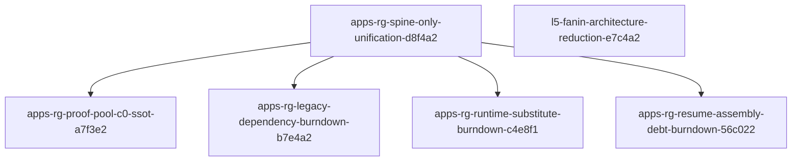

# Active In-Progress Plans Manifest (2026-05-24)

SSOT for active Plans DB execution queue. **Updated 2026-05-25** after scope tests + closeouts ([receipt](active_backlog_scope_tests_receipt_20260525.md)).

**In Progress (five):** spine master, proof-pool, assembly, legacy, L5 ratchet.

**Completed this tranche:** `apps-rg-runtime-substitute-burndown-c4e8f1`, `exec-summary-targeting-wiring-closeout-b9e2a4`, `exec-summary-operator-ship-a3f7c2` (Notion reconcile).

**Notion Plans data source:** `ac53d31b-3068-4039-9ebe-856c12caab32`

---

## Execution order (recommended)

| Priority | Slug | Role | Next seam |
|----------|------|------|-----------|
| P0 | [apps-rg-proof-pool-c0-ssot-a7f3e2](../../.cursor/plans/apps-rg-proof-pool-c0-ssot-a7f3e2.md) | Spine child — product signal | Track C5 live `X3_ALLOW` (judge soft-fail path) |
| P0 | [apps-rg-spine-only-unification-d8f4a2](../../.cursor/plans/apps-rg-spine-only-unification-d8f4a2.md) | **Master** | W5 full résumé + lane spine entry; W7 deferred |
| P1 | [apps-rg-resume-assembly-debt-burndown-56c022](../../.cursor/plans/apps-rg-resume-assembly-debt-burndown-56c022.md) | Spine child (W5) | W4 offline demotion, W5 engines boundary |
| P2 | [apps-rg-legacy-dependency-burndown-b7e4a2](../../.cursor/plans/apps-rg-legacy-dependency-burndown-b7e4a2.md) | Spine child | D3 partial, E blocked |
| — | ~~apps-rg-runtime-substitute-burndown-c4e8f1~~ | — | **Completed 2026-05-25** (W0–W8; polish deferred) |
| P2 | [l5-fanin-architecture-reduction-e7c4a2](../../.cursor/plans/l5-fanin-architecture-reduction-e7c4a2.md) | Independent (core) | ADG regen + ratchet exit 0 or W4 baseline |

---

## Parent / child graph



`l5-fanin-architecture-reduction-e7c4a2` is **not** a spine child; runs on `agentic_core` CI ratchet.

---

## Per-plan snapshot

### 1. apps-rg-spine-only-unification-d8f4a2 (master)

| Field | Value |
|-------|--------|
| Disk | `PLAN_STATUS: IN_PROGRESS`, `CURRENT_WAVE: W5` |
| Open | W5 whole-run L3+assembly+package X1D/Exit; W7 core migration (author-gate); section lanes → full spine C0 entry |
| Done | W1–W4, W6 |
| Notion | [In Progress](https://www.notion.so/apps-rg-spine-only-unification-d8f4a2-36927693f55c8190b30bde1f6534e2a7) |

### 2. apps-rg-proof-pool-c0-ssot-a7f3e2 (P0 child)

| Field | Value |
|-------|--------|
| Disk | `IN_PROGRESS`, `Track-C5-live` |
| Open | Live unanimous `X3_ALLOW`; W0–W4 original waves |
| Done | Track B W23 RCAs |
| Notion | [In Progress](https://www.notion.so/apps-rg-proof-pool-c0-ssot-a7f3e2-36927693f55c817399c1c25da5321677) |

### 3. l5-fanin-architecture-reduction-e7c4a2

| Field | Value |
|-------|--------|
| Disk | `IN_PROGRESS`, `CURRENT_WAVE: W3` |
| Open | Ratchet green or governed W4 baseline |
| Done | W1–W3C documented implementation |
| Notion | [In Progress](https://www.notion.so/l5-fanin-architecture-reduction-e7c4a2-36227693f55c81fca35bdea4f39b11d8) |

### 4. apps-rg-legacy-dependency-burndown-b7e4a2

| Field | Value |
|-------|--------|
| Disk | `IN_PROGRESS`, `D3_PARTIAL` |
| Open | D3 blockers, Phase E archive gated |
| Notion | [In Progress](https://www.notion.so/apps-rg-legacy-dependency-burndown-b7e4a2-36527693f55c81788c13f1c889dccaf1) |

### 5. apps-rg-resume-assembly-debt-burndown-56c022

| Field | Value |
|-------|--------|
| Disk | `IN_PROGRESS`, W4–W5 open |
| Open | Offline stack demotion, engines boundary |
| Done | W0–W3 |
| Notion | [In Progress](https://www.notion.so/apps-rg-resume-assembly-debt-burndown-56c022-36827693f55c811f9caec14d491432c4) |

### ~~6. apps-rg-runtime-substitute-burndown-c4e8f1~~ — Completed 2026-05-25

Moved to Completed; optional X3 polish is backlog-only.

---

## Hygiene notes (2026-05-24)

- Do **not** mark these Completed until plan `PLAN_COMPLETE` + wave DoD satisfied.
- Completed this session: `apps-rg-x2-dead-gates-burndown-c4e8f2`, `exec-summary-targeting-ingress-u0-b8e4f1`, `l5-pa-orchestrator-ref-forward-c7e4a1`.
- Retired: `ag-purity-open-work-remediation-roadmap`, `nist-ai-rmf-l5-profile-e7a3c1` (archive paths).

---

## Marker

```text
ACTIVE_BACKLOG_MANIFEST: path=docs/reports/plans/active_in_progress_plans_manifest_20260524.md locked=5 plans date=2026-05-25
```
